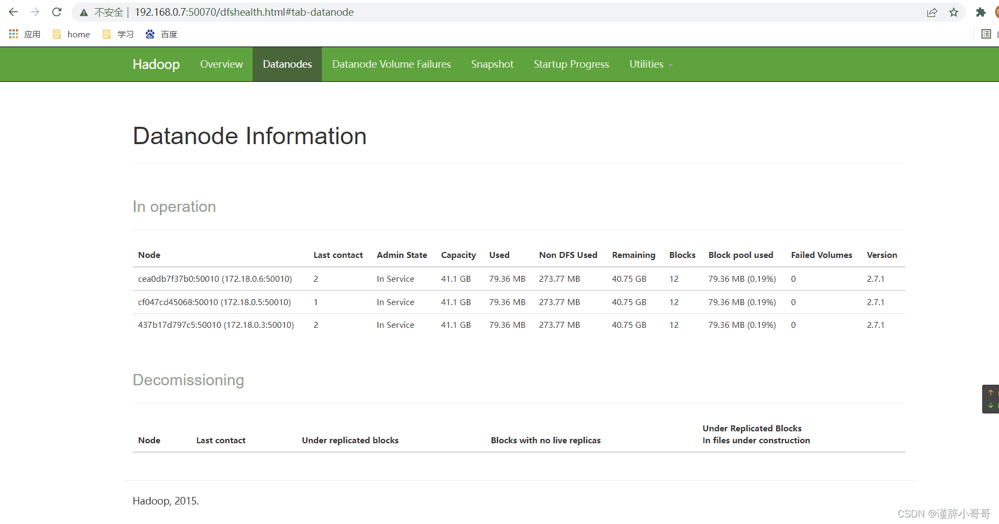

# docker安装

## 官方教程 for Ubuntu

```shell
#Uninstall old versions
#Older versions of Docker were called docker, docker.io, or docker-engine. If these are installed, uninstall them:
sudo apt-get remove docker docker-engine docker.io containerd runc

#Install using the repository
#Before you install Docker Engine for the first time on a new host machine, you need to set up the Docker repository. Afterward, you can install and update Docker from the repository.
#Set up the repository
#Update the apt package index and install packages to allow apt to use a repository over HTTPS:
sudo apt-get update
sudo apt-get install \
    ca-certificates \
    curl \
    gnupg \
    lsb-release

#Add Docker’s official GPG key:
sudo mkdir -p /etc/apt/keyrings
curl -fsSL https://download.docker.com/linux/ubuntu/gpg | sudo gpg --dearmor -o /etc/apt/keyrings/docker.gpg

#Use the following command to set up the repository:
echo \
  "deb [arch=$(dpkg --print-architecture) signed-by=/etc/apt/keyrings/docker.gpg] https://download.docker.com/linux/ubuntu \
  $(lsb_release -cs) stable" | sudo tee /etc/apt/sources.list.d/docker.list > /dev/null
  
#Install Docker Engine
#Update the apt package index, and install the latest version of Docker Engine, containerd, and Docker Compose, or go to the next step to install a specific version:
sudo apt-get update
sudo apt-get install docker-ce docker-ce-cli containerd.io docker-compose-plugin
```


## 使用Tsinghua源

```shell
#如果你过去安装过 docker,先删掉:
sudo apt-get remove docker docker-engine docker.io containerd runc

#首先安装依赖:
sudo apt-get install apt-transport-https ca-certificates curl gnupg2 software-properties-common

#根据你的发行版，下面的内容有所不同。
#Ubuntu
#信任 Docker 的 GPG 公钥:
curl -fsSL https://download.docker.com/linux/ubuntu/gpg | sudo gpg --dearmor -o /etc/apt/keyrings/docker.gpg

#添加软件仓库:
echo \
  "deb [arch=$(dpkg --print-architecture) signed-by=/etc/apt/keyrings/docker.gpg] https://mirrors.tuna.tsinghua.edu.cn/docker-ce/linux/ubuntu \
  $(lsb_release -cs) stable" | sudo tee /etc/apt/sources.list.d/docker.list > /dev/null

#最后安装
sudo apt-get update
sudo apt-get install docker-ce

#Fedora/CentOS/RHEL
#以下内容根据 官方文档 修改而来。
#如果你之前安装过 docker，请先删掉
sudo yum remove docker docker-client docker-client-latest docker-common docker-latest docker-latest-logrotate docker-logrotate docker-engine

#安装一些依赖
sudo yum install -y yum-utils device-mapper-persistent-data lvm2

#根据你的发行版下载repo文件: CentOS/RHEL
yum-config-manager --add-repo https://download.docker.com/linux/centos/docker-ce.repo

#把软件仓库地址替换为 TUNA:
sudo sed -i 's+download.docker.com+mirrors.tuna.tsinghua.edu.cn/docker-ce+' /etc/yum.repos.d/docker-ce.repo

#最后安装:
sudo yum makecache fast
sudo yum install docker-ce
```

## 使用阿里源(推荐使用)

```shell
#Ubuntu 14.04/16.04（使用 apt-get 进行安装）
# step 1: 安装必要的一些系统工具
sudo apt-get update
sudo apt-get -y install apt-transport-https ca-certificates curl software-properties-common
# step 2: 安装GPG证书
curl -fsSL https://mirrors.aliyun.com/docker-ce/linux/ubuntu/gpg | sudo apt-key add -
# Step 3: 写入软件源信息
sudo add-apt-repository "deb [arch=amd64] https://mirrors.aliyun.com/docker-ce/linux/ubuntu $(lsb_release -cs) stable"
# Step 4: 更新并安装Docker-CE
sudo apt-get -y update
sudo apt-get -y install docker-ce

# 安装指定版本的Docker-CE:
# Step 1: 查找Docker-CE的版本:
# apt-cache madison docker-ce
#   docker-ce | 17.03.1~ce-0~ubuntu-xenial | https://mirrors.aliyun.com/docker-ce/linux/ubuntu xenial/stable amd64 Packages
#   docker-ce | 17.03.0~ce-0~ubuntu-xenial | https://mirrors.aliyun.com/docker-ce/linux/ubuntu xenial/stable amd64 Packages
# Step 2: 安装指定版本的Docker-CE: (VERSION例如上面的17.03.1~ce-0~ubuntu-xenial)
# sudo apt-get -y install docker-ce=[VERSION]


#CentOS 7（使用 yum 进行安装）
# step 1: 安装必要的一些系统工具
sudo yum install -y yum-utils device-mapper-persistent-data lvm2
# Step 2: 添加软件源信息
sudo yum-config-manager --add-repo https://mirrors.aliyun.com/docker-ce/linux/centos/docker-ce.repo
# Step 3
sudo sed -i 's+download.docker.com+mirrors.aliyun.com/docker-ce+' /etc/yum.repos.d/docker-ce.repo
# Step 4: 更新并安装Docker-CE
sudo yum makecache fast
sudo yum -y install docker-ce
# Step 4: 开启Docker服务
sudo service docker start

# 注意：
# 官方软件源默认启用了最新的软件，您可以通过编辑软件源的方式获取各个版本的软件包。例如官方并没有将测试版本的软件源置为可用，您可以通过以下方式开启。同理可以开启各种测试版本等。
# vim /etc/yum.repos.d/docker-ce.repo
#   将[docker-ce-test]下方的enabled=0修改为enabled=1
#
# 安装指定版本的Docker-CE:
# Step 1: 查找Docker-CE的版本:
# yum list docker-ce.x86_64 --showduplicates | sort -r
#   Loading mirror speeds from cached hostfile
#   Loaded plugins: branch, fastestmirror, langpacks
#   docker-ce.x86_64            17.03.1.ce-1.el7.centos            docker-ce-stable
#   docker-ce.x86_64            17.03.1.ce-1.el7.centos            @docker-ce-stable
#   docker-ce.x86_64            17.03.0.ce-1.el7.centos            docker-ce-stable
#   Available Packages
# Step2: 安装指定版本的Docker-CE: (VERSION例如上面的17.03.0.ce.1-1.el7.centos)
# sudo yum -y install docker-ce-[VERSION]
```

## 使用ustc源

```shell
#安装 Docker CE，请按照 官方安装文档 ，选择你对应的系统。 以 Ubuntu 为例，参考 官方 Ubuntu 安装 Docker CE 手册 进行安装。 在阅读官方安装手册时，只要把 download.docker.com 地址换成 mirrors.ustc.edu.cn/docker-ce 即可。
#CentOS、 Fedora 等用户在下载 docker-ce.repo 文件后（位于 /etc/yum.repos.d/）， 还需要将该文件中的 download.docker.com 地址换成 mirrors.ustc.edu.cn/docker-ce。


#Uninstall old versions
#Older versions of Docker were called docker, docker.io, or docker-engine. If these are installed, uninstall them:
sudo apt-get remove docker docker-engine docker.io containerd runc

#Install using the repository
#Before you install Docker Engine for the first time on a new host machine, you need to set up the Docker repository. Afterward, you can install and update Docker from the repository.
#Set up the repository
#Update the apt package index and install packages to allow apt to use a repository over HTTPS:
sudo apt-get update
sudo apt-get install \
    ca-certificates \
    curl \
    gnupg \
    lsb-release

#Add Docker’s official GPG key:
sudo mkdir -p /etc/apt/keyrings
curl -fsSL https://mirrors.ustc.edu.cn/docker-ce/linux/ubuntu/gpg | sudo gpg --dearmor -o /etc/apt/keyrings/docker.gpg

#Use the following command to set up the repository:
echo \
  "deb [arch=$(dpkg --print-architecture) signed-by=/etc/apt/keyrings/docker.gpg] https://mirrors.ustc.edu.cn/docker-ce/linux/ubuntu \
  $(lsb_release -cs) stable" | sudo tee /etc/apt/sources.list.d/docker.list > /dev/null
  
#Install Docker Engine
#Update the apt package index, and install the latest version of Docker Engine, containerd, and Docker Compose, or go to the next step to install a specific version:
sudo apt-get update
sudo apt-get install docker-ce docker-ce-cli containerd.io docker-compose-plugin
```

## 使用sjtu源

```shell
#如果你过去安装过 docker，先删掉:
sudo apt-get remove docker docker-engine docker.io
#首先安装依赖:
sudo apt-get install apt-transport-https ca-certificates curl gnupg2 software-properties-common
#根据你的发行版，下面的内容有所不同。你使用的发行版：


#Debian
#信任 Docker 的 GPG 公钥:
curl -fsSL https://download.docker.com/linux/debian/gpg | sudo apt-key add -
#对于 amd64 架构的计算机，添加软件仓库:
sudo add-apt-repository \
   "deb [arch=amd64] https://mirror.sjtu.edu.cn/docker-ce/linux/debian \
   $(lsb_release -cs) \
   stable"
#如果你用的是树莓派或其它ARM架构计算机，请运行:
echo "deb [arch=armhf] https://mirror.sjtu.edu.cn/docker-ce/linux/debian \
     $(lsb_release -cs) stable" | \
    sudo tee /etc/apt/sources.list.d/docker.list
#最后安装
sudo apt-get update
sudo apt-get install docker-ce


#Ubuntu
#信任 Docker 的 GPG 公钥:
curl -fsSL https://download.docker.com/linux/ubuntu/gpg | sudo apt-key add -
#对于 amd64 架构的计算机，添加软件仓库:
sudo add-apt-repository \
   "deb [arch=amd64] https://mirror.sjtu.edu.cn/docker-ce/linux/ubuntu \
   $(lsb_release -cs) \
   stable"
#如果你用的是树莓派或其它ARM架构计算机，请运行:
echo "deb [arch=armhf] https://mirror.sjtu.edu.cn/docker-ce/linux/ubuntu \
     $(lsb_release -cs) stable" | \
    sudo tee /etc/apt/sources.list.d/docker.list
#最后安装
sudo apt-get update
sudo apt-get install docker-ce


#Fedora/CentOS/RHEL
#以下内容根据TUNA文档修改而来。
#如果你之前安装过 docker，请先删掉
sudo yum remove docker docker-common docker-selinux docker-engine
#安装一些依赖
sudo yum install -y yum-utils device-mapper-persistent-data lvm2
#根据你的发行版下载repo文件:


#CentOS/RHEL
#Fedora
#把软件仓库地址替换为 SJTUG:
sudo sed -i 's+download.docker.com+mirror.sjtu.edu.cn/docker-ce+' /etc/yum.repos.d/docker-ce.repo
#最后安装:
sudo yum makecache fast
sudo yum install docker-ce
```


# docker-compose安装

## apt安装

直接使用apt-get install

```bash
sudo apt-get install docker-compose
```


# docker国内镜像

https://fast360.xyz/

https://www.cnblogs.com/OneSeting/p/18532166

https://cloud.tencent.com/developer/article/2485043

https://xuanyuan.me/blog/archives/1154

在`/etc/docker/daemon.json`中添加镜像地址，如：

```json
{
    "registry-mirrors": [
        "https://hub.fast360.xyz"
    ]
}
```


# docker走代理

```bash
sudo cd /etc/systemd/system/
#创建配置文件
sudo mkdir docker.service.d
cd docker.service.d
sudo vim proxy.conf

#切换到插入模式，插入以下内容
[Service]
Environment="HTTP_PROXY=127.0.0.1:7890"
Environment="HTTPS_PROXY=127.0.0.1:7890"
#保存退出

#重启docker
sudo systemctl daemon-reload
sudo systemctl restart docker

#最后我们仍然是验证一下是否修改成功，运行
sudo docker info
#在长串info信息中如果出现类似下文的内容：
# HTTP Proxy: 代理服务器ip:port
# HTTPS Proxy: 代理服务器ip:port
```

# WSL设置docker代理

当启动docker服务时，后调用`/etc/init.d/docker`脚本，而此脚本会执行`/etc/default/docker`脚本，因此可在后者设置代理的环境变量，由此docker拉取镜像时便会使用代理。

修改`/etc/default/docker`文件，加入以下内容:

```bash
export http_proxy="127.0.0.1:7890"
export https_proxy="127.0.0.1:7890"
# 注意：https代理链接为http，Windows IP即为宿主机IP
```

重启docker：sudo service docker restart


# 修改 docker 容器的目录映射

https://cloud.tencent.com/developer/article/1750909

## 1.直接删除，重新创建容器

## 2.修改容器配置文件

暂停 Docker 服务

```
systemctl stop docker
```

进入 Docker 容器配置文件目录下

```
cd /var/lib/docker/containers/
ls
```

进入某个容器的配置文件目录下，容器ID 就是文件夹名称，可通过 docker ps -aq 来查看，不过这是缩写，对照起来看就行。

修改 config.v2.json，修改其中映射目录相关路径。

重新启动 Docker 服务。

## 3.使用 docker commit 命令

停止 Docker 容器

```
docker stop tomcat7
```

使用 commit 构建新镜像

```
docker commit tomcat7 new_tomcat7
docker images
```

使用新镜像重新创建一个 Docker 容器

```
docker run -d -p 9999:8080 -i --name tomcat77 -v /usr/local/tomcat/webapps:/usr/local/tomcat/webapps tomcat:7
```

修改新容器的名字

如果新容器想用回旧容器的名字，需要先删了旧容器，再改名

```
docker rm -f tomcat7
docker rename tomcat77 tomcat7
docker ps
```


# Portainer(docker面板)

```bash
#拉取镜像
sudo docker pull portainer/portainer-ce:latest
```

创建并启动容器

```bash
#不映射数据
sudo docker run -d -p 8000:8000 -p 9443:9443 -p 9000:9000 --name portainer-default --restart=always -v /var/run/docker.sock:/var/run/docker.sock portainer/portainer-ce:latest
```

```bash
#映射数据至指定目录
sudo mkdir -p /home/ubuntu/docker/portainer-default/
sudo chown ubuntu /home/ubuntu/docker/portainer-default/
sudo docker run -d -p 48000:8000 -p 49443:9443 -p 49000:9000 --name portainer-default --restart=unless-stopped -v /var/run/docker.sock:/var/run/docker.sock -v /home/ubuntu/docker/portainer-default:/data portainer/portainer-ce:latest
```

创建完毕后，访问49000端口。


# Grafana

```bash
docker run -d --name=grafana -p 3000:3000 grafana/grafana

docker run -d --name=grafana -p 3000:3000 grafana/grafana-enterprise
```


# uptime-kuma(应用监控)

```bash
sudo docker pull elestio/uptime-kuma:1.23.10

sudo docker run -itd --name uptime-kuma-default -p 13001:3001  elestio/uptime-kuma:1.23.10
```


# minio(分布式对象存储服务器)

```bash
sudo docker pull minio/minio:latest
sudo mkdir -p /mnt/sda1/docker/minio-default/data
sudo chown ubuntu /mnt/sda1/docker/minio-default/data
sudo mkdir -p /mnt/sda1/docker/minio-default/config
sudo chown ubuntu /mnt/sda1/docker/minio-default/config
# 指定用户名和密码
sudo docker run -itd --restart=unless-stopped --name minio-default -p 49900:9000 -p 49901:9001 -v /mnt/sda1/docker/minio-default/data:/data -v /mnt/sda1/docker/minio-default/config:/root/.minio -e "MINIO_ROOT_USER=minioadmin" -e "MINIO_ROOT_PASSWORD=abcd123456" minio/minio:latest server /data --console-address ":9001"


# 不指定用户名和密码，默认为minioadmin,minioadmin
sudo docker run -itd --restart=unless-stopped --name minio-default -p 49900:9000 -p 49901:9001 -v /mnt/sda1/docker/minio-default/data:/data -v /mnt/sda1/docker/minio-default/config:/root/.minio minio/minio:latest server /data --console-address ":9001"

# 配置与存储分离
mkdir -p /mnt/sda1/docker/minio-default/data
mkdir -p /home/ubuntu/docker/minio-default/config

docker run -itd --restart=unless-stopped --name minio-default -p 49900:9000 -p 49901:9001 -v /mnt/sda1/docker/minio-default/data:/data -v /home/ubuntu/docker/minio-default/config:/root/.minio  -e "MINIO_ROOT_USER=minioadmin" -e "MINIO_ROOT_PASSWORD=a0b0c1d2minio" quay.io/minio/minio:RELEASE.2025-01-18T00-31-37Z server /data --console-address ":9001"
```


# sun-panel

```bash
sudo docker run -d --restart=always -p 8226:3002 -v ~/docker_data/sun-panel/conf:/app/conf -v /var/run/docker.sock:/var/run/docker.sock --name sun-panel hslr/sun-panel:1.5.2
```

默认账号密码

账号：admin@sun.cc

密码：12345678


# 1panel(Linux运维面板)

https://hub.docker.com/r/moelin/1panel

由于容器内部`systemd`限制，部分功能目前尚不完整。

**20230919：添加自动修改面板显示应用版本，无需手动修改数据库**

相关操作查看下文。

1. 默认端口：`10086`
2. 默认账户：`1panel`
3. 默认密码：`1panel_password`
4. 默认入口：`entrance`

docker方式安装：

```bash
sudo docker pull moelin/1panel:v1.10.1-lts

sudo docker run -d --name 1panel-default --restart always --network host -p 10086:10086 -v /var/run/docker.sock:/var/run/docker.sock -v /var/lib/docker/volumes:/var/lib/docker/volumes -v /opt:/opt -v /root:/root -e TZ=Asia/Shanghai moelin/1panel:v1.10.1-lts
```

docker-compose方式安装：

```yaml
#创建一个docker-compose.yml文件，内容类似如下
version: '3'
services:
  1panel:
    container_name: 1panel # 容器名
    restart: always
    network_mode: "host"
    volumes:
      - /var/run/docker.sock:/var/run/docker.sock
      - /var/lib/docker/volumes:/var/lib/docker/volumes
      - /opt:/opt  # 文件存储映射
      - /root:/root  # 可选的文件存储映射
    environment:
      - TZ=Asia/Shanghai  # 时区设置
    image: moelin/1panel:latest
    labels:  
      createdBy: "Apps"
#然后docker-compose up -d运行
```


# code-server

## codercon/code-server

```bash
#sudo docker pull codercom/code-server:4.89.1-39
sudo docker pull codercom/code-server:latest
sudo mkdir -p /home/ubuntu/docker/code-server/project/
sudo mkdir -p /home/ubuntu/docker/code-server/.config/

#sudo docker run -itd --name code-server-default -p 8240:8080 -v "/home/ubuntu/docker/code-server/.config:/home/coder/.config" -v "/home/ubuntu/docker/code-server/project:/home/coder/project" -u "$(id -u):$(id -g)" -e "DOCKER_USER=$USER" codercom/code-server:4.89.1-39

sudo docker run -itd --name code-server-default -p 8240:8080 -v "/home/ubuntu/docker/code-server/.config:/home/coder/.config" -v "/home/ubuntu/docker/code-server/project:/home/coder/project" -u "$(id -u):$(id -g)" -e "DOCKER_USER=$USER" codercom/code-server:latest

#sudo docker run -itd --name code-server-default -p 8240:8080 -v "/home/ubuntu/docker/code-server/.config:/home/coder/.config" -v "/home/ubuntu/docker/code-server/project:/home/coder/project" -u "$(id -u):$(id -g)" -e "DOCKER_USER=$USER" -e PASSWORD=123456 codercom/code-server:latest
```

密码在`.config/code-server/config.yaml`中。


## linuxserver/code-server

```bash
#docker pull linuxserver/code-server:4.89.1
docker pull linuxserver/code-server:latest
sudo mkdir -p /home/ubuntu/docker/code-server/project/
sudo mkdir -p /home/ubuntu/docker/code-server/config/

#docker run -d --name=code-server -e PUID=1000 -e PGID=1000 -e TZ=Etc/UTC -e PASSWORD=password -e SUDO_PASSWORD=password -e DEFAULT_WORKSPACE=/config/workspace -p 8240:8443 -v /home/ubuntu/docker/code-server/config:/config --restart unless-stopped linuxserver/code-server:4.89.1

docker run -d --name=code-server -e PUID=1000 -e PGID=1000 -e TZ=Etc/UTC -e PASSWORD=password -e SUDO_PASSWORD=password -e DEFAULT_WORKSPACE=/config/workspace -p 8240:8443 -v /home/ubuntu/docker/code-server/config:/config --restart unless-stopped linuxserver/code-server:latest
```

https://hub.docker.com/r/linuxserver/code-server

**Usage**

To help you get started creating a container from this image you can either use docker-compose or the docker cli.

> [!NOTE] Unless a parameter is flaged as 'optional', it is *mandatory* and a value must be provided.

**docker-compose (recommended, [click here for more info⁠](https://docs.linuxserver.io/general/docker-compose))**

```yaml
---
services:
  code-server:
    image: lscr.io/linuxserver/code-server:latest
    container_name: code-server
    environment:
      - PUID=1000
      - PGID=1000
      - TZ=Etc/UTC
      - PASSWORD=password #optional
      - HASHED_PASSWORD= #optional
      - SUDO_PASSWORD=password #optional
      - SUDO_PASSWORD_HASH= #optional
      - PROXY_DOMAIN=code-server.my.domain #optional
      - DEFAULT_WORKSPACE=/config/workspace #optional
    volumes:
      - /path/to/code-server/config:/config
    ports:
      - 8443:8443
    restart: unless-stopped
```

**docker cli ([click here for more info⁠](https://docs.docker.com/engine/reference/commandline/cli/))**

```bash
docker run -d \
  --name=code-server \
  -e PUID=1000 \
  -e PGID=1000 \
  -e TZ=Etc/UTC \
  -e PASSWORD=password `#optional` \
  -e HASHED_PASSWORD= `#optional` \
  -e SUDO_PASSWORD=password `#optional` \
  -e SUDO_PASSWORD_HASH= `#optional` \
  -e PROXY_DOMAIN=code-server.my.domain `#optional` \
  -e DEFAULT_WORKSPACE=/config/workspace `#optional` \
  -p 8443:8443 \
  -v /path/to/code-server/config:/config \
  --restart unless-stopped \
  lscr.io/linuxserver/code-server:latest
```

```shell
mkdir -p /mnt/data/docker/code-server-default/config

docker run -itd --name=code-server-default -e PUID=0 -e GUID=0 -e TZ=Asia/Shanghai -e PASSWORD=abcd123456 -e SUDO_PASSWORD=abcd123456 -e DEFAULT_WORKSPACE=/config/workspace -p 8252:8443 -v /mnt/data/docker/code-server-default/config:/config/workspace --restart=unless-stopped linuxserver/code-server:4.92.2
```


**Parameters**

Containers are configured using parameters passed at runtime (such as those above). These parameters are separated by a colon and indicate `<external>:<internal>` respectively. For example, `-p 8080:80` would expose port `80` from inside the container to be accessible from the host's IP on port `8080` outside the container.

|                Parameter                 | Function                                                     |
| :--------------------------------------: | :----------------------------------------------------------- |
|              `-p 8443:8443`              | web gui                                                      |
|              `-e PUID=1000`              | for UserID - see below for explanation                       |
|              `-e PGID=1000`              | for GroupID - see below for explanation                      |
|             `-e TZ=Etc/UTC`              | specify a timezone to use, see this [list⁠](https://en.wikipedia.org/wiki/List_of_tz_database_time_zones#List). |
|          `-e PASSWORD=password`          | Optional web gui password, if `PASSWORD` or `HASHED_PASSWORD` is not provided, there will be no auth. |
|          `-e HASHED_PASSWORD=`           | Optional web gui password, overrides `PASSWORD`, instructions on how to create it is below. |
|       `-e SUDO_PASSWORD=password`        | If this optional variable is set, user will have sudo access in the code-server terminal with the specified password. |
|         `-e SUDO_PASSWORD_HASH=`         | Optionally set sudo password via hash (takes priority over `SUDO_PASSWORD` var). Format is `$type$salt$hashed`. |
| `-e PROXY_DOMAIN=code-server.my.domain`  | If this optional variable is set, this domain will be proxied for subdomain proxying. See [Documentation⁠](https://github.com/coder/code-server/blob/main/docs/guide.md#using-a-subdomain) |
| `-e DEFAULT_WORKSPACE=/config/workspace` | If this optional variable is set, code-server will open this directory by default |
|               `-v /config`               | Contains all relevant configuration files.                   |

**Environment variables from files (Docker secrets)**

You can set any environment variable from a file by using a special prepend `FILE__`.

As an example:

```bash
-e FILE__MYVAR=/run/secrets/mysecretvariable
```

Will set the environment variable `MYVAR` based on the contents of the `/run/secrets/mysecretvariable` file.

**Umask for running applications**

For all of our images we provide the ability to override the default umask settings for services started within the containers using the optional `-e UMASK=022` setting. Keep in mind umask is not chmod it subtracts from permissions based on it's value it does not add. Please read up [here⁠](https://en.wikipedia.org/wiki/Umask) before asking for support.

**User / Group Identifiers**

When using volumes (`-v` flags), permissions issues can arise between the host OS and the container, we avoid this issue by allowing you to specify the user `PUID` and group `PGID`.

Ensure any volume directories on the host are owned by the same user you specify and any permissions issues will vanish like magic.

In this instance `PUID=1000` and `PGID=1000`, to find yours use `id your_user` as below:

```bash
id your_user
```

Example output:

```text
uid=1000(your_user) gid=1000(your_user) groups=1000(your_user)
```

**Docker Mods**

[](https://mods.linuxserver.io/?mod=code-server)[](https://mods.linuxserver.io/?mod=universal)

We publish various [Docker Mods⁠](https://github.com/linuxserver/docker-mods) to enable additional functionality within the containers. The list of Mods available for this image (if any) as well as universal mods that can be applied to any one of our images can be accessed via the dynamic badges above.

**Support Info**

- Shell access whilst the container is running:

  ```bash
  docker exec -it code-server /bin/bash
  ```

- To monitor the logs of the container in realtime:

  ```bash
  docker logs -f code-server
  ```

- Container version number:

  ```bash
  docker inspect -f '{{ index .Config.Labels "build_version" }}' code-server
  ```

- Image version number:

  ```bash
  docker inspect -f '{{ index .Config.Labels "build_version" }}' lscr.io/linuxserver/code-server:latest
  ```

**Updating Info**

Most of our images are static, versioned, and require an image update and container recreation to update the app inside. With some exceptions (noted in the relevant readme.md), we do not recommend or support updating apps inside the container. Please consult the [Application Setup](https://hub.docker.com/r/linuxserver/code-server#application-setup) section above to see if it is recommended for the image.

Below are the instructions for updating containers:

**Via Docker Compose**

- Update images:

  - All images:

    ```bash
    docker-compose pull
    ```

  - Single image:

    ```bash
    docker-compose pull code-server
    ```

- Update containers:

  - All containers:

    ```bash
    docker-compose up -d
    ```

  - Single container:

    ```bash
    docker-compose up -d code-server
    ```

- You can also remove the old dangling images:

  ```bash
  docker image prune
  ```

**Via Docker Run**

- Update the image:

  ```bash
  docker pull lscr.io/linuxserver/code-server:latest
  ```

- Stop the running container:

  ```bash
  docker stop code-server
  ```

- Delete the container:

  ```bash
  docker rm code-server
  ```

- Recreate a new container with the same docker run parameters as instructed above (if mapped correctly to a host folder, your `/config` folder and settings will be preserved)

- You can also remove the old dangling images:

  ```bash
  docker image prune
  ```

**Image Update Notifications - Diun (Docker Image Update Notifier)**

> [!TIP] We recommend [Diun⁠](https://crazymax.dev/diun/) for update notifications. Other tools that automatically update containers unattended are not recommended or supported.

**Building locally**

If you want to make local modifications to these images for development purposes or just to customize the logic:

```bash
git clone https://github.com/linuxserver/docker-code-server.git
cd docker-code-server
docker build \
  --no-cache \
  --pull \
  -t lscr.io/linuxserver/code-server:latest .
```

The ARM variants can be built on x86_64 hardware and vice versa using `lscr.io/linuxserver/qemu-static`

```bash
docker run --rm --privileged lscr.io/linuxserver/qemu-static --reset
```

Once registered you can define the dockerfile to use with `-f Dockerfile.aarch64`.


# mysql8部署

## 部署命令

拉取镜像

```shell
sudo docker pull mysql
```

运行

```shell
#创建映射目录
sudo mkdir -p /home/ubuntu/docker/mysql-default/conf
sudo mkdir -p /home/ubuntu/docker/mysql-default/logs
sudo mkdir -p /home/ubuntu/docker/mysql-default/data

#启动容器
sudo docker run -it --name mysql-default -p 3080:3306 -e MYSQL_ROOT_PASSWORD=123456 --restart=always -v /home/ubuntu/docker/mysql-default/conf:/etc/mysql/conf.d -v /home/ubuntu/docker/mysql-default/logs:/var/log/mysql -v /home/ubuntu/docker/mysql-default/data:/var/lib/mysql mysql

# 报错：[ERROR] [Entrypoint]: mysqld failed while attempting to check config
#        command was: mysqld --verbose --help --log-bin-index=/tmp/tmp.UI6ajKmnml
#        mysqld: Can't read dir of '/etc/mysql/conf.d/' (OS errno 2 - No such file or #directory)
# mysql5.7的配置在 /etc/mysql
# mysql8.0以上的配置位置在 /etc/mysql/conf.d
#/mydata/mysql/conf:/etc/mysql
#					||
#					||
#					||
#					\/
#/mydata/mysql/conf:/etc/mysql/conf.d
```


## 配置命令

进入容器

```shell
sudo docker exec -it mysql-default /bin/bash
```


# mysql5.7部署

## 部署命令

拉取镜像

```shell
sudo docker pull mysql:5.7
```

运行

```shell
#创建映射目录
sudo mkdir -p /home/ubuntu/docker/mysql5-default/conf
sudo mkdir -p /home/ubuntu/docker/mysql5-default/logs
sudo mkdir -p /home/ubuntu/docker/mysql5-default/mysql

#创建配置文件
cd /home/ubuntu/docker/mysql5-default/conf/
sudo vi my.cnf
‘’‘
# Copyright (c) 2014, 2016, Oracle and/or its affiliates. All rights reserved.
#
# This program is free software; you can redistribute it and/or modify
# it under the terms of the GNU General Public License as published by
# the Free Software Foundation; version 2 of the License.
#
# This program is distributed in the hope that it will be useful,
# but WITHOUT ANY WARRANTY; without even the implied warranty of
# MERCHANTABILITY or FITNESS FOR A PARTICULAR PURPOSE.  See the
# GNU General Public License for more details.
#
# You should have received a copy of the GNU General Public License
# along with this program; if not, write to the Free Software
# Foundation, Inc., 51 Franklin St, Fifth Floor, Boston, MA  02110-1301 USA

#
# The MySQL  Server configuration file.
#
# For explanations see
# http://dev.mysql.com/doc/mysql/en/server-system-variables.html

[mysqld]
pid-file	= /var/run/mysqld/mysqld.pid
socket		= /var/run/mysqld/mysqld.sock
datadir		= /var/lib/mysql
#log-error	= /var/log/mysql/error.log
# Disabling symbolic-links is recommended to prevent assorted security risks
symbolic-links=0

max_connections = 2000
max_user_connections = 1900
max_connect_errors = 100000
max_allowed_packet = 50M
lower_case_table_names=1
[mysqld]
skip-name-resolve
sql_mode=STRICT_TRANS_TABLES,NO_ZERO_IN_DATE,NO_ZERO_DATE,ERROR_FOR_DIVISION_BY_ZERO,NO_AUTO_CREATE_USER,NO_ENGINE_SUBSTITUTION
’‘’
#保存后退出


#启动容器
sudo docker run  -p 3090:3306 --name mysql5-default --restart=always -v /home/ubuntu/docker/mysql5-default/conf/my.cnf:/etc/mysql/my.cnf -v /home/ubuntu/docker/mysql5-default/logs:/logs -v /home/ubuntu/docker/mysql5-default/mysql:/var/lib/mysql -e MYSQL_ROOT_PASSWORD=123456 -d mysql:5.7
```


## 配置命令

```
sudo docker exec -it mysql5-default /bin/bash
```


# mongodb部署

## 部署命令

拉取镜像

```bash
sudo docker pull mongo
```

运行

```bash
sudo docker run --name=mongodb-default --restart=always -p 27017:27017 -itd -v /home/ubuntu/docker/mongodb-default/data:/data/db -v/home/ubuntu/docker/mongodb-default/backup:/data/backup -v /home/ubuntu/docker/mongodb-default/conf:/data/configdb mongo --auth
```

  进入mongo容器

```bash
sudo docker exec -it mongodb-default mongosh admin
```

  添加账号

```bash
db.createUser({user:'admin',pwd:'123456',roles:[{role:'root',db:'admin'}],});
db.auth('admin','123456');
#读取权限的账户
db.createUser({user:'user',pwd:'123456',roles:[{role:"readWrite",db:"elec_safe"}]});
db.auth("user","123456");
```


# apache2部署

## 部署命令

拉取镜像

```shell
sudo docker pull httpd
```

运行

注：若容器运行后自动无限重启，可使用`sudo docker logs httpd-default`查看日志输出。

如果输出日志报错`AH00534: httpd............`，则根据以下命令，在启动容器前先修改httpd.conf的内容/或直接复制全新的httpd.conf。

```shell
#创建映射目录
sudo mkdir -p /mnt/sda1/docker/httpd-default/htdocs
sudo mkdir -p /mnt/sda1/docker/httpd-default/conf
sudo touch /mnt/sda1/docker/httpd-default/conf/httpd.conf
sudo mkdir -p /mnt/sda1/docker/httpd-default/logs

#编辑httpd.conf文件内容
'''
#
# This is the main Apache HTTP server configuration file.  It contains the
# configuration directives that give the server its instructions.
# See <URL:http://httpd.apache.org/docs/2.4/> for detailed information.
# In particular, see 
# <URL:http://httpd.apache.org/docs/2.4/mod/directives.html>
# for a discussion of each configuration directive.
#
# Do NOT simply read the instructions in here without understanding
# what they do.  They're here only as hints or reminders.  If you are unsure
# consult the online docs. You have been warned.  
#
# Configuration and logfile names: If the filenames you specify for many
# of the server's control files begin with "/" (or "drive:/" for Win32), the
# server will use that explicit path.  If the filenames do *not* begin
# with "/", the value of ServerRoot is prepended -- so "logs/access_log"
# with ServerRoot set to "/usr/local/apache2" will be interpreted by the
# server as "/usr/local/apache2/logs/access_log", whereas "/logs/access_log" 
# will be interpreted as '/logs/access_log'.

#
# ServerRoot: The top of the directory tree under which the server's
# configuration, error, and log files are kept.
#
# Do not add a slash at the end of the directory path.  If you point
# ServerRoot at a non-local disk, be sure to specify a local disk on the
# Mutex directive, if file-based mutexes are used.  If you wish to share the
# same ServerRoot for multiple httpd daemons, you will need to change at
# least PidFile.
#
ServerRoot "/usr/local/apache2"

#
# Mutex: Allows you to set the mutex mechanism and mutex file directory
# for individual mutexes, or change the global defaults
#
# Uncomment and change the directory if mutexes are file-based and the default
# mutex file directory is not on a local disk or is not appropriate for some
# other reason.
#
# Mutex default:logs

#
# Listen: Allows you to bind Apache to specific IP addresses and/or
# ports, instead of the default. See also the <VirtualHost>
# directive.
#
# Change this to Listen on specific IP addresses as shown below to 
# prevent Apache from glomming onto all bound IP addresses.
#
#Listen 12.34.56.78:80
Listen 80

#
# Dynamic Shared Object (DSO) Support
#
# To be able to use the functionality of a module which was built as a DSO you
# have to place corresponding `LoadModule' lines at this location so the
# directives contained in it are actually available _before_ they are used.
# Statically compiled modules (those listed by `httpd -l') do not need
# to be loaded here.
#
# Example:
# LoadModule foo_module modules/mod_foo.so
#
LoadModule mpm_event_module modules/mod_mpm_event.so
#LoadModule mpm_prefork_module modules/mod_mpm_prefork.so
#LoadModule mpm_worker_module modules/mod_mpm_worker.so
LoadModule authn_file_module modules/mod_authn_file.so
#LoadModule authn_dbm_module modules/mod_authn_dbm.so
#LoadModule authn_anon_module modules/mod_authn_anon.so
#LoadModule authn_dbd_module modules/mod_authn_dbd.so
#LoadModule authn_socache_module modules/mod_authn_socache.so
LoadModule authn_core_module modules/mod_authn_core.so
LoadModule authz_host_module modules/mod_authz_host.so
LoadModule authz_groupfile_module modules/mod_authz_groupfile.so
LoadModule authz_user_module modules/mod_authz_user.so
#LoadModule authz_dbm_module modules/mod_authz_dbm.so
#LoadModule authz_owner_module modules/mod_authz_owner.so
#LoadModule authz_dbd_module modules/mod_authz_dbd.so
LoadModule authz_core_module modules/mod_authz_core.so
#LoadModule authnz_ldap_module modules/mod_authnz_ldap.so
#LoadModule authnz_fcgi_module modules/mod_authnz_fcgi.so
LoadModule access_compat_module modules/mod_access_compat.so
LoadModule auth_basic_module modules/mod_auth_basic.so
#LoadModule auth_form_module modules/mod_auth_form.so
#LoadModule auth_digest_module modules/mod_auth_digest.so
#LoadModule allowmethods_module modules/mod_allowmethods.so
#LoadModule isapi_module modules/mod_isapi.so
#LoadModule file_cache_module modules/mod_file_cache.so
#LoadModule cache_module modules/mod_cache.so
#LoadModule cache_disk_module modules/mod_cache_disk.so
#LoadModule cache_socache_module modules/mod_cache_socache.so
#LoadModule socache_shmcb_module modules/mod_socache_shmcb.so
#LoadModule socache_dbm_module modules/mod_socache_dbm.so
#LoadModule socache_memcache_module modules/mod_socache_memcache.so
#LoadModule socache_redis_module modules/mod_socache_redis.so
#LoadModule watchdog_module modules/mod_watchdog.so
#LoadModule macro_module modules/mod_macro.so
#LoadModule dbd_module modules/mod_dbd.so
#LoadModule bucketeer_module modules/mod_bucketeer.so
#LoadModule dumpio_module modules/mod_dumpio.so
#LoadModule echo_module modules/mod_echo.so
#LoadModule example_hooks_module modules/mod_example_hooks.so
#LoadModule case_filter_module modules/mod_case_filter.so
#LoadModule case_filter_in_module modules/mod_case_filter_in.so
#LoadModule example_ipc_module modules/mod_example_ipc.so
#LoadModule buffer_module modules/mod_buffer.so
#LoadModule data_module modules/mod_data.so
#LoadModule ratelimit_module modules/mod_ratelimit.so
LoadModule reqtimeout_module modules/mod_reqtimeout.so
#LoadModule ext_filter_module modules/mod_ext_filter.so
#LoadModule request_module modules/mod_request.so
#LoadModule include_module modules/mod_include.so
LoadModule filter_module modules/mod_filter.so
#LoadModule reflector_module modules/mod_reflector.so
#LoadModule substitute_module modules/mod_substitute.so
#LoadModule sed_module modules/mod_sed.so
#LoadModule charset_lite_module modules/mod_charset_lite.so
#LoadModule deflate_module modules/mod_deflate.so
#LoadModule xml2enc_module modules/mod_xml2enc.so
#LoadModule proxy_html_module modules/mod_proxy_html.so
#LoadModule brotli_module modules/mod_brotli.so
LoadModule mime_module modules/mod_mime.so
#LoadModule ldap_module modules/mod_ldap.so
LoadModule log_config_module modules/mod_log_config.so
#LoadModule log_debug_module modules/mod_log_debug.so
#LoadModule log_forensic_module modules/mod_log_forensic.so
#LoadModule logio_module modules/mod_logio.so
#LoadModule lua_module modules/mod_lua.so
LoadModule env_module modules/mod_env.so
#LoadModule mime_magic_module modules/mod_mime_magic.so
#LoadModule cern_meta_module modules/mod_cern_meta.so
#LoadModule expires_module modules/mod_expires.so
LoadModule headers_module modules/mod_headers.so
#LoadModule ident_module modules/mod_ident.so
#LoadModule usertrack_module modules/mod_usertrack.so
#LoadModule unique_id_module modules/mod_unique_id.so
LoadModule setenvif_module modules/mod_setenvif.so
LoadModule version_module modules/mod_version.so
#LoadModule remoteip_module modules/mod_remoteip.so
#LoadModule proxy_module modules/mod_proxy.so
#LoadModule proxy_connect_module modules/mod_proxy_connect.so
#LoadModule proxy_ftp_module modules/mod_proxy_ftp.so
#LoadModule proxy_http_module modules/mod_proxy_http.so
#LoadModule proxy_fcgi_module modules/mod_proxy_fcgi.so
#LoadModule proxy_scgi_module modules/mod_proxy_scgi.so
#LoadModule proxy_uwsgi_module modules/mod_proxy_uwsgi.so
#LoadModule proxy_fdpass_module modules/mod_proxy_fdpass.so
#LoadModule proxy_wstunnel_module modules/mod_proxy_wstunnel.so
#LoadModule proxy_ajp_module modules/mod_proxy_ajp.so
#LoadModule proxy_balancer_module modules/mod_proxy_balancer.so
#LoadModule proxy_express_module modules/mod_proxy_express.so
#LoadModule proxy_hcheck_module modules/mod_proxy_hcheck.so
#LoadModule session_module modules/mod_session.so
#LoadModule session_cookie_module modules/mod_session_cookie.so
#LoadModule session_crypto_module modules/mod_session_crypto.so
#LoadModule session_dbd_module modules/mod_session_dbd.so
#LoadModule slotmem_shm_module modules/mod_slotmem_shm.so
#LoadModule slotmem_plain_module modules/mod_slotmem_plain.so
#LoadModule ssl_module modules/mod_ssl.so
#LoadModule optional_hook_export_module modules/mod_optional_hook_export.so
#LoadModule optional_hook_import_module modules/mod_optional_hook_import.so
#LoadModule optional_fn_import_module modules/mod_optional_fn_import.so
#LoadModule optional_fn_export_module modules/mod_optional_fn_export.so
#LoadModule dialup_module modules/mod_dialup.so
#LoadModule http2_module modules/mod_http2.so
#LoadModule proxy_http2_module modules/mod_proxy_http2.so
#LoadModule md_module modules/mod_md.so
#LoadModule lbmethod_byrequests_module modules/mod_lbmethod_byrequests.so
#LoadModule lbmethod_bytraffic_module modules/mod_lbmethod_bytraffic.so
#LoadModule lbmethod_bybusyness_module modules/mod_lbmethod_bybusyness.so
#LoadModule lbmethod_heartbeat_module modules/mod_lbmethod_heartbeat.so
LoadModule unixd_module modules/mod_unixd.so
#LoadModule heartbeat_module modules/mod_heartbeat.so
#LoadModule heartmonitor_module modules/mod_heartmonitor.so
#LoadModule dav_module modules/mod_dav.so
LoadModule status_module modules/mod_status.so
LoadModule autoindex_module modules/mod_autoindex.so
#LoadModule asis_module modules/mod_asis.so
#LoadModule info_module modules/mod_info.so
#LoadModule suexec_module modules/mod_suexec.so
<IfModule !mpm_prefork_module>
	#LoadModule cgid_module modules/mod_cgid.so
</IfModule>
<IfModule mpm_prefork_module>
	#LoadModule cgi_module modules/mod_cgi.so
</IfModule>
#LoadModule dav_fs_module modules/mod_dav_fs.so
#LoadModule dav_lock_module modules/mod_dav_lock.so
#LoadModule vhost_alias_module modules/mod_vhost_alias.so
#LoadModule negotiation_module modules/mod_negotiation.so
LoadModule dir_module modules/mod_dir.so
#LoadModule imagemap_module modules/mod_imagemap.so
#LoadModule actions_module modules/mod_actions.so
#LoadModule speling_module modules/mod_speling.so
#LoadModule userdir_module modules/mod_userdir.so
LoadModule alias_module modules/mod_alias.so
#LoadModule rewrite_module modules/mod_rewrite.so

<IfModule unixd_module>
#
# If you wish httpd to run as a different user or group, you must run
# httpd as root initially and it will switch.  
#
# User/Group: The name (or #number) of the user/group to run httpd as.
# It is usually good practice to create a dedicated user and group for
# running httpd, as with most system services.
#
User www-data
Group www-data

</IfModule>

# 'Main' server configuration
#
# The directives in this section set up the values used by the 'main'
# server, which responds to any requests that aren't handled by a
# <VirtualHost> definition.  These values also provide defaults for
# any <VirtualHost> containers you may define later in the file.
#
# All of these directives may appear inside <VirtualHost> containers,
# in which case these default settings will be overridden for the
# virtual host being defined.
#

#
# ServerAdmin: Your address, where problems with the server should be
# e-mailed.  This address appears on some server-generated pages, such
# as error documents.  e.g. admin@your-domain.com
#
ServerAdmin you@example.com

#
# ServerName gives the name and port that the server uses to identify itself.
# This can often be determined automatically, but we recommend you specify
# it explicitly to prevent problems during startup.
#
# If your host doesn't have a registered DNS name, enter its IP address here.
#
#ServerName www.example.com:80

#
# Deny access to the entirety of your server's filesystem. You must
# explicitly permit access to web content directories in other 
# <Directory> blocks below.
#
<Directory />
    AllowOverride none
    Require all denied
</Directory>

#
# Note that from this point forward you must specifically allow
# particular features to be enabled - so if something's not working as
# you might expect, make sure that you have specifically enabled it
# below.
#

#
# DocumentRoot: The directory out of which you will serve your
# documents. By default, all requests are taken from this directory, but
# symbolic links and aliases may be used to point to other locations.
#
DocumentRoot "/usr/local/apache2/htdocs"
<Directory "/usr/local/apache2/htdocs">
    #
    # Possible values for the Options directive are "None", "All",
    # or any combination of:
    #   Indexes Includes FollowSymLinks SymLinksifOwnerMatch ExecCGI MultiViews
    #
    # Note that "MultiViews" must be named *explicitly* --- "Options All"
    # doesn't give it to you.
    #
    # The Options directive is both complicated and important.  Please see
    # http://httpd.apache.org/docs/2.4/mod/core.html#options
    # for more information.
    #
    Options Indexes FollowSymLinks

    #
    # AllowOverride controls what directives may be placed in .htaccess files.
    # It can be "All", "None", or any combination of the keywords:
    #   AllowOverride FileInfo AuthConfig Limit
    #
    AllowOverride None

    #
    # Controls who can get stuff from this server.
    #
    Require all granted
</Directory>

#
# DirectoryIndex: sets the file that Apache will serve if a directory
# is requested.
#
<IfModule dir_module>
    DirectoryIndex index.html
</IfModule>

#
# The following lines prevent .htaccess and .htpasswd files from being 
# viewed by Web clients. 
#
<Files ".ht*">
    Require all denied
</Files>

#
# ErrorLog: The location of the error log file.
# If you do not specify an ErrorLog directive within a <VirtualHost>
# container, error messages relating to that virtual host will be
# logged here.  If you *do* define an error logfile for a <VirtualHost>
# container, that host's errors will be logged there and not here.
#
ErrorLog /proc/self/fd/2

#
# LogLevel: Control the number of messages logged to the error_log.
# Possible values include: debug, info, notice, warn, error, crit,
# alert, emerg.
#
LogLevel warn

<IfModule log_config_module>
    #
    # The following directives define some format nicknames for use with
    # a CustomLog directive (see below).
    #
    LogFormat "%h %l %u %t \"%r\" %>s %b \"%{Referer}i\" \"%{User-Agent}i\"" combined
    LogFormat "%h %l %u %t \"%r\" %>s %b" common

    <IfModule logio_module>
      # You need to enable mod_logio.c to use %I and %O
      LogFormat "%h %l %u %t \"%r\" %>s %b \"%{Referer}i\" \"%{User-Agent}i\" %I %O" combinedio
    </IfModule>

    #
    # The location and format of the access logfile (Common Logfile Format).
    # If you do not define any access logfiles within a <VirtualHost>
    # container, they will be logged here.  Contrariwise, if you *do*
    # define per-<VirtualHost> access logfiles, transactions will be
    # logged therein and *not* in this file.
    #
    CustomLog /proc/self/fd/1 common

    #
    # If you prefer a logfile with access, agent, and referer information
    # (Combined Logfile Format) you can use the following directive.
    #
    #CustomLog "logs/access_log" combined
</IfModule>

<IfModule alias_module>
    #
    # Redirect: Allows you to tell clients about documents that used to 
    # exist in your server's namespace, but do not anymore. The client 
    # will make a new request for the document at its new location.
    # Example:
    # Redirect permanent /foo http://www.example.com/bar

    #
    # Alias: Maps web paths into filesystem paths and is used to
    # access content that does not live under the DocumentRoot.
    # Example:
    # Alias /webpath /full/filesystem/path
    #
    # If you include a trailing / on /webpath then the server will
    # require it to be present in the URL.  You will also likely
    # need to provide a <Directory> section to allow access to
    # the filesystem path.

    #
    # ScriptAlias: This controls which directories contain server scripts. 
    # ScriptAliases are essentially the same as Aliases, except that
    # documents in the target directory are treated as applications and
    # run by the server when requested rather than as documents sent to the
    # client.  The same rules about trailing "/" apply to ScriptAlias
    # directives as to Alias.
    #
    ScriptAlias /cgi-bin/ "/usr/local/apache2/cgi-bin/"

</IfModule>

<IfModule cgid_module>
    #
    # ScriptSock: On threaded servers, designate the path to the UNIX
    # socket used to communicate with the CGI daemon of mod_cgid.
    #
    #Scriptsock cgisock
</IfModule>

#
# "/usr/local/apache2/cgi-bin" should be changed to whatever your ScriptAliased
# CGI directory exists, if you have that configured.
#
<Directory "/usr/local/apache2/cgi-bin">
    AllowOverride None
    Options None
    Require all granted
</Directory>

<IfModule headers_module>
    #
    # Avoid passing HTTP_PROXY environment to CGI's on this or any proxied
    # backend servers which have lingering "httpoxy" defects.
    # 'Proxy' request header is undefined by the IETF, not listed by IANA
    #
    RequestHeader unset Proxy early
</IfModule>

<IfModule mime_module>
    #
    # TypesConfig points to the file containing the list of mappings from
    # filename extension to MIME-type.
    #
    TypesConfig conf/mime.types

    #
    # AddType allows you to add to or override the MIME configuration
    # file specified in TypesConfig for specific file types.
    #
    #AddType application/x-gzip .tgz
    #
    # AddEncoding allows you to have certain browsers uncompress
    # information on the fly. Note: Not all browsers support this.
    #
    #AddEncoding x-compress .Z
    #AddEncoding x-gzip .gz .tgz
    #
    # If the AddEncoding directives above are commented-out, then you
    # probably should define those extensions to indicate media types:
    #
    AddType application/x-compress .Z
    AddType application/x-gzip .gz .tgz

    #
    # AddHandler allows you to map certain file extensions to "handlers":
    # actions unrelated to filetype. These can be either built into the server
    # or added with the Action directive (see below)
    #
    # To use CGI scripts outside of ScriptAliased directories:
    # (You will also need to add "ExecCGI" to the "Options" directive.)
    #
    #AddHandler cgi-script .cgi

    # For type maps (negotiated resources):
    #AddHandler type-map var

    #
    # Filters allow you to process content before it is sent to the client.
    #
    # To parse .shtml files for server-side includes (SSI):
    # (You will also need to add "Includes" to the "Options" directive.)
    #
    #AddType text/html .shtml
    #AddOutputFilter INCLUDES .shtml
</IfModule>

#
# The mod_mime_magic module allows the server to use various hints from the
# contents of the file itself to determine its type.  The MIMEMagicFile
# directive tells the module where the hint definitions are located.
#
#MIMEMagicFile conf/magic

#
# Customizable error responses come in three flavors:
# 1) plain text 2) local redirects 3) external redirects
#
# Some examples:
#ErrorDocument 500 "The server made a boo boo."
#ErrorDocument 404 /missing.html
#ErrorDocument 404 "/cgi-bin/missing_handler.pl"
#ErrorDocument 402 http://www.example.com/subscription_info.html
#

#
# MaxRanges: Maximum number of Ranges in a request before
# returning the entire resource, or one of the special
# values 'default', 'none' or 'unlimited'.
# Default setting is to accept 200 Ranges.
#MaxRanges unlimited

#
# EnableMMAP and EnableSendfile: On systems that support it, 
# memory-mapping or the sendfile syscall may be used to deliver
# files.  This usually improves server performance, but must
# be turned off when serving from networked-mounted 
# filesystems or if support for these functions is otherwise
# broken on your system.
# Defaults: EnableMMAP On, EnableSendfile Off
#
#EnableMMAP off
#EnableSendfile on

# Supplemental configuration
#
# The configuration files in the conf/extra/ directory can be 
# included to add extra features or to modify the default configuration of 
# the server, or you may simply copy their contents here and change as 
# necessary.

# Server-pool management (MPM specific)
#Include conf/extra/httpd-mpm.conf

# Multi-language error messages
#Include conf/extra/httpd-multilang-errordoc.conf

# Fancy directory listings
#Include conf/extra/httpd-autoindex.conf

# Language settings
#Include conf/extra/httpd-languages.conf

# User home directories
#Include conf/extra/httpd-userdir.conf

# Real-time info on requests and configuration
#Include conf/extra/httpd-info.conf

# Virtual hosts
#Include conf/extra/httpd-vhosts.conf

# Local access to the Apache HTTP Server Manual
#Include conf/extra/httpd-manual.conf

# Distributed authoring and versioning (WebDAV)
#Include conf/extra/httpd-dav.conf

# Various default settings
#Include conf/extra/httpd-default.conf

# Configure mod_proxy_html to understand HTML4/XHTML1
<IfModule proxy_html_module>
Include conf/extra/proxy-html.conf
</IfModule>

# Secure (SSL/TLS) connections
#Include conf/extra/httpd-ssl.conf
#
# Note: The following must must be present to support
#       starting without SSL on platforms with no /dev/random equivalent
#       but a statically compiled-in mod_ssl.
#
<IfModule ssl_module>
SSLRandomSeed startup builtin
SSLRandomSeed connect builtin
</IfModule>
'''


#启动容器
sudo docker run -itd --name httpd-default -p 8234:80 --restart=always -v /mnt/sda1/docker/httpd-default/htdocs:/usr/local/apache2/htdocs -v /mnt/sda1/docker/httpd-default/conf/httpd.conf:/usr/local/apache2/conf/httpd.conf -v /mnt/sda1/docker/httpd-default/logs:/usr/local/apache2/logs httpd
#sudo docker run -itd --name httpd-default -p 8234:80 --restart=always -v /mnt/sda1/docker/httpd-default/htdocs:/usr/local/apache2/htdocs -v /mnt/sda1/docker/httpd-default/conf:/usr/local/apache2/conf -v /mnt/sda1/docker/httpd-default/logs:/usr/local/apache2/logs httpd
```


## 配置命令

进入容器

```shell
sudo docker exec -it httpd-default /bin/bash
```

### 修改中文显示

```shell
#首先更新apt源
apt-get update
#安装文本编辑器vim
apt-get install vim
#切换到conf目录
cd ./conf
#修改httpd.conf配置文件，在末尾添加`IndexOptions Charset=UTF-8`
#先备份
cp ./httpd.conf ./httpd.conf.BAK
vi ./httpd.conf
#按`i`进入编辑模式
#在文件末尾插入以下内容
'
IndexOptions Charset=UTF-8
'
#修改完毕后按ESC退出编辑模式，按`:`，输入`wq`后回车，保存退出
#退出容器
exit
#重启容器生效
sudo docker restart httpd-default
```

### 设置需要密码访问

```shell
#修改Apache的配置文件/usr/local/apache2/conf/httpd.conf，对需要认证的资源所在的目录进行配置
cd ./conf
#修改httpd.conf配置文件，在末尾添加``
#先备份
cp ./httpd.conf ./httpd.conf.BAK
vi ./httpd.conf
#按`i`进入编辑模式，然后修改文件目录对应的<Directory>，此处以`htdocs`根目录为例
#修改Apache的配置文件/usr/local/apache2/conf/httpd.conf，对需要认证的资源所在的目录进行配置
'
<Directory "/usr/local/apache2/htdocs">  #网站根目录
    Options Indexes MultiViews
    AllowOverride AuthConfig
    Order allow,deny
    Allow from all
</Directory>
'
#修改完毕后按ESC退出编辑模式，按`:`，输入`wq`后回车，保存退出
#在限制访问目录/usr/local/apache2/htdocs/下创建文件.htaccess，修改文件内容
cd ..
cd ./htdocs
vi .htaccess
#按`i`进入编辑模式，然后修改文件目录对应的<Directory>，此处以`htdocs`根目录为例
'
AuthName "sys"
AuthType Basic
AuthUserFile /usr/local/apache2/htdocs/.htpasswd
require user admin
'
#修改完毕后按ESC退出编辑模式，按`:`，输入`wq`后回车，保存退出
#利用Apache附带的程序htpasswd，生成包含用户名和密码的文本文件：/var/www/html/.htpasswd
htpasswd -c /usr/local/apache2/htdocs/.htpasswd admin

# 若需要添加多个用户，则依次再为每个用户设置密码:
htpasswd -m .htpasswd your_user_name
# htaccess中，添加对应用户名，使用空格分隔
require user admin your_user_name1 your_user_name2

#若使用映射到主机的目录，则为： htpasswd -c /mnt/sda1/docker/httpd-default/htdocs/.htpasswd admin
#输入密码
# 或：/usr/local/apache2/bin/htpasswd -c /usr/local/apache2/htdocs/.htpasswd admin
#退出容器
exit
#重启容器生效
sudo docker restart httpd-default
```

### 自定义404等页面

httpd.conf中：

```bash
#
# Customizable error responses come in three flavors:
# 1) plain text 2) local redirects 3) external redirects
#
# Some examples:
#ErrorDocument 500 "The server made a boo boo."
#ErrorDocument 404 /missing.html
#ErrorDocument 404 "/cgi-bin/missing_handler.pl"
#ErrorDocument 402 http://www.example.com/subscription_info.html
#
```

```bash
ErrorDocument 400 /error_pages/400.html
ErrorDocument 401 /error_pages/401.html
ErrorDocument 403 /error_pages/403.html
ErrorDocument 404 /error_pages/404.html
ErrorDocument 500 /error_pages/500.html
```


# navidrome自建音乐播放器

先拉取镜像：

```bash
#latest version
sudo docker pull deluan/navidrome:latest


#custom version, e.g.pr-2818
sudo docker pull deluan/navidrome:pr-2818
```

创建并运行容器（自定义音乐所在目录和数据目录）：

```bash
#latest version
sudo docker run -itd --name navidrome-default -v /mnt/toshiba/docker/httpd-default/htdocs:/music -v /mnt/toshiba/docker/navidrome-default:/data --restart=unless-stopped --user $(id -u):$(id -g) -p 48236:4533 -e ND_LOGLEVEL=info deluan/navidrome:latest


#custom version, e.g.pr-2818
sudo docker run -itd --name navidrome-default -v /mnt/sda1/docker/httpd-default/htdocs:/music -v /mnt/sda1/docker/navidrome-default:/data --restart=unless-stopped --user $(id -u):$(id -g) -p 48236:4533 -e ND_LOGLEVEL=info deluan/navidrome:pr-2818
```


# jellyfin

```bash
sudo mkdir -p /home/ubuntu/docker/jellyfin-default/library
sudo mkdir -p /home/ubuntu/docker/jellyfin-default/tvseries
sudo mkdir -p /home/ubuntu/docker/jellyfin-default/movies

sudo docker run -d --name=jellyfin-default -e PUID=1000 -e PGID=1000 -e TZ=Etc/UTC -p 8096:8096 -p 8920:8920 -p 7359:7359  -p 1900:1900 -v /home/ubuntu/docker/jellyfin-default/library:/config -v /home/ubuntu:/data/tvshows -v /home/ubuntu:/data/movies -v /:/data/root --restart unless-stopped  linuxserver/jellyfin:10.9.10

#sudo docker run -d --name=jellyfin-default -e PUID=1000 -e PGID=1000 -e TZ=Etc/UTC -p 8096:8096 -p 8920:8920 -p 7359:7359  -p 1900:1900 -v /home/ubuntu/docker/jellyfin-default/library:/config -v /home/ubuntu/docker/jellyfin-default/tvseries:/data/tvshows -v /home/ubuntu/docker/jellyfin-default/movies:/data/movies --restart unless-stopped  lscr.io/linuxserver/jellyfin:10.9.10
```


# emby

```bash
sudo mkdir -p /home/ubuntu/docker/emby-default/library
sudo mkdir -p /home/ubuntu/docker/emby-default/tvseries
sudo mkdir -p /home/ubuntu/docker/emby-default/movies

sudo docker run -d --name=emby-default -e PUID=0 -e PGID=0 -e TZ=Asia/Shanghai -p 48096:8096 -p 48920:8920 -p 47359:7359  -p 41900:1900 -v /home/ubuntu/docker/emby-default/library:/config -v /home/ubuntu/docker/emby-default/tvseries:/data/tvshows -v /home/ubuntu/docker/emby-default/movies:/data/movies -v /:/data/root --restart unless-stopped  lovechen/embyserver:4.7.14.0


# 数据存储到/mnt/sda1
sudo mkdir -p /mnt/sda1/docker/emby-default/library
sudo mkdir -p /mnt/sda1/docker/emby-default/tvseries
sudo mkdir -p /mnt/sda1/docker/emby-default/movies

sudo docker run -d --name=emby-default -e PUID=0 -e PGID=0 -e TZ=Asia/Shanghai -p 48096:8096 -p 48920:8920 -p 47359:7359  -p 41900:1900 -v /mnt/sda1/docker/emby-default/library:/config -v /mnt/sda1/docker/emby-default/tvseries:/data/tvshows -v /mnt/sda1/docker/emby-default/movies:/data/movies -v /:/data/root --restart unless-stopped  lovechen/embyserver:4.7.14.0
#sudo docker run -d --name=jellyfin-default -e PUID=1000 -e PGID=1000 -e TZ=Etc/UTC -p 8096:8096 -p 8920:8920 -p 7359:7359  -p 1900:1900 -v /home/ubuntu/docker/jellyfin-default/library:/config -v /home/ubuntu/docker/jellyfin-default/tvseries:/data/tvshows -v /home/ubuntu/docker/jellyfin-default/movies:/data/movies --restart unless-stopped  lscr.io/linuxserver/jellyfin:10.9.10
```


# kodexplorer

## 1.快速启动

```bash
docker run -d -p 80:80 kodcloud/kodexplorer
```

## 2.实现数据持久化——创建数据目录并在启动时挂载

```bash
mkdir /data
docker run -d -p 80:80 -v /data:/var/www/html kodcloud/kodexplorer
```

thinServer的部署代码：

```bash
cd /mnt/toshiba
mkdir kodexplorer-default

sudo docker pull kodcloud/kodexplorer:4.52

sudo docker run -itd --name kodexplorer-default --restart=always -v /mnt/toshiba/docker/kodexplorer-default:/var/www/html -p 8237:80 kodcloud/kodexplorer:4.52
```

## 3.禁止更新：

https://www.jianshu.com/p/65961c08b73d

去更新操作

- 进入你的KodExplorer的根目录, 并找到版本号文件
  KodTest文件夹是我的根目录, 所以我的版本号文件在 `KodTest/config/version.php`
- 打开version.php, 将其中的版本号改为`100.520` 并保存. (这个只要是大于官网最新版本就行)
  [图片上传失败...(image-14b990-1590122980697)]
- 之后, 进入你的KodExplorer, 这时已经不再提醒更新了.

------

版权信息修改

- 版权信息文件位于`KodTest/config/i18n/zh-CN/main.php`目录下, 相关代码在288行左右. 建议没有基础的小白不要自行修改. (KodExplorer的新版本的版权信息位置可能会更改)
- 注意: 修改版权信息字样是, 登录会弹出窗口提醒版权信息已修改. 这个弹窗的文件和代码位置目前我还没找到. 所以解决办法可以使不去除版权字样, 但在版权字样前加自己想要的文字, 之后多打几个空格, 这样版权字样没被去除但是版权字样也不会出现. (因为被空格挤出了屏幕)


# nextcloud部署

## 部署命令

拉取镜像

```shell
sudo docker pull nextcloud
```

创建对应的mysql5.7容器，并配置数据库、创建管理员账户

```shell
#拉取mysql5.7镜像
sudo docker pull mysql:5.7
#运行mysql5.7镜像
sudo docker run --name=mysql5-default -e MYSQL_ROOT_PASSWORD=123456 -d -p 3306:3306 --restart=always mysql:5.7
#创建nextcloud_db数据库
sudo docker exec -it mysql5-default mysql -u root -p
```

```sql
CREATE DATABASE nextcloud;
GRANT ALL ON *.* TO 'root'@'%';
flush privileges;
exit;
```

运行

```shell
#创建映射目录
sudo mkdir -p /home/ubuntu/docker/nextcloud-default/nextcloud/html
#启动容器
sudo docker run -itd --restart always --name nextcloud-default --link mysql5-default:db -p 8235:80 -v /home/ubuntu/docker/nextcloud-default/nextcloud/html:/var/www/html nextcloud

#数据和配置分离
mkdir -p /mnt/sda1/docker/nextcloud-default/html/data
mkdir -p /home/ubuntu/docker/nextcloud-default/html
#启动容器
docker run -itd --restart unless-stopped --name nextcloud-default --link mysql-default:db -p 48235:80 -v /mnt/sda1/docker/nextcloud-default/html/data:/var/www/html/data -v /home/ubuntu/docker/nextcloud-default/html:/var/www/html nextcloud:30.0.5
```

运行后，配置时数据库名可任意（最好写和上述匹配的mysql5-default），主机名称和端口号写db。

## **错误：nextcloud 您的数据目录可被其他用户读取 请更改权限为 0770 以避免其他用户查看目录**

解决办法：config.php 添加 ‘check_data_directory_permissions’ => false

```php
'check_data_directory_permissions' => false,
```

## Nextcloud 通过不被信任的域名访问 动态IP解决方案，允许所有IP访问

解决方法：

打开 /config/config.php

找到 trusted_domains

增加一项

`preg_match('/cli/i',php_sapi_name())?'127.0.0.1':$_SERVER['SERVER_NAME']`

完整的代码

```php
//索引数字顺延就可以
'trusted_domains' => array(
        0 => '127.0.0.1',
        1 => preg_match('/cli/i',php_sapi_name())?'127.0.0.1':$_SERVER['SERVER_NAME'],
),
```


解释：$_SERVER[‘SERVER_NAME’] 为获得当前访问的域名或IP，最初只设置了server_name，后来在查看cron任务时，发现在cli模式下是无法获得的，所以增加了cli模式判断，cli模式直接给个本地IP忽悠程序，正常模式将当前访问的域名或IP动态的添加的信任的域名中。

### 修改注册时的默认语言和时区

 在`/home/nextcloud/config/config.php`中追加以下内容，实现用户注册时自动设置语言和区域：

```ini
'default_language' => 'zh_CN',
'default_locale' => 'zh',
```

 重启`nc`服务。


# Patched OnlyOffice

```bash
mkdir -p /mnt/data/docker/oo-ce-docker-license-default/logs
mkdir -p /mnt/data/docker/oo-ce-docker-license-default/data

docker run --name=oo-ce-docker-license-default -itd -p 8248:80 -p 8249:443 -v /mnt/data/docker/oo-ce-docker-license-default/logs:/var/log/onlyoffice -v /mnt/data/docker/oo-ce-docker-license-default/data:/var/www/onlyoffice/Data  alehoho/oo-ce-docker-license:6.3.1.32
```


# OnlyOffice魔改版

```bash
mkdir -p /mnt/sda1/docker/onlyoffice-frost1123-default/logs
mkdir -p /mnt/sda1/docker/onlyoffice-frost1123-default/data

docker run --name=onlyoffice-frost1123-default -itd -p 48250:80 -p 48251:443 -e JWT_ENABLED=true -v /mnt/sda1/docker/onlyoffice-frost1123-default/logs:/var/log/onlyoffice -v /mnt/sda1/docker/onlyoffice-frost1123-default/data:/var/www/onlyoffice/Data frost1123/office:7.3.3.40
```

然后访问8250，根据命令查看JWT_TOKEN。

或者加参数`-e JWT_SECRET=`，手动指定密钥。

# OnlyOffice

```bash
mkdir -p /mnt/data/docker/onlyoffice-documentserver-default/logs
mkdir -p /mnt/data/docker/onlyoffice-documentserver-default/data

sudo docker run -i -t -d --name=onlyoffice-documentserver-default -p 8246:80 -p 8247:443 -v /mnt/data/docker/onlyoffice-documentserver-default/logs:/var/log/onlyoffice  -v /mnt/data/docker/onlyoffice-documentserver-default/data:/var/www/onlyoffice/Data  onlyoffice/documentserver:8.3.1.1
```

## HTTPS

Running ONLYOFFICE Document Server using HTTPS

```bash
#sudo docker run -i -t -d -p 443:443 -v /app/onlyoffice/DocumentServer/data:/var/www/onlyoffice/Data  onlyoffice/documentserver
```

Access to the onlyoffice application can be secured using SSL so as to prevent unauthorized access. While a CA certified SSL certificate allows for verification of trust via the CA, a self signed certificates can also provide an equal level of trust verification as long as each client takes some additional steps to verify the identity of your website. Below the instructions on achieving this are provided.

To secure the application via SSL basically two things are needed:

- **Private key (.key)**
- **SSL certificate (.crt)**

So you need to create and install the following files:

```bash
    #/app/onlyoffice/DocumentServer/data/certs/onlyoffice.key
    #/app/onlyoffice/DocumentServer/data/certs/onlyoffice.crt
```

When using CA certified certificates, these files are provided to you by the CA. When using self-signed certificates you need to generate these files yourself. Skip the following section if you are have CA certified SSL certificates.

**Generation of Self Signed Certificates**

Generation of self-signed SSL certificates involves a simple 3 step procedure.

**STEP 1**: Create the server private key

```bash
openssl genrsa -out onlyoffice.key 2048
```

**STEP 2**: Create the certificate signing request (CSR)

```bash
openssl req -new -key onlyoffice.key -out onlyoffice.csr
```

**STEP 3**: Sign the certificate using the private key and CSR

```bash
openssl x509 -req -days 365 -in onlyoffice.csr -signkey onlyoffice.key -out onlyoffice.crt
```

You have now generated an SSL certificate that's valid for 365 days.

**Strengthening the server security**

This section provides you with instructions to [strengthen your server security⁠](https://raymii.org/s/tutorials/Strong_SSL_Security_On_nginx.html). To achieve this you need to generate stronger DHE parameters.

```bash
openssl dhparam -out dhparam.pem 2048
```

**Installation of the SSL Certificates**

Out of the four files generated above, you need to install the `onlyoffice.key`, `onlyoffice.crt` and `dhparam.pem` files at the onlyoffice server. The CSR file is not needed, but do make sure you safely backup the file (in case you ever need it again).

The default path that the onlyoffice application is configured to look for the SSL certificates is at `/var/www/onlyoffice/Data/certs`, this can however be changed using the `SSL_KEY_PATH`, `SSL_CERTIFICATE_PATH` and `SSL_DHPARAM_PATH` configuration options.

The `/var/www/onlyoffice/Data/` path is the path of the data store, which means that you have to create a folder named certs inside `/app/onlyoffice/DocumentServer/data/` and copy the files into it and as a measure of security you will update the permission on the `onlyoffice.key` file to only be readable by the owner.

```bash
#mkdir -p /app/onlyoffice/DocumentServer/data/certs
#cp onlyoffice.key /app/onlyoffice/DocumentServer/data/certs/
#cp onlyoffice.crt /app/onlyoffice/DocumentServer/data/certs/
#cp dhparam.pem /app/onlyoffice/DocumentServer/data/certs/
#chmod 400 /app/onlyoffice/DocumentServer/data/certs/onlyoffice.key

mkdir -p /mnt/data/docker/onlyoffice-documentserver-default/data/certs
cp onlyoffice.key /mnt/data/docker/onlyoffice-documentserver-default/data/certs/
cp onlyoffice.crt /mnt/data/docker/onlyoffice-documentserver-default/data/certs/
cp dhparam.pem /mnt/data/docker/onlyoffice-documentserver-default/data/certs/
chmod 400 /mnt/data/docker/onlyoffice-documentserver-default/data/certs/onlyoffice.key
```

You are now just one step away from having our application secured.

**Available Configuration Parameters**

*Please refer the docker run command options for the `--env-file` flag where you can specify all required environment variables in a single file. This will save you from writing a potentially long docker run command.*

Below is the complete list of parameters that can be set using environment variables.

- **ONLYOFFICE_HTTPS_HSTS_ENABLED**: Advanced configuration option for turning off the HSTS configuration. Applicable only when SSL is in use. Defaults to `true`.
- **ONLYOFFICE_HTTPS_HSTS_MAXAGE**: Advanced configuration option for setting the HSTS max-age in the onlyoffice nginx vHost configuration. Applicable only when SSL is in use. Defaults to `31536000`.
- **SSL_CERTIFICATE_PATH**: The path to the SSL certificate to use. Defaults to `/var/www/onlyoffice/Data/certs/onlyoffice.crt`.
- **SSL_KEY_PATH**: The path to the SSL certificate's private key. Defaults to `/var/www/onlyoffice/Data/certs/onlyoffice.key`.
- **SSL_DHPARAM_PATH**: The path to the Diffie-Hellman parameter. Defaults to `/var/www/onlyoffice/Data/certs/dhparam.pem`.
- **SSL_VERIFY_CLIENT**: Enable verification of client certificates using the `CA_CERTIFICATES_PATH` file. Defaults to `false`


# onlyoffice部署

## 部署命令

拉取镜像

```shell
sudo docker pull onlyoffice/documentserver
```

运行

```shell
#创建映射目录
sudo mkdir -p /home/ubuntu/docker/onlyoffice-default/log
sudo mkdir -p /home/ubuntu/docker/onlyoffice-default/data
sudo mkdir -p /home/ubuntu/docker/onlyoffice-default/lib
sudo mkdir -p /home/ubuntu/docker/onlyoffice-default/db
#启动容器
sudo docker run -i -t -d -p 8236:80 --name onlyoffice-default --restart=always -v /home/ubuntu/docker/onlyoffice-default/log:/var/log/onlyoffice -v /home/ubuntu/docker/onlyoffice-default/data:/var/www/onlyoffice/Data -v /home/ubuntu/docker/onlyoffice-default/lib:/var/lib/onlyoffice -v /home/ubuntu/docker/onlyoffice-default/db:/var/lib/postgresql  onlyoffice/documentserver
```


## 配置命令

```shell
sudo docker exec -it onlyoffice-default /bin/bash
```


## nextcloud与onlyoffice链接

在应用中下载onlyoffice，如果显示链接超时错误，进入目录/home/[docker](https://so.csdn.net/so/search?q=docker&spm=1001.2101.3001.7020)/nextcloud/config，打开config.php文件，在末尾加入内容：

```php
'appstoreenabled' => true,
'appstoreurl' => 'https://www.orcy.net/ncapps/v1/',
```

在nextcloud的设置中找到ONLYOFFICE，修改相应设置。

如果显示无法连接，则在config.php末尾加上：

```php
'allow_local_remote_servers' => true,
```


# jupyter/base-notebook配置

## 镜像拉取

```bash
sudo docker pull jupyter/base-notebook
```

## 创建容器

首先创建一个测试容器，用于生成jupyter-notebook的登陆密码：

```bash
#在启动时携带--rm选项表示退出容器时会自动将其删除
sudo docker run --rm -p 8765:8888 jupyter/base-notebook
#在启动时携带--rm选项表示退出容器时会自动将其删除
```

设置密码：

```python
from notebook.auth import passwd
passwd()
#输入密码，输入确认密码后，生成序列
```

此处使用了--rm参数，退出容器时会自动将其删除。

然后修改NotebookApp.password为上一步生成的序列，先创建对应工作目录并设置目录权限，然后创建容器：

```bash
sudo mkdir -p /home/ubuntu/docker/jupyter-base-notebook-default
sudo chown ubuntu /home/ubuntu/docker/jupyter-base-notebook-default
sudo chmod 777 /home/ubuntu/docker/jupyter-base-notebook-default/
sudo docker run -itd --user root -p 9003:8888 -v /home/ubuntu/docker/jupyter-base-notebook-default:/home/jovyan/work --name jupyter-base-notebook-default jupyter/base-notebook start-notebook.sh --NotebookApp.password='argon2:$argon2id$v=19$m=10240,t=10,p=8$jrgM8WxzlfpOvvvsMnSikg$cZWW4J5Vxan2cUDvkguw4ZWQ7rnnTqPqKVR9XEEeoSY' --NotebookApp.allow_password_change=False --NotebookApp.allow_remote_access=True --NotebookApp.open_browser=False --NotebookApp.notebook_dir="/home/jovyan/work"
#此命令中密码为abcd1234
```

以下是映射到端口8765，默认密码abcd123456：

```bash
sudo mkdir -p /home/ubuntu/docker/jupyter-base-notebook-default
sudo chown ubuntu /home/ubuntu/docker/jupyter-base-notebook-default
sudo chmod 777 /home/ubuntu/docker/jupyter-base-notebook-default/
sudo docker run -itd --user root -p 8765:8888 -v /home/ubuntu/docker/jupyter-base-notebook-default:/home/jovyan/work --name jupyter-base-notebook-default jupyter/base-notebook start-notebook.sh --NotebookApp.password='argon2:$argon2id$v=19$m=10240,t=10,p=8$5yg+H3DM01xG9iGx0fmAdw$0nxMo9IEY9z0WSf/hNcjdpDOwRQhZcAdq/UymeSzJOA' --NotebookApp.allow_password_change=False --NotebookApp.allow_remote_access=True --NotebookApp.open_browser=False --NotebookApp.notebook_dir="/home/jovyan/work"
```

## 修改中文

若需修改语言为中文，请使用pip安装此包，然后在Settings-Language中切换语言为中文即可：

```bash
pip install jupyterlab-language-pack-zh-CN
```


# jupyterhub/jupyterhub

https://hub.docker.com/r/jupyterhub/jupyterhub

A starter [**docker image for JupyterHub**⁠](https://quay.io/repository/jupyterhub/jupyterhub) gives a baseline deployment of JupyterHub using Docker.

**Important:** This `quay.io/jupyterhub/jupyterhub` image contains only the Hub itself, with no configuration. In general, one needs to make a derivative image, with at least a `jupyterhub_config.py` setting up an Authenticator and/or a Spawner. To run the single-user servers, which may be on the same system as the Hub or not, Jupyter Notebook version 4 or greater must be installed.

The JupyterHub docker image can be started with the following command:

```bash
docker run -p 8000:8000 -d --name jupyterhub quay.io/jupyterhub/jupyterhub jupyterhub
```

This command will create a container named `jupyterhub` that you can **stop and resume** with `docker stop/start`.

The Hub service will be listening on all interfaces at port 8000, which makes this a good choice for **testing JupyterHub on your desktop or laptop**.

If you want to run docker on a computer that has a public IP then you should (as in MUST) **secure it with ssl** by adding ssl options to your docker configuration or by using an ssl enabled proxy.

[Mounting volumes⁠](https://docs.docker.com/engine/admin/volumes/volumes/) will allow you to **store data outside the docker image (host system) so it will be persistent**, even when you start a new image.

The command `docker exec -it jupyterhub bash` will spawn a root shell in your docker container. You can **use the root shell to create system users in the container**. These accounts will be used for authentication in JupyterHub's default configuration.


## Docker中安装Jupyterhub实现多用户使用

https://blog.csdn.net/qq_44809829/article/details/139441011

先创建容器：

```shell
sudo -s
mkdir -p /home/ubuntu/docker/jupyterhub-default/home
mkdir -p /home/ubuntu/docker/jupyterhub-default/jupyterhub

docker run -p 65305:8000 -itd --name jupyterhub-default -v /home/ubuntu/docker/jupyterhub-default/jupyterhub:/srv/jupyterhub -v /home/ubuntu/docker/jupyterhub-default/home:/home --restart=unless-stopped quay.io/jupyterhub/jupyterhub:5.2.1
```

(

**Generate a default config file**

On startup, JupyterHub will look by default for a configuration file, `jupyterhub_config.py`, in the current working directory.

To generate a default config file, `jupyterhub_config.py`:

```
jupyterhub --generate-config
```

This default `jupyterhub_config.py` file contains comments and guidance for all configuration variables and their default values. We recommend storing configuration files in the standard UNIX filesystem location, i.e. `/etc/jupyterhub`.

**Start with a specific config file**

You can load a specific config file and start JupyterHub using:

```shell
#jupyterhub -f /path/to/jupyterhub_config.py

jupyterhub -f /srv/jupyterhub/jupyterhub_config.py
```

If you have stored your configuration file in the recommended UNIX filesystem location, `/etc/jupyterhub`, the following command will start JupyterHub using the configuration file:

```shell
jupyterhub -f /etc/jupyterhub/jupyterhub_config.py
```

The IPython documentation provides additional information on the [config system](https://ipython.readthedocs.io/en/stable/development/config.html) that Jupyter uses.

)

**2. 进入容器**

```shell
docker exec -it jupyterhub-default /bin/bash  
```

**3. 环境配置**

```shell
apt-get update &&
apt-get install -y python3-venv vim &&
jupyterhub --generate-config &&
chmod 777 /home
```

**4. 用户配置**

```shell
useradd admin
passwd admin
chmod 777 /home
su admin
python3 -m pip install jupyterlab notebook -i https://pypi.tuna.tsinghua.edu.cn/simple
python3 -m pip install jupyterhub-nativeauthenticator -i https://pypi.tuna.tsinghua.edu.cn/simple

exit
```

**5.编辑[配置文件](https://so.csdn.net/so/search?q=配置文件&spm=1001.2101.3001.7020)**

配置内容[复制到](https://so.csdn.net/so/search?q=复制到&spm=1001.2101.3001.7020)配置文件里面即可

```shell
# 允许所有可以成功验证对 Hub 访问权限的用户
c.Authenticator.allow_all = True
c.Authenticator.allow_existing_users = True

# 设置管理员用户
c.Authenticator.admin_users = {'admin'}

# 允许 root 用户启动 JupyterLab
c.Spawner.args = ['--allow-root', '--NotebookApp.terminals_enabled=False']

# 设置单用户服务器的监听 IP 地址
c.Spawner.ip = '0.0.0.0'

# 设置默认启动 URL 为 JupyterLab
c.Spawner.default_url = '/lab'

# 设置单用户服务器的工作目录
c.Spawner.notebook_dir = '~'

# 设置启动命令为 JupyterLab
c.Spawner.cmd = ['jupyter-labhub']

# 允许创建系统用户
c.LocalAuthenticator.create_system_users = True

# 配置使用 NativeAuthenticator
c.JupyterHub.authenticator_class = 'nativeauthenticator.NativeAuthenticator'

# 配置用户的工作目录
c.LocalProcessSpawner.notebook_dir = '/home/{username}/notebooks'

# 导入所需模块
import os
import subprocess

# 定义 pre_spawn_hook 函数，用于在用户服务器启动之前创建用户目录
def create_user_directory(spawner):
    username = spawner.user.name
    user_home = f"/home/{username}"
    user_notebook_dir = os.path.join(user_home, "notebooks")

    # 检查用户是否存在
    try:
        subprocess.check_call(['id', username])
    except subprocess.CalledProcessError:
        # 用户不存在，创建用户
        subprocess.check_call(['useradd', '-m', username])

    # 创建用户的 notebook 目录
    if not os.path.exists(user_notebook_dir):
        os.makedirs(user_notebook_dir)
        subprocess.check_call(['chown', '-R', f'{username}:{username}', user_home])

# 配置使用 LocalProcessSpawner
c.JupyterHub.spawner_class = 'jupyterhub.spawner.LocalProcessSpawner'

# 配置 pre_spawn_hook
c.Spawner.pre_spawn_hook = create_user_directory

# 配置自定义模板路径
import nativeauthenticator
c.JupyterHub.template_paths = [f"{os.path.dirname(nativeauthenticator.__file__)}/templates/"]

# 配置服务，如 idle-culler
c.JupyterHub.services = [
    {
        'name': 'idle-culler',
        'command': ['python3', '-m', 'jupyterhub_idle_culler', '--timeout=3600'],
        'admin': True  # 1.5.0 需要服务管理员权限
    }
]
```


# jupyter notebook

## jupyter/nbviewer

Jupyter Notebook Viewer

https://hub.docker.com/r/jupyter/nbviewer

**Quick Run**

If you have `docker` installed, you can pull and run the currently built version of the Docker container by

```shell
$ docker pull jupyter/nbviewer
$ docker run -p 8080:8080 jupyter/nbviewer
```

It automatically gets built with each push to `master`, so you'll always be able to get the freshest copy.

For speed and friendliness to GitHub, be sure to set `GITHUB_OAUTH_KEY` and `GITHUB_OAUTH_SECRET`:

```shell
$ docker run -p 8080:8080 -e 'GITHUB_OAUTH_KEY=YOURKEY' \
                          -e 'GITHUB_OAUTH_SECRET=YOURSECRET' \
                          jupyter/nbviewer
```

Or to use your GitHub personal access token, you can just set `GITHUB_API_TOKEN`.

**GitHub Enterprise**

To use nbviewer on your own GitHub Enterprise instance you need to set `GITHUB_API_URL`. The relevant [API endpoints for GitHub Enterprise⁠](https://developer.github.com/v3/enterprise/) are prefixed with `http://hostname/api/v3`. You must also specify your `OAUTH` or `API_TOKEN` as explained above. For example:

```shell
$ docker run -p 8080:8080 -e 'GITHUB_OAUTH_KEY=YOURKEY' \
                          -e 'GITHUB_OAUTH_SECRET=YOURSECRET' \
                          -e 'GITHUB_API_URL=https://ghe.example.com/api/v3/' \
                          jupyter/nbviewer
```

With this configured all GitHub API requests will go to your Enterprise instance so you can view all of your internal notebooks.

**Base URL**

If the environment variable `JUPYTERHUB_SERVICE_PREFIX` is specified, then NBViewer *always* uses the value of this environment variable as the base URL.

In the case that there is no value for `JUPYTERHUB_SERVICE_PREFIX`, then as a backup the value of the `--base-url` flag passed to the `python -m nbviewer` command on the command line will be used as the base URL.

**Local Development**

**With Docker**

You can build a docker image that uses your local branch.

**Build**

```shell
$ cd <path to repo>
$ docker build -t nbviewer .
```

**Run**

```shell
$ cd <path to repo>
$ docker run -p 8080:8080 nbviewer
```

**With Docker Compose**

The Notebook Viewer uses `memcached` in production. To locally try out this setup, a [docker-compose⁠](https://docs.docker.com/compose/) configuration is provided to easily start/stop the `nbviewer` and `memcached` containers together from your current branch. You will need to install `docker` prior to this.

**Run**

```shell
$ cd <path to repo>
$ pip install docker-compose
$ docker-compose up
```

**Local Installation**

The Notebook Viewer requires several binary packages to be installed on your system. The primary ones are `libmemcached-dev libcurl4-openssl-dev pandoc libevent-dev libgnutls28-dev`. Package names may differ on your system, see [salt-states⁠](https://github.com/rgbkrk/salt-states-nbviewer/blob/master/nbviewer/init.sls) for more details.

If they are installed, you can install the required Python packages via pip.

```shell
$ cd <path to repo>
$ pip install -r requirements.txt
```

**Static Assets**

Static assets are maintained with `bower` and `less` (which require having `npm` installed), and the `invoke` python module.

```shell
$ cd <path to repo>
$ pip install -r requirements-dev.txt
$ npm install
$ invoke bower
$ invoke less [-d]
```

This will download the relevant assets into `nbviewer/static/components` and create the built assets in `nbviewer/static/build`.

Pass `-d` or `--debug` to `invoke less` to create a CSS sourcemap, useful for debugging.

**Running Locally**

```shell
$ cd <path to repo>
$ python -m nbviewer --debug --no-cache
```

This will automatically relaunch the server if a change is detected on a python file, and not cache any results. You can then just do the modifications you like to the source code and/or the templates then refresh the pages.

## jupyter/pyspark-notebook

Jupyter Notebook Python, Spark Stack

https://hub.docker.com/r/jupyter/pyspark-notebook

DigestOS|ARCH|Compressed size|tags

3159c3aa2e9a|linux/amd64|1.68 GB|x86_64-ubuntu-22.04, x86_64-spark-3.5.0, x86_64-python-3.11.6, x86_64-python-3.11, x86_64-notebook-7.0.6, x86_64-lab-4.0.7, x86_64-java-17.0.8.1, x86_64-hub-4.0.2, x86_64-hadoop-3, x86_64-7cce21edff82, x86_64-2023-10-20

## jupyter/scipy-notebook

Jupyter Notebook Scientific Python Stack

https://hub.docker.com/r/jupyter/scipy-notebook

## jupyter/datascience-notebook

Jupyter Notebook Data Science Stack

https://hub.docker.com/r/jupyter/datascience-notebook

## jupyter/minimal-notebook

Minimal Jupyter Notebook Stack

https://hub.docker.com/r/jupyter/minimal-notebook

## jupyter/base-notebook

Base Jupyter Notebook Stack

https://hub.docker.com/r/jupyter/base-notebook


# rtmp

```bash
sudo docker pull alqutami/rtmp-hls
sudo docker run -d -p 11935:1935 -p 18080:8080 alqutami/rtmp-hls
```

### To stream to the server

- **Stream live RTMP content to:**

  ```
  rtmp://<server ip>:1935/live/<stream_key>
  ```

  where `<stream_key>` is any stream key you specify.

- **Configure [OBS](https://obsproject.com/) to stream content:**
  Go to Settings > Stream, choose the following settings:

  - Service: Custom Streaming Server.
  - Server: `rtmp://<server ip>:1935/live`.
  - Stream key: anything you want, however provided video players assume stream key is `test`


# calibre-web部署

初次启动时的 [metadata.db](./File/metadata.db) 在File目录中。

```bash
sudo docker pull linuxserver/calibre-web:0.6.21
```

#### User / Group Identifiers

**注：必须使用正确的id，否则会导致目录无读写权限**

When using volumes (`-v` flags), permissions issues can arise between the host OS and the container, we avoid this issue by allowing you to specify the user `PUID` and group `PGID`.

Ensure any volume directories on the host are owned by the same user you specify and any permissions issues will vanish like magic.

In this instance `PUID=1000` and `PGID=1000`, to find yours use `id your_user` as below:

```bash
id your_user
```

Example output:

```text
uid=1000(your_user) gid=1000(your_user) groups=1000(your_user)
```

**docker-compose (recommended, [click here for more info](https://docs.linuxserver.io/general/docker-compose))**

```yaml
---
services:
  calibre-web:
    image: lscr.io/linuxserver/calibre-web:latest
    container_name: calibre-web
    environment:
      - PUID=1000
      - PGID=1000
      - TZ=Etc/UTC
      - DOCKER_MODS=linuxserver/mods:universal-calibre #optional
      - OAUTHLIB_RELAX_TOKEN_SCOPE=1 #optional
    volumes:
      - /path/to/data:/config
      - /path/to/calibre/library:/books
    ports:
      - 8083:8083
    restart: unless-stopped
```

**docker cli ([click here for more info](https://docs.docker.com/engine/reference/commandline/cli/))**

```bash
sudo mkdir -p /mnt/sda1/docker/calibre-web-default/data
sudo mkdir -p /mnt/sda1/docker/calibre-web-default/library
sudo docker run -d --name=calibre-web-default -e PUID=0 -e PGID=0 -e TZ=Asia/Shanghai -e DOCKER_MODS=linuxserver/mods:universal-calibre -e OAUTHLIB_RELAX_TOKEN_SCOPE=1 -p 48239:8083 -v /mnt/sda1/docker/calibre-web-default/data:/config -v /mnt/sda1/docker/calibre-web-default/library:/books --restart unless-stopped linuxserver/calibre-web:0.6.21
```

**Parameters**

| Parameter                                           | Function                                                     |
| --------------------------------------------------- | ------------------------------------------------------------ |
| `-p 8083`                                           | WebUI                                                        |
| `-e PUID=1000`                                      | for UserID - see below for explanation                       |
| `-e PGID=1000`                                      | for GroupID - see below for explanation                      |
| `-e TZ=Etc/UTC`                                     | specify a timezone to use, see this [list](https://en.wikipedia.org/wiki/List_of_tz_database_time_zones#List). |
| `-e DOCKER_MODS=linuxserver/mods:universal-calibre` | #optional & **x86-64 only** Adds the ability to perform ebook conversion |
| `-e OAUTHLIB_RELAX_TOKEN_SCOPE=1`                   | Optionally set this to allow Google OAUTH to work            |
| `-v /config`                                        | Where calibre-web stores the internal database and config.   |
| `-v /books`                                         | Where your preexisting calibre database is located.          |

**Environment variables from files (Docker secrets)**

You can set any environment variable from a file by using a special prepend `FILE__`.

As an example:

```bash
-e FILE__MYVAR=/run/secrets/mysecretvariable
```

Will set the environment variable `MYVAR` based on the contents of the `/run/secrets/mysecretvariable` file.


# teamspeak部署

```bash
sudo docker run -p 9987:9987/udp -p 10011:10011 -p 10022:10022 -p 10080:10080 -p 10443:10443 -p 30033:30033 -p 41144:41144 -e TS3SERVER_LICENSE=accept --name teamspeak-default -d teamspeak
```

然后查看token，使用teamspeak client登陆

```bash
sudo docker logs teamspeak-default
```


# kms服务器部署及windoows+office激活

有两个kms服务器镜像，二选一部署即可：

## 服务器部署

### 镜像A：mogeko/vlmcsd

```bash
sudo docker pull mogeko/vlmcsd
sudo docker run -d --name vlmcsd-default -p 1688:1688 --restart always mogeko/vlmcsd
```

### 镜像B：luodaoyi/kms-server

```bash
sudo docker pull luodaoyi/kms-server
sudo docker run -d --name kms-server-default -p 1688:1688 --restart always luodaoyi/kms-server
```

## 


# docker-compose spark+hadoop部署

## 部署命令

首先拉取singularities/spark:2.2镜像。

```bash
sudo docker pull singularities/spark
```

创建工作目录，创建并修改docker-compose.yml。

```bash
sudo mkdir singularitiesCR
sudo touch docker-compose.yml
sudo vi docker-compose.yml
```

docker-compose.yml文件的内容如下，注意需要修改data目录与本机实际的data目录匹配。可以自行修改端口映射。

```yaml
version: "2"
 
services:
  master:
    image: singularities/spark
    command: start-spark master
    hostname: master
    ports:
      - "6066:6066"
      - "7070:7070"
      - "8080:8080"
      - "50070:50070"
  worker:
    image: singularities/spark
    command: start-spark worker master
    environment:
      SPARK_WORKER_CORES: 1
      SPARK_WORKER_MEMORY: 2g
    links:
      - master
    volumes:
      # 设置本地目录和镜像目录的映射关系（格式：本地机器目录:镜像中对应路径）
      - /home/ubuntu/docker/spark-demo/singularitiesCR/data:/input_files
```

运行容器、查看容器状态、停止容器、删除容器

```bash
sudo docker-compose up -d
sudo docker-compose ps
sudo docker-compose stop
sudo docker-compose rm
```

后台页面对应地址如下：

```yaml
# Hadoop管理页面
127.0.0.1:50070
# Spark任务管理页面
127.0.0.1:8080
```


# docker-compose搭建spark+hadoop集群

## 1、安装docker和docker-Compose

**(不推荐使用这里的步骤，请参阅最顶部的docker和docker-compose安装教程)**

**1.1、安装docker**

(如果机器中已经安装过docker，可以直接跳过)

关闭防火墙

```bash
sudo systemctl stop firewalld
sudo systemctl disable firewalld
sudo systemctl status firewalld
```

设置SELinux成为permissive模式（临时关闭SELinux）

```bash
sudo setenforce 0
sudo getenforce
```

更换yum源为阿里源加速

```bash
sudo yum -y update
sudo mkdir /etc/yum.repos.d/oldrepo
sudo mv /etc/yum.repos.d/*.repo /etc/yum.repos.d/oldrepo/
sudo wget -O /etc/yum.repos.d/CentOS-Base.repo http://mirrors.aliyun.com/repo/Centos-7.repo
sudo yum install -y yum-utils device-mapper-persistent-data lvm2
sudo yum-config-manager --add-repo http://mirrors.aliyun.com/docker-ce/linux/centos/docker-ce.repo
sudo yum clean all
sudo yum makecache fast
```

安装docker

```bash
sudo yum list docker-ce --showduplicates | sort -r
sudo yum -y install docker-ce
sudo systemctl start docker
sudo systemctl enable docker
sudo ps -ef | grep docker
sudo docker version
```

到这一步能正常输出docker版本，说明docker已经成功安装。

为了后续拉取镜像能更快，需要添加一个镜像：

```bash
sudo vi /etc/docker/daemon.json
```

添加以下内容，保存退出

```json
 {
  "registry-mirrors": ["https://x3n9jrcg.mirror.aliyuncs.com"]
 }
```

重启docker

```bash
sudo systemctl daemon-reload
sudo systemctl restart docker
```

后面需要用git拉取一些资源，所以要安装git，为了能够正常访问github，需要修改一下hosts文件

```bash
sudo yum -y install git
sudo sudo vi /etc/hosts
```

添加以下内容：

```
192.30.255.112  github.com git
```

**1.2、安装docker-Compose**

(如果已经安装过docker-compose，可以直接跳过)

```bash
sudo curl -L https://get.daocloud.io/docker/compose/releases/download/1.27.4/docker-compose-`uname -s`-`uname -m` > /usr/local/bin/docker-compose
sudo chmod +x /usr/local/bin/docker-compose
sudo docker-compose --version
```

能够正常输出docker-compose版本号，说明成功安装。

## 2、极速搭建Spark集群（含HDFS集群）

先创建一个文件夹用来存放配置文件，集群的安装路径也会是这个文件夹，所以想好放在哪里比较好，我的路径是：/home/ubuntu/docker/sparkcluster_hdfs/

**2.1、编辑hadoop.env配置文件**

进入你创建的目录编辑hadoop.env配置文件，我这里是/home/sparkcluster_hdfs目录：

```bash
sudo mkdir -p /home/ubuntu/docker/sparkcluster_hdfs/
cd /home/ubuntu/docker/sparkcluster_hdfs/
sudo touch hadoop.env
sudo vi hadoop.env
```

复制以下内容进去保存

```env
CORE_CONF_fs_defaultFS=hdfs://namenode:8020
CORE_CONF_hadoop_http_staticuser_user=root
CORE_CONF_hadoop_proxyuser_hue_hosts=*
CORE_CONF_hadoop_proxyuser_hue_groups=*

HDFS_CONF_dfs_webhdfs_enabled=true
HDFS_CONF_dfs_permissions_enabled=false

YARN_CONF_yarn_log___aggregation___enable=true
YARN_CONF_yarn_resourcemanager_recovery_enabled=true
YARN_CONF_yarn_resourcemanager_store_class=org.apache.hadoop.yarn.server.resourcemanager.recovery.FileSystemRMStateStore
YARN_CONF_yarn_resourcemanager_fs_state___store_uri=/rmstate
YARN_CONF_yarn_nodemanager_remote___app___log___dir=/app-logs
YARN_CONF_yarn_log_server_url=http://historyserver:8188/applicationhistory/logs/
YARN_CONF_yarn_timeline___service_enabled=true
YARN_CONF_yarn_timeline___service_generic___application___history_enabled=true
YARN_CONF_yarn_resourcemanager_system___metrics___publisher_enabled=true
YARN_CONF_yarn_resourcemanager_hostname=resourcemanager
YARN_CONF_yarn_timeline___service_hostname=historyserver
YARN_CONF_yarn_resourcemanager_address=resourcemanager:8032
YARN_CONF_yarn_resourcemanager_scheduler_address=resourcemanager:8030
YARN_CONF_yarn_resourcemanager_resource___tracker_address=resourcemanager:8031
```

**2.2、编辑docker-compose.yml编排配置文件**

还是在/home/sparkcluster_hdfs目录编辑docker-compose.yml编排配置文件：

```bash
cd /home/ubuntu/docker/sparkcluster_hdfs/
sudo touch docker-compose.yml
sudo vi docker-compose.yml
```

复制以下内容进去保存
注意：spark的worker数量，以及worker内存的分配，都可以通过修改docker-compose.yml文件来调整。

**1、此为（3datanode+6worker）的yml文件示例**

```yaml
version: "2.2"
services:
  namenode:
    image: bde2020/hadoop-namenode:1.1.0-hadoop2.7.1-java8
    container_name: namenode
    volumes:
      - ./hadoop/namenode:/hadoop/dfs/name
      - ./input_files:/input_files
    environment:
      - CLUSTER_NAME=test
    env_file:
      - ./hadoop.env
    ports:
      - 50070:50070

  resourcemanager:
    image: bde2020/hadoop-resourcemanager:1.1.0-hadoop2.7.1-java8
    container_name: resourcemanager
    depends_on:
      - namenode
      - datanode1
      - datanode2
    env_file:
      - ./hadoop.env

  historyserver:
    image: bde2020/hadoop-historyserver:1.1.0-hadoop2.7.1-java8
    container_name: historyserver
    depends_on:
      - namenode
      - datanode1
      - datanode2
    volumes:
      - ./hadoop/historyserver:/hadoop/yarn/timeline
    env_file:
      - ./hadoop.env

  nodemanager1:
    image: bde2020/hadoop-nodemanager:1.1.0-hadoop2.7.1-java8
    container_name: nodemanager1
    depends_on:
      - namenode
      - datanode1
      - datanode2
    env_file:
      - ./hadoop.env

  datanode1:
    image: bde2020/hadoop-datanode:1.1.0-hadoop2.7.1-java8
    container_name: datanode1
    depends_on:
      - namenode
    volumes:
      - ./hadoop/datanode1:/hadoop/dfs/data
    env_file:
      - ./hadoop.env

  datanode2:
    image: bde2020/hadoop-datanode:1.1.0-hadoop2.7.1-java8
    container_name: datanode2
    depends_on:
      - namenode
    volumes:
      - ./hadoop/datanode2:/hadoop/dfs/data
    env_file:
      - ./hadoop.env

  datanode3:
    image: bde2020/hadoop-datanode:1.1.0-hadoop2.7.1-java8
    container_name: datanode3
    depends_on:
      - namenode
    volumes:
      - ./hadoop/datanode3:/hadoop/dfs/data
    env_file:
      - ./hadoop.env

  master:
    image: gettyimages/spark:2.3.0-hadoop-2.8
    container_name: master
    command: bin/spark-class org.apache.spark.deploy.master.Master -h master
    hostname: master
    environment:
      MASTER: spark://master:7077
      SPARK_CONF_DIR: /conf
      SPARK_PUBLIC_DNS: localhost
    links:
      - namenode
    expose:
      - 4040
      - 7001
      - 7002
      - 7003
      - 7004
      - 7005
      - 7077
      - 6066
    ports:
      - 4040:4040
      - 6066:6066
      - 7077:7077
      - 8080:8080
    volumes:
      - ./conf/master:/conf
      - ./data:/tmp/data
      - ./jars:/root/jars

  worker1:
    image: gettyimages/spark:2.3.0-hadoop-2.8
    container_name: worker1
    command: bin/spark-class org.apache.spark.deploy.worker.Worker spark://master:7077
    hostname: worker1
    environment:
      SPARK_CONF_DIR: /conf
      SPARK_WORKER_CORES: 1
      SPARK_WORKER_MEMORY: 1g
      SPARK_WORKER_PORT: 8881
      SPARK_WORKER_WEBUI_PORT: 8081
      SPARK_PUBLIC_DNS: localhost
    links:
      - master
    expose:
      - 7012
      - 7013
      - 7014
      - 7015
      - 8881
      - 8081
    ports:
      - 8081:8081
    volumes:
      - ./conf/worker1:/conf
      - ./data/worker1:/tmp/data

  worker2:
    image: gettyimages/spark:2.3.0-hadoop-2.8
    container_name: worker2
    command: bin/spark-class org.apache.spark.deploy.worker.Worker spark://master:7077
    hostname: worker2
    environment:
      SPARK_CONF_DIR: /conf
      SPARK_WORKER_CORES: 1
      SPARK_WORKER_MEMORY: 1g
      SPARK_WORKER_PORT: 8881
      SPARK_WORKER_WEBUI_PORT: 8082
      SPARK_PUBLIC_DNS: localhost
    links:
      - master
    expose:
      - 7012
      - 7013
      - 7014
      - 7015
      - 8881
      - 8082
    ports:
      - 8082:8082
    volumes:
      - ./conf/worker2:/conf
      - ./data/worker2:/tmp/data     

  worker3:
    image: gettyimages/spark:2.3.0-hadoop-2.8
    container_name: worker3
    command: bin/spark-class org.apache.spark.deploy.worker.Worker spark://master:7077
    hostname: worker3
    environment:
      SPARK_CONF_DIR: /conf
      SPARK_WORKER_CORES: 1
      SPARK_WORKER_MEMORY: 1g
      SPARK_WORKER_PORT: 8881
      SPARK_WORKER_WEBUI_PORT: 8083
      SPARK_PUBLIC_DNS: localhost
    links:
      - master
    expose:
      - 7012
      - 7013
      - 7014
      - 7015
      - 8881
      - 8083
    ports:
      - 8083:8083
    volumes:
      - ./conf/worker3:/conf
      - ./data/worker3:/tmp/data

  worker4:
    image: gettyimages/spark:2.3.0-hadoop-2.8
    container_name: worker4
    command: bin/spark-class org.apache.spark.deploy.worker.Worker spark://master:7077
    hostname: worker4
    environment:
      SPARK_CONF_DIR: /conf
      SPARK_WORKER_CORES: 1
      SPARK_WORKER_MEMORY: 1g
      SPARK_WORKER_PORT: 8881
      SPARK_WORKER_WEBUI_PORT: 8084
      SPARK_PUBLIC_DNS: localhost
    links:
      - master
    expose:
      - 7012
      - 7013
      - 7014
      - 7015
      - 8881
      - 8084
    ports:
      - 8084:8084
    volumes:
      - ./conf/worker4:/conf
      - ./data/worker4:/tmp/data

  worker5:
    image: gettyimages/spark:2.3.0-hadoop-2.8
    container_name: worker5
    command: bin/spark-class org.apache.spark.deploy.worker.Worker spark://master:7077
    hostname: worker5
    environment:
      SPARK_CONF_DIR: /conf
      SPARK_WORKER_CORES: 1
      SPARK_WORKER_MEMORY: 1g
      SPARK_WORKER_PORT: 8881
      SPARK_WORKER_WEBUI_PORT: 8085
      SPARK_PUBLIC_DNS: localhost
    links:
      - master
    expose:
      - 7012
      - 7013
      - 7014
      - 7015
      - 8881
      - 8085
    ports:
      - 8085:8085
    volumes:
      - ./conf/worker5:/conf
      - ./data/worker5:/tmp/data

  worker6:
    image: gettyimages/spark:2.3.0-hadoop-2.8
    container_name: worker6
    command: bin/spark-class org.apache.spark.deploy.worker.Worker spark://master:7077
    hostname: worker6
    environment:
      SPARK_CONF_DIR: /conf
      SPARK_WORKER_CORES: 1
      SPARK_WORKER_MEMORY: 1g
      SPARK_WORKER_PORT: 8881
      SPARK_WORKER_WEBUI_PORT: 8086
      SPARK_PUBLIC_DNS: localhost
    links:
      - master
    expose:
      - 7012
      - 7013
      - 7014
      - 7015
      - 8881
      - 8086
    ports:
      - 8086:8086
    volumes:
      - ./conf/worker6:/conf
      - ./data/worker6:/tmp/data
```

**2、此为（2datanode+3worker）的yml文件示例**

```yml
version: "2.2"
services:
  namenode:
    image: bde2020/hadoop-namenode:1.1.0-hadoop2.7.1-java8
    container_name: namenode
    volumes:
      - ./hadoop/namenode:/hadoop/dfs/name
      - ./input_files:/input_files
    environment:
      - CLUSTER_NAME=test
    env_file:
      - ./hadoop.env
    ports:
      - 50070:50070

  resourcemanager:
    image: bde2020/hadoop-resourcemanager:1.1.0-hadoop2.7.1-java8
    container_name: resourcemanager
    depends_on:
      - namenode
      - datanode1
      - datanode2
    env_file:
      - ./hadoop.env

  historyserver:
    image: bde2020/hadoop-historyserver:1.1.0-hadoop2.7.1-java8
    container_name: historyserver
    depends_on:
      - namenode
      - datanode1
      - datanode2
    volumes:
      - ./hadoop/historyserver:/hadoop/yarn/timeline
    env_file:
      - ./hadoop.env

  nodemanager1:
    image: bde2020/hadoop-nodemanager:1.1.0-hadoop2.7.1-java8
    container_name: nodemanager1
    depends_on:
      - namenode
      - datanode1
      - datanode2
    env_file:
      - ./hadoop.env

  datanode1:
    image: bde2020/hadoop-datanode:1.1.0-hadoop2.7.1-java8
    container_name: datanode1
    depends_on:
      - namenode
    volumes:
      - ./hadoop/datanode1:/hadoop/dfs/data
    env_file:
      - ./hadoop.env

  datanode2:
    image: bde2020/hadoop-datanode:1.1.0-hadoop2.7.1-java8
    container_name: datanode2
    depends_on:
      - namenode
    volumes:
      - ./hadoop/datanode2:/hadoop/dfs/data
    env_file:
      - ./hadoop.env

  master:
    image: gettyimages/spark:2.3.0-hadoop-2.8
    container_name: master
    command: bin/spark-class org.apache.spark.deploy.master.Master -h master
    hostname: master
    environment:
      MASTER: spark://master:7077
      SPARK_CONF_DIR: /conf
      SPARK_PUBLIC_DNS: localhost
    links:
      - namenode
    expose:
      - 4040
      - 7001
      - 7002
      - 7003
      - 7004
      - 7005
      - 7077
      - 6066
    ports:
      - 4040:4040
      - 6066:6066
      - 7077:7077
      - 8080:8080
    volumes:
      - ./conf/master:/conf
      - ./data:/tmp/data
      - ./jars:/root/jars

  worker1:
    image: gettyimages/spark:2.3.0-hadoop-2.8
    container_name: worker1
    command: bin/spark-class org.apache.spark.deploy.worker.Worker spark://master:7077
    hostname: worker1
    environment:
      SPARK_CONF_DIR: /conf
      SPARK_WORKER_CORES: 1
      SPARK_WORKER_MEMORY: 1g
      SPARK_WORKER_PORT: 8881
      SPARK_WORKER_WEBUI_PORT: 8081
      SPARK_PUBLIC_DNS: localhost
    links:
      - master
    expose:
      - 7012
      - 7013
      - 7014
      - 7015
      - 8881
      - 8081
    ports:
      - 8081:8081
    volumes:
      - ./conf/worker1:/conf
      - ./data/worker1:/tmp/data

  worker2:
    image: gettyimages/spark:2.3.0-hadoop-2.8
    container_name: worker2
    command: bin/spark-class org.apache.spark.deploy.worker.Worker spark://master:7077
    hostname: worker2
    environment:
      SPARK_CONF_DIR: /conf
      SPARK_WORKER_CORES: 1
      SPARK_WORKER_MEMORY: 1g
      SPARK_WORKER_PORT: 8881
      SPARK_WORKER_WEBUI_PORT: 8082
      SPARK_PUBLIC_DNS: localhost
    links:
      - master
    expose:
      - 7012
      - 7013
      - 7014
      - 7015
      - 8881
      - 8082
    ports:
      - 8082:8082
    volumes:
      - ./conf/worker2:/conf
      - ./data/worker2:/tmp/data     

  worker3:
    image: gettyimages/spark:2.3.0-hadoop-2.8
    container_name: worker3
    command: bin/spark-class org.apache.spark.deploy.worker.Worker spark://master:7077
    hostname: worker3
    environment:
      SPARK_CONF_DIR: /conf
      SPARK_WORKER_CORES: 1
      SPARK_WORKER_MEMORY: 1g
      SPARK_WORKER_PORT: 8881
      SPARK_WORKER_WEBUI_PORT: 8083
      SPARK_PUBLIC_DNS: localhost
    links:
      - master
    expose:
      - 7012
      - 7013
      - 7014
      - 7015
      - 8881
      - 8083
    ports:
      - 8083:8083
    volumes:
      - ./conf/worker3:/conf
      - ./data/worker3:/tmp/data

```

**2.3、执行docker-compose命令，一键搭建集群**

还是在/home/sparkcluster_hdfs目录下，执行命令：

```bash
sudo docker-compose up -d
```

接下来静候命令执行完成，整个spark和hdfs集群环境就搭建好了。

**2.4、查看集群环境**

在/home/sparkcluster_hdfs目录查看容器情况：

```bash
sudo docker-compose ps
```

用浏览器查看hdfs，如下图，可见有三个DataNode
地址是：http://centos机器的ip:50070，e.g.: 127.0.0.1:50070



浏览器查看spark，如下图，可见有六个worker
地址是：http://centos机器的ip:8080，e.g.: 127.0.0.1:8080


**在CentOS机器的命令行输入以下命令，即可创建一个spark_shell：**

```bash
sudo docker exec -it master spark-shell --executor-memory 512M --total-executor-cores 2
```


## 3、spark集群开机自启动

spark集群和hdfs集群由多个容器各司其职来完成整个工作的，每个容器启动有顺序要求，官方通过 docker-compose.yml 文件对容器进行编排，使用 depends_on 定义依赖关系决定了容器的启动顺序。常规来说，正常使用 docker-compose 来启动容器不会存在任何问题，各个容器服务都能正常启动并运行。

我们上面配置的docker-compose.yml文件中并没有给容器配置开机自启（restart: always）

但是…

如果你在docker-compose.yml 中为所有容器都配置了 restart: always
这表示所有的容器在意外关闭后都会自动重启，比如 docker 重启或服务器重启。

然而…

docker 本身对容器的启动是不区分顺序的，也就是你可以认为 depends_on 是 docker-compose 独有的功能。当我们服务器重启后，docker 会将设定 restart: always 的容器启动（不分先后顺序）。而我们实际的业务需要又会因为启动顺序问题导致一些容器启动失败，这样就出现了我们的集群在服务器重启后可能出现部分容器启动失败的问题。

那么，如何解决这个问题呢？

写一个系统服务（将 spark和hdfs集群 配置为 systemd 的 service），将 docker-compose up -d 纳入启动命令中，将 docker-compose stop纳入停止命令中，这样将服务配置为随系统启动即可。

**3.1、自定义系统服务**

进入到/usr/lib/systemd/system/目录，并编辑一个spark和hdfs集群的服务配置文件（这里我把文件命名为：sparkcluster_hdfs.service）:

```bash
cd /usr/lib/systemd/system/
sudo vi sparkcluster_hdfs.service
```

添加以下内容：

```
[Unit]
Description=sparkcluster_hdfs
After=docker.service systemd-networkd.service systemd-resolved.service
Requires=docker.service
Documentation=https://www.baidu.com/

[Service]
Type=simple
Restart=always
RestartSec=5
PrivateTmp=true
ExecStart=/usr/local/bin/docker-compose -f /home/sparkcluster_hdfs/docker-compose.yml up
ExecReload=/usr/local/bin/docker-compose -f /home/sparkcluster_hdfs/docker-compose.yml restart
ExecStop=/usr/local/bin/docker-compose -f /home/sparkcluster_hdfs/docker-compose.yml stop

[Install]
WantedBy=multi-user.target
```


这里面的路径只能是绝对路径！！！
docker-compose 的绝对路径，可以通过命令 which docker-compose 查看。

**3.2、设置服务为随系统自启**

设置开机自启

```bash
sudo systemctl enable sparkcluster_hdfs
```

启动服务

```bash
sudo systemctl start sparkcluster_hdfs
```

最后，重启你的服务器验证一下结果。


# v2ray-core


# nginx

```shell
mkdir -p /home/ubuntu/docker/nginx-80/conf
mkdir -p /home/ubuntu/docker/nginx-80/conf/conf.d
mkdir -p /home/ubuntu/docker/nginx-80/log
mkdir -p /home/ubuntu/docker/nginx-80/html
#touch /mnt/data/docker/nginx-80/conf/nginx.conf


docker run -p 80:80 -p 443:443 --name nginx-80 -v /home/ubuntu/docker/nginx-80/conf/nginx.conf:/etc/nginx/nginx.conf -v /home/ubuntu/docker/nginx-80/conf/conf.d:/etc/nginx/conf.d -v /home/ubuntu/docker/nginx-80/log:/var/log/nginx -v /home/ubuntu/docker/nginx-80/html:/usr/share/nginx/html -itd nginx:latest
```

## Nginx配置负载均衡（反向代理）

```nginx
upstream myapp {
	server localhost:48234;
	server localhost:48235;
	server localhost:48236;
}


server {
    listen       80;
    server_name  sblpzx.asia;

    location /myapp {
   		proxy_pass http://myapp;
    }
}

```


## [Nginx 配置反向代理](https://www.cnblogs.com/zhengqing/p/11256417.html)


**反向代理作用**

隐藏服务器信息 -> 保证内网的安全，通常将反向代理作为公网访问地址，web服务器是内网，即通过nginx配置外网访问web服务器内网

**举例**

比如小编的码云个人博客地址为：http://zhengqingya.gitee.io/blog/ ，现在小编想通过自己的服务器地址 http://www.zhengqing520.com/blog/ 来访问到码云上面个人博客的地址，并且访问地址是自己的服务器ip或者域名地址，这时候我们就可以通过Nginx配置反向代理来实现 ~

我们可以通过 **proxy_pass** 来配置

**（1）找到nginx配置文件 nginx.conf**

**温馨小提示**

小编是通过docker拉取的nginx，默认配置文件是nginx.conf中引入包含的default.conf文件
也就是说nginx.conf配置文件中有如下一个配置

```nginx
include /etc/nginx/conf.d/*.conf;
```

**（2）修改配置 -> 实现反向代理**

> 注：这里小编将我的default.conf配置文件中的内容提到nginx.conf配置文件中来实现
> 即注释 include /etc/nginx/conf.d/*.conf;

**简单配置**

比如 www.zhengqing520.com 转发到 [http://zhengqingya.gitee.io](http://zhengqingya.gitee.io/)

```nginx
server {
    listen       80;
    server_name  www.zhengqing520.com;# 服务器地址或绑定域名

    location / { # 访问80端口后的所有路径都转发到 proxy_pass 配置的ip中
        root   /usr/share/nginx/html;
        index  index.html index.htm;
   		proxy_pass http://zhengqingya.gitee.io; # 配置反向代理的ip地址和端口号 【注：url地址需加上http:// 或 https://】
    }
}
```

**复杂配置**

根据不同的后缀名访问不同的服务器地址

1. www.zhengqing520.com/api 转发到 http://www.zhengqing520.com:9528/api/
2. www.zhengqing520.com/blog/ 转发到 http://zhengqingya.gitee.io/blog/

```nginx
server {
    listen       80;
    server_name  www.zhengqing520.com;# 服务器地址或绑定域名
 
    location ^~ /api {  # ^~/api 表示匹配前缀为api的请求
        proxy_pass  http://www.zhengqing520.com:9528/api/;  # 注：proxy_pass的结尾有/， -> 效果：会在请求时将/api/*后面的路径直接拼接到后面
  
        # proxy_set_header作用：设置发送到后端服务器(上面proxy_pass)的请求头值  
            # 【当Host设置为 $http_host 时，则不改变请求头的值;
            #   当Host设置为 $proxy_host 时，则会重新设置请求头中的Host信息;
            #   当为$host变量时，它的值在请求包含Host请求头时为Host字段的值，在请求未携带Host请求头时为虚拟主机的主域名;
            #   当为$host:$proxy_port时，即携带端口发送 ex: $host:8080 】
        proxy_set_header Host $host; 
  
        proxy_set_header X-Real-IP $remote_addr; # 在web服务器端获得用户的真实ip 需配置条件①    【 $remote_addr值 = 用户ip 】
        proxy_set_header X-Forwarded-For $proxy_add_x_forwarded_for;# 在web服务器端获得用户的真实ip 需配置条件②
        proxy_set_header REMOTE-HOST $remote_addr;
        # proxy_set_header X-Forwarded-For $http_x_forwarded_for; # $http_x_forwarded_for变量 = X-Forwarded-For变量
    }

    location ^~ /blog/ { # ^~/blog/ 表示匹配前缀为blog/后的请求
        proxy_pass  http://zhengqingya.gitee.io/blog/; 
  
        proxy_set_header Host $proxy_host; # 改变请求头值 -> 转发到码云才会成功
        proxy_set_header  X-Real-IP  $remote_addr;
        proxy_set_header  X-Forwarded-For $proxy_add_x_forwarded_for;
        proxy_set_header X-NginX-Proxy true;
    }
}
```

**三、总结**

这里再给出一下小编nginx配置文件中的全部内容以供参考

```nginx
user  nginx;
worker_processes  1;

error_log  /var/log/nginx/error.log warn;
pid        /var/run/nginx.pid;

events {
    worker_connections  1024;
}

http {
    include       /etc/nginx/mime.types;
    default_type  application/octet-stream;

    log_format  main  '$remote_addr - $remote_user [$time_local] "$request" '
                      '$status $body_bytes_sent "$http_referer" '
                      '"$http_user_agent" "$http_x_forwarded_for"';

    access_log  /var/log/nginx/access.log  main;

    sendfile        on;
    #tcp_nopush     on;

    keepalive_timeout  65;

    #gzip  on;

    # include /etc/nginx/conf.d/*.conf; # 引入default.conf配置文件
  
    server {
        listen       80;
        server_name  www.zhengqing520.com;# 服务器地址或绑定域名

        #charset koi8-r;
        #access_log  /var/log/nginx/host.access.log  main;
        
        # start ---------------------------------------------------------------------------------------------
    
        location / {
            root   /usr/share/nginx/html;
            try_files $uri $uri/ @router;
            index  index.html index.htm;
            # proxy_pass http://zhengqingya.gitee.io; # 代理的ip地址和端口号
            # proxy_connect_timeout 600; #代理的连接超时时间（单位：毫秒）
            # proxy_read_timeout 600; #代理的读取资源超时时间（单位：毫秒）
        } 

        location @router {
            rewrite ^.*$ /index.html last;  
        }

        location ^~ /api {  # ^~/api/表示匹配前缀为api的请求
            proxy_pass  http://www.zhengqing520.com:9528/api/;  # 注：proxy_pass的结尾有/， -> 效果：会在请求时将/api/*后面的路径直接拼接到后面
      
            # proxy_set_header作用：设置发送到后端服务器(上面proxy_pass)的请求头值  
                # 【当Host设置为 $http_host 时，则不改变请求头的值;
                #   当Host设置为 $proxy_host 时，则会重新设置请求头中的Host信息;
                #   当为$host变量时，它的值在请求包含Host请求头时为Host字段的值，在请求未携带Host请求头时为虚拟主机的主域名;
                #   当为$host:$proxy_port时，即携带端口发送 ex: $host:8080 】
            proxy_set_header Host $host; 
      
            proxy_set_header X-Real-IP $remote_addr; # 在web服务器端获得用户的真实ip 需配置条件①    【 $remote_addr值 = 用户ip 】
            proxy_set_header X-Forwarded-For $proxy_add_x_forwarded_for;# 在web服务器端获得用户的真实ip 需配置条件②
            proxy_set_header REMOTE-HOST $remote_addr;
            # proxy_set_header X-Forwarded-For $http_x_forwarded_for; # $http_x_forwarded_for变量 = X-Forwarded-For变量
        }
    
        location ^~ /blog/ { # ^~/blog/ 表示匹配前缀为blog/后的请求
            proxy_pass  http://zhengqingya.gitee.io/blog/;   
      
            proxy_set_header Host $proxy_host; # 改变请求头值 -> 转发到码云才会成功
            proxy_set_header  X-Real-IP  $remote_addr;
            proxy_set_header  X-Forwarded-For $proxy_add_x_forwarded_for;
            proxy_set_header X-NginX-Proxy true;
        }
       
        # end ---------------------------------------------------------------------------------------------

        #error_page  404              /404.html;

        # redirect server error pages to the static page /50x.html
        #
        error_page   500 502 503 504  /50x.html;
        location = /50x.html {
            root   /usr/share/nginx/html;
        }

   }
}
```


# nginx-proxy-manager

Default Admin User:

```
Email:    admin@example.com
Password: changeme
```

Immediately after logging in with this default user you will be asked to modify your details and change your password.


```bash
sudo docker pull jc21/nginx-proxy-manager:2.12.2
sudo docker pull zoeyvid/nginx-proxy-manager:341

sudo docker pull chishin/nginx-proxy-manager-zh:2.12.2

sudo docker pull zoeyvid/npmplus:434
#https://hub.docker.com/r/zoeyvid/npmplus#quick-setup
```

docker-compose方式：

```yaml
version: '3'
services:
  app:
    image: 'jc21/nginx-proxy-manager:latest'
    restart: unless-stopped
    ports:
      - '80:80'
      - '81:81'
      - '443:443'
    volumes:
      - ./data:/data
      - ./letsencrypt:/etc/letsencrypt
```

```shell
docker-compose up -d
 
#如果使用的是 docker-compose-plugin
docker compose up -d
```

Here is an example of what your `docker-compose.yml` will look like when using a **MariaDB** container:

```yaml
services:
  app:
    image: 'jc21/nginx-proxy-manager:latest'
    restart: unless-stopped
    ports:
      # These ports are in format <host-port>:<container-port>
      - '80:80' # Public HTTP Port
      - '443:443' # Public HTTPS Port
      - '81:81' # Admin Web Port
      # Add any other Stream port you want to expose
      # - '21:21' # FTP
    environment:
      # Mysql/Maria connection parameters:
      DB_MYSQL_HOST: "db"
      DB_MYSQL_PORT: 3306
      DB_MYSQL_USER: "npm"
      DB_MYSQL_PASSWORD: "npm"
      DB_MYSQL_NAME: "npm"
      # Uncomment this if IPv6 is not enabled on your host
      # DISABLE_IPV6: 'true'
    volumes:
      - ./data:/data
      - ./letsencrypt:/etc/letsencrypt
    depends_on:
      - db

  db:
    image: 'jc21/mariadb-aria:latest'
    restart: unless-stopped
    environment:
      MYSQL_ROOT_PASSWORD: 'npm'
      MYSQL_DATABASE: 'npm'
      MYSQL_USER: 'npm'
      MYSQL_PASSWORD: 'npm'
      MARIADB_AUTO_UPGRADE: '1'
    volumes:
      - ./mysql:/var/lib/mysql
```

Here is an example of what your `docker-compose.yml` will look like when using a **SQLite** container:

```yaml
services:
  app:
    image: 'jc21/nginx-proxy-manager:latest'
    restart: unless-stopped
    ports:
      # These ports are in format <host-port>:<container-port>
      - '80:80' # Public HTTP Port
      - '443:443' # Public HTTPS Port
      - '81:81' # Admin Web Port
      # Add any other Stream port you want to expose
      # - '21:21' # FTP

    environment:
      # Uncomment this if you want to change the location of
      # the SQLite DB file within the container
      DB_SQLITE_FILE: "/data/database.sqlite"

      # Uncomment this if IPv6 is not enabled on your host
      # DISABLE_IPV6: 'true'

    volumes:
      - ./data:/data
      - ./letsencrypt:/etc/letsencrypt
```

Here is an example of what your `docker-compose.yml` will look like when using a **Postgres** container:

```yaml
services:
  app:
    image: 'jc21/nginx-proxy-manager:latest'
    restart: unless-stopped
    ports:
      # These ports are in format <host-port>:<container-port>
      - '80:80' # Public HTTP Port
      - '443:443' # Public HTTPS Port
      - '81:81' # Admin Web Port
      # Add any other Stream port you want to expose
      # - '21:21' # FTP
    environment:
      # Postgres parameters:
      DB_POSTGRES_HOST: 'db'
      DB_POSTGRES_PORT: '5432'
      DB_POSTGRES_USER: 'npm'
      DB_POSTGRES_PASSWORD: 'npmpass'
      DB_POSTGRES_NAME: 'npm'
      # Uncomment this if IPv6 is not enabled on your host
      # DISABLE_IPV6: 'true'
    volumes:
      - ./data:/data
      - ./letsencrypt:/etc/letsencrypt
    depends_on:
      - db

  db:
    image: postgres:latest
    environment:
      POSTGRES_USER: 'npm'
      POSTGRES_PASSWORD: 'npmpass'
      POSTGRES_DB: 'npm'
    volumes:
      - ./postgres:/var/lib/postgresql/data
```


# Nginx UI

**Deploy with Docker**

1. [Install Docker.⁠](https://docs.docker.com/install/)
2. Then deploy nginx-ui like this:

```bash
docker run -dit --name=nginx-ui --restart=always -e TZ=Asia/Shanghai -v /mnt/user/appdata/nginx:/etc/nginx -v /mnt/user/appdata/nginx-ui:/etc/nginx-ui -p 8080:80 -p 8443:443 uozi/nginx-ui:latest
```

1. When your docker container is running, Log in to nginx-ui panel with `http://<your_server_ip>:8080/install`.

**Deploy with Docker-Compose**

1. [Install Docker-Compose.⁠](https://docs.docker.com/compose/install/)
2. Create a docker-compose.yml file like this:

```yml
services:
    nginx-ui:
        stdin_open: true
        tty: true
        container_name: nginx-ui
        restart: always
        environment:
            - TZ=Asia/Shanghai
        volumes:
            - '/mnt/user/appdata/nginx:/etc/nginx'
            - '/mnt/user/appdata/nginx-ui:/etc/nginx-ui'
            - '/var/www:/var/www'
        ports:
            - 8080:80
            - 8443:443
        image: 'uozi/nginx-ui:latest'
```

1. Then creat your container by:

```bash
docker compose up -d
```

1. When your docker container is running, Log in to nginx-ui panel with `http://<your_server_ip>:8080/install`.

**Example of Nginx Reverse Proxy Configuration**

```nginx
server {
    listen          80;
    listen          [::]:80;

    server_name     <your_server_name>;
    rewrite ^(.*)$  https://$host$1 permanent;
}

map $http_upgrade $connection_upgrade {
    default upgrade;
    ''      close;
}

server {
    listen  443       ssl;
    listen  [::]:443  ssl;
    http2   on;

    server_name         <your_server_name>;

    ssl_certificate     /path/to/ssl_cert;
    ssl_certificate_key /path/to/ssl_cert_key;

    location / {
        proxy_set_header    Host                $host;
        proxy_set_header    X-Real-IP           $remote_addr;
        proxy_set_header    X-Forwarded-For     $proxy_add_x_forwarded_for;
        proxy_set_header    X-Forwarded-Proto   $scheme;
        proxy_http_version  1.1;
        proxy_set_header    Upgrade             $http_upgrade;
        proxy_set_header    Connection          $connection_upgrade;
        proxy_pass          http://127.0.0.1:9000/;
    }
}
```


# linuxserver/letsencrypt

https://hub.docker.com/r/linuxserver/letsencrypt

**docker**

```
docker create \
  --name=swag \
  --cap-add=NET_ADMIN \
  -e PUID=1000 \
  -e PGID=1000 \
  -e TZ=Europe/London \
  -e URL=yourdomain.url \
  -e SUBDOMAINS=www, \
  -e VALIDATION=http \
  -e DNSPLUGIN=cloudflare `#optional` \
  -e PROPAGATION= `#optional` \
  -e DUCKDNSTOKEN= `#optional` \
  -e EMAIL= `#optional` \
  -e ONLY_SUBDOMAINS=false `#optional` \
  -e EXTRA_DOMAINS= `#optional` \
  -e STAGING=false `#optional` \
  -p 443:443 \
  -p 80:80 `#optional` \
  -v /path/to/appdata/config:/config \
  --restart unless-stopped \
  linuxserver/letsencrypt
```

**docker-compose**

Compatible with docker-compose v2 schemas.

```
---
version: "2.1"
services:
  swag:
    image: linuxserver/letsencrypt
    container_name: swag
    cap_add:
      - NET_ADMIN
    environment:
      - PUID=1000
      - PGID=1000
      - TZ=Europe/London
      - URL=yourdomain.url
      - SUBDOMAINS=www,
      - VALIDATION=http
      - DNSPLUGIN=cloudflare #optional
      - PROPAGATION= #optional
      - DUCKDNSTOKEN= #optional
      - EMAIL= #optional
      - ONLY_SUBDOMAINS=false #optional
      - EXTRA_DOMAINS= #optional
      - STAGING=false #optional
    volumes:
      - /path/to/appdata/config:/config
    ports:
      - 443:443
      - 80:80 #optional
    restart: unless-stopped
```

**Parameters**

Container images are configured using parameters passed at runtime (such as those above). These parameters are separated by a colon and indicate `<external>:<internal>` respectively. For example, `-p 8080:80` would expose port `80` from inside the container to be accessible from the host's IP on port `8080` outside the container.

| Parameter                  | Function                                                     |
| -------------------------- | ------------------------------------------------------------ |
| `-p 443`                   | Https port                                                   |
| `-p 80`                    | Http port (required for http validation and http -> https redirect) |
| `-e PUID=1000`             | for UserID - see below for explanation                       |
| `-e PGID=1000`             | for GroupID - see below for explanation                      |
| `-e TZ=Europe/London`      | Specify a timezone to use EG Europe/London.                  |
| `-e URL=yourdomain.url`    | Top url you have control over (`customdomain.com` if you own it, or `customsubdomain.ddnsprovider.com` if dynamic dns). |
| `-e SUBDOMAINS=www,`       | Subdomains you'd like the cert to cover (comma separated, no spaces) ie. `www,ftp,cloud`. For a wildcard cert, set this *exactly* to `wildcard` (wildcard cert is available via `dns` and `duckdns` validation only) |
| `-e VALIDATION=http`       | Certbot validation method to use, options are `http`, `dns` or `duckdns` (`dns` method also requires `DNSPLUGIN` variable set) (`duckdns` method requires `DUCKDNSTOKEN` variable set, and the `SUBDOMAINS` variable must be either empty or set to `wildcard`). |
| `-e DNSPLUGIN=cloudflare`  | Required if `VALIDATION` is set to `dns`. Options are `aliyun`, `cloudflare`, `cloudxns`, `cpanel`, `digitalocean`, `dnsimple`, `dnsmadeeasy`, `domeneshop`, `gandi`, `google`, `inwx`, `linode`, `luadns`, `nsone`, `ovh`, `rfc2136`, `route53` and `transip`. Also need to enter the credentials into the corresponding ini (or json for some plugins) file under `/config/dns-conf`. |
| `-e PROPAGATION=`          | Optionally override (in seconds) the default propagation time for the dns plugins. |
| `-e DUCKDNSTOKEN=`         | Required if `VALIDATION` is set to `duckdns`. Retrieve your token from [https://www.duckdns.org](https://www.duckdns.org/) |
| `-e EMAIL=`                | Optional e-mail address used for cert expiration notifications. |
| `-e ONLY_SUBDOMAINS=false` | If you wish to get certs only for certain subdomains, but not the main domain (main domain may be hosted on another machine and cannot be validated), set this to `true` |
| `-e EXTRA_DOMAINS=`        | Additional fully qualified domain names (comma separated, no spaces) ie. `extradomain.com,subdomain.anotherdomain.org,*.anotherdomain.org` |
| `-e STAGING=false`         | Set to `true` to retrieve certs in staging mode. Rate limits will be much higher, but the resulting cert will not pass the browser's security test. Only to be used for testing purposes. |
| `-v /config`               | All the config files including the webroot reside here.      |

**Environment variables from files (Docker secrets)**

You can set any environment variable from a file by using a special prepend `FILE__`.

As an example:

```
-e FILE__PASSWORD=/run/secrets/mysecretpassword
```

Will set the environment variable `PASSWORD` based on the contents of the `/run/secrets/mysecretpassword` file.


# openvpn

## 教程1：

- 镜像：https://hub.docker.com/r/kylemanna/openvpn

```bash
docker pull kylemanna/openvpn:latest
# 创建缩主机目录
mkdir openvpn
```

- docker-compose.yml

```bash
services:
  openvpn:
    image: kylemanna/openvpn:latest
    container_name: openvpn
    volumes:
      - /etc/localtime:/etc/localtime
      - ./openvpn:/etc/openvpn
    ports:
      - '1194:1194/udp'
    cap_add:
      - NET_ADMIN
    restart: always
    privileged: true
```

- 公网 IP

```bash
# 查询服务器公网 IP 地址
curl ifconfig.me 
```

- 公网 IP 是一个唯一标识你的服务器的地址。当客户端想要连接到 OpenVPN 服务器时，它们需要知道服务器的公网 IP 才能建立连接。
- 路由器和防火墙通过公网 IP 来将传入的 OpenVPN 流量路由到正确的服务器。

**使用方法**

**生成配置文件**

```bash
# 生成 OpenVPN 配置文件，使用 UDP 协议和指定的服务器 IP 地址
docker-compose run --rm openvpn ovpn_genconfig -u udp://公网IP
```

**初始化 PKI**

```bash
# 初始化 Public Key Infrastructure (PKI)，也就是生成和管理证书、密钥
docker-compose run --rm openvpn ovpn_initpki
# 输入新的 CA 密钥
# Common Name (eg: your user, host, or server name) [Easy-RSA CA]
```

**生成客户端证书**

```bash
# 生成客户端证书，而且这个证书是无需密码的
docker-compose run --rm openvpn easyrsa build-client-full client1 nopass

# 或：生成客户端证书，而且这个证书是有密码的
docker-compose run --rm openvpn easyrsa build-client-full client2
```

- 新生成的客户端证书密钥文件在 ./openvpn/pki/private 目录下

```bash
# 导出已生成的客户端配置文件（.ovpn 文件）
docker-compose run --rm openvpn ovpn_getclient client1 > ./client1.ovpn
```

启动 VPN 服务

```bash
# 启动 openvpn 服务
docker-compose up -d openvp
```

载你系统对应的客户端并安装运行后，在你的任务栏右下角中可看到小电脑类似的图标，右键后在出来的导入配置文件选项中，将先前导出的客户端配置文件client1.ovpn文件 

**撤销客户端证书**

```bash
# 撤销客户端证书
docker-compose run --rm openvpn easyrsa revoke client1
```

```bash
# 生成证书撤销列表（CRL），并且额外指示 EasyRSA 更新相关数据库或索引
docker-compose run *--rm openvpn easyrsa gen-crl update-db*
```

```bash
# 重启 openvpn 服务
docker-compose up -d openvpn
```

**Docker容器内部的命令执行**

```bash
# 创建client1用户，有两次密码输入
easyrsa build-client-full client1

# 导出证书
cd /etc/openvpn/pki/private/ && ovpn_getclient client1 > ./client1.ovpn

#注销client1用户，注意，注销完后同样需要重启容器
easyrsa revoke client1
```

**常见问题**

1、在连接时提示：server pushed compression settings that are not allowed and will result in a non-working connection. See also allow-compression in the manual.

解决方案：在你的Open[VPN配置](https://so.csdn.net/so/search?q=VPN配置&spm=1001.2101.3001.7020)文件中添加或修改以下行  

```bash
allow-compression yes
```

## 教程2：

**Docker 部署**

- 镜像：https://hub.docker.com/r/kylemanna/openvpn

```bash
docker pull kylemanna/openvpn:latest
# 创建缩主机目录
mkdir openvpn
```

- docker-compose.yml

```yml
services:
  openvpn:
    image: kylemanna/openvpn:latest
    container_name: openvpn
    volumes:
      - /etc/localtime:/etc/localtime
      - ./openvpn:/etc/openvpn
    ports:
      - '1194:1194/udp'
    cap_add:
      - NET_ADMIN
    restart: always
    privileged: true
```

**公网 IP**

```bash
# 查询服务器公网 IP 地址
curl ifconfig.me
```

- 公网 IP 是一个唯一标识你的服务器的地址。当客户端想要连接到 OpenVPN 服务器时，它们需要知道服务器的公网 IP 才能建立连接。
- 路由器和防火墙通过公网 IP 来将传入的 OpenVPN 流量路由到正确的服务器。

**使用方法**

**生成配置文件**

```bash
# 生成 OpenVPN 配置文件，使用 UDP 协议和指定的服务器 IP 地址
docker-compose run --rm openvpn ovpn_genconfig -u udp://公网IP
```

- 在 ./openvpn 目录下生成配置文件

**初始化 PKI**

```bash
# 初始化 Public Key Infrastructure (PKI)，也就是生成和管理证书、密钥
docker-compose run --rm openvpn ovpn_initpki
# 输入新的 CA 密钥
# Common Name (eg: your user, host, or server name) [Easy-RSA CA]
```

- 在 ./openvpn 目录下新生成 pki 目录

**生成客户端证书**

```bash
# 生成客户端证书，而且这个证书是无需密码的
docker-compose run --rm openvpn easyrsa build-client-full client1 nopass
# 或：生成客户端证书，而且这个证书是有密码的
docker-compose run --rm openvpn easyrsa build-client-full client2
```

- 新生成的客户端证书密钥文件在 ./openvpn/pki/private 目录下

```bash
# 导出已生成的客户端配置文件（.ovpn 文件）
docker-compose run --rm openvpn ovpn_getclient client1 > ./client1.ovpn
```

- client1.ovpn 文件

**启动 VPN 服务**

```bash
# 启动 openvpn 服务
docker-compose up -d openvpn
```

**OpenVPN 客户端**

**撤销客户端证书**

```bash
# 撤销客户端证书
docker-compose run --rm openvpn easyrsa revoke client1
```

- 并且 ./openvpn/pki/private 目录下的 client1.key 文件也已被删除

```bash
# 生成证书撤销列表（CRL），并且额外指示 EasyRSA 更新相关数据库或索引
docker-compose run --rm openvpn easyrsa gen-crl update-db
```

```bash
# 重启 openvpn 服务
docker restart openvpn
```

> **注意：** 完成 openvpn 服务重启后，客户端证书才算真正完成撤销。


# ××openvpn-as

## zh-cn:

拉取镜像：

```bash
sudo docker pull openvpn/openvpn-as:2.14.1-ff013d4d-Ubuntu22
```

运行：

创建数据文件夹：

```bash
sudo mkdir -p /home/ubuntu/docker/openvpn-as-default/openvpn
```

基于 Access Server 镜像并使用以下参数运行 Docker 容器：

```bash
sudo docker run -itd --name=openvpn-as-default --restart=always --device /dev/net/tun --cap-add=MKNOD --cap-add=NET_ADMIN -p 943:943 -p 443:443 -p 1194:1194/udp -v /home/ubuntu/docker/openvpn-as-default/openvpn:/openvpn openvpn/openvpn-as:2.14.1-ff013d4d-Ubuntu22

#sudo docker run -itd --name=openvpn-as-default --restart=always --device /dev/net/tun --cap-add=MKNOD --cap-add=NET_ADMIN -p 40943:943 -p 40443:443 -p 41194:1194/udp -v /home/ubuntu/docker/openvpn-as-default/openvpn:/openvpn openvpn/openvpn-as:2.14.1-ff013d4d-Ubuntu22

```

| [**1**](https://openvpn.net/as-docs/docker.html#UUID-d7e3eb1d-7337-ddfd-c84c-2ce341b3e7e3_run-co1) | 为 VPN 流量提供对 TUN 设备的访问。                           |
| ------------------------------------------------------------ | ------------------------------------------------------------ |
| [**2**](https://openvpn.net/as-docs/docker.html#UUID-d7e3eb1d-7337-ddfd-c84c-2ce341b3e7e3_run-co2) | 允许容器创建设备节点。                                       |
| [**3**](https://openvpn.net/as-docs/docker.html#UUID-d7e3eb1d-7337-ddfd-c84c-2ce341b3e7e3_run-co3) | 授予容器必要的网络管理权限。                                 |
| [**4**](https://openvpn.net/as-docs/docker.html#UUID-d7e3eb1d-7337-ddfd-c84c-2ce341b3e7e3_run-co4) | 打开必要的端口：943 用于管理 Web UI，443 用于 TCP，1194 用于 UDP。 |
| [**5**](https://openvpn.net/as-docs/docker.html#UUID-d7e3eb1d-7337-ddfd-c84c-2ce341b3e7e3_run-co5) | 存储 Access Server 配置文件的位置。将 ***\*<path to date>\**** 替换为您首选的文件路径。 |

登录到管理 Web UI：

您已经安装了 Access Server，并且容器正在运行。现在，您可以登录到管理 Web UI，这是一个用于管理 VPN 服务器的基于 Web 的图形界面，无需 Linux 知识也能使用。

管理 Web UI 可通过 `https://DOCKER-HOST-IP:943/admin` 访问。

查找临时密码

默认用户是 ***\*openvpn\****，您可以在容器日志中找到与初始 Access Server 配置一起创建的临时密码：

1. 在容器运行时，使用以下命令显示日志：

   ```bash
   sudo docker logs -f openvpn-as
   ```

   - 显示 Access Server 初始配置工具的输出。

2. 滚动查找行，***\*Auto-generated pass = "<password>". Setting in db...\****

3. 使用生成的密码和 ***\*openvpn\**** 用户名登录管理 Web UI。

以管理员身份登录

要访问并登录到管理 Web UI：

1. 打开一个 Web 浏览器。

2. 输入管理 Web UI URL，格式为 ***\*https://DOCKER-HOST-IP:943/admin\****。

   - 会显示安全警告。Access Server 使用自签名 SSL 证书。我们建议您将其替换为签名证书。请参阅 [SSL 证书](https://openvpn.net/as-docs/ssl-certificates.html)。

   ### 重要

   确保在 URL 中使用 ***\*https\****。

3. 点击通过安全警告。

   - 显示 ***\*管理员登录\**** 页面。

4. 输入 ***\*openvpn\**** 用户名和临时密码，然后点击 ***\*登录\****。

   - 显示 EULA，供您阅读、接受并继续到管理员 Web UI 配置页面。

更新 IP 地址/主机名

为了使您的设备能够正确连接到 VPN 服务器，您需要更新域名或公网 IP 地址：

1. 登录到管理 Web UI。

2. 点击 ***\*配置 > 网络设置\****。

3. 将 ***\*主机名或 IP 地址\**** 字段更改为公网 IP 地址或您的域名。

   ### 注意

   Access Server 可能会在此字段中填充一个私有 IP 地址。客户端需要公网 IP 来从外部网络访问，或者是映射了 A 记录的域名。我们建议使用 [域名](https://openvpn.net/as-docs/hostname.html)。

4. 点击 ***\*保存设置\**** 并点击 ***\*更新正在运行的服务器\****。

限制和已知问题

以下是从 Docker 镜像部署 Access Server 时的已知问题或限制：

- ***\*故障转移模式：\**** 不支持此功能。
- ***\*第 2 层（桥接）：\**** 不支持此模式。
- ***\*固定许可证密钥：\**** 不支持此许可证密钥模型。使用固定密钥可能会导致许可证失效，因为硬件规格指纹不是持久性的。
- ***\*DCO：\**** 如果您在主机 Linux 系统上安装并加载 DCO，则可以启用 DCO。
- ***\*集群：\**** 您可以使用从 Docker 镜像部署的 Access Server 构建集群功能，具有以下限制：
  - 必须暴露端口 TCP945 用于节点间通信。
  - 每个主机系统一次只能运行一个集群节点。
  - 主机必须能够直接通过互联网访问，而不是通过负载均衡器、代理或入口控制器。
- ***\*性能：\**** 额外的抽象层可能导致性能下降并增加延迟。我们不建议使用 Docker 部署高负载的安装。
- ***\*PAM 认证方法：\**** 我们建议避免使用 PAM 作为认证方法，因为存储在容器中的用户凭证不是持久性的。
- ***\*日志：\**** Access Server 会将日志转发到 Docker，因此它不能在 Access Server 配置中处理日志记录。请参阅 Docker 日志文档以设置日志轮换、转发等。
- ***\*IPv6：\**** 如果您计划为 VPN 客户端使用 IPv6，我们不建议将 Access Server 部署在 Docker 容器中，因为 Docker 网络工具集对 IPv6 的支持是有限的/实验性的。

## en:

Pull the image:

```bash
sudo docker pull openvpn/openvpn-as
```

Run:

Create data folder:

```bash
sudo mkdir -p /home/ubuntu/docker/openvpn-as-default
```

Run the Docker container based on the Access Server image with these parameters:

```bash
sudo docker run -itd --name=openvpn-as-default --device /dev/net/tun --cap-add=MKNOD --cap-add=NET_ADMIN -p 40943:943 -p 40443:443 -p 41194:1194/udp -v /home/ubuntu/docker/openvpn-as-default:/openvpn openvpn/openvpn-as
```

| [**1**](https://openvpn.net/as-docs/docker.html#UUID-d7e3eb1d-7337-ddfd-c84c-2ce341b3e7e3_run-co1) | Provides access to the TUN device for VPN traffic.           |
| ------------------------------------------------------------ | ------------------------------------------------------------ |
| [**2**](https://openvpn.net/as-docs/docker.html#UUID-d7e3eb1d-7337-ddfd-c84c-2ce341b3e7e3_run-co2) | Allows the container to create device nodes.                 |
| [**3**](https://openvpn.net/as-docs/docker.html#UUID-d7e3eb1d-7337-ddfd-c84c-2ce341b3e7e3_run-co3) | Grants the container the necessary network administration capabilities. |
| [**4**](https://openvpn.net/as-docs/docker.html#UUID-d7e3eb1d-7337-ddfd-c84c-2ce341b3e7e3_run-co4) | Opens up the necessary ports: 943 for the Admin Web UI, 443 for TCP, and 1194 for UDP. |
| [**5**](https://openvpn.net/as-docs/docker.html#UUID-d7e3eb1d-7337-ddfd-c84c-2ce341b3e7e3_run-co5) | Location for storing the Access Server configuration files. Replace ***\*<path to date>\**** with your preferred file path. |

Sign in to the Admin Web UI:

You've installed Access Server, and the container is running. You can now sign in to the Admin Web UI, a web-based GUI for managing your VPN server, with or without Linux knowledge.

The Admin Web UI is available at `https://DOCKER-HOST-IP:943/admin`.

Find the temporary password

The default user is ***\*openvpn\**** and you can find the temporary password created with the initial Access Server configuration in the container logs:

1. With the container running, display the logs with this command:

   ```bash
   sudo docker logs -f openvpn-as
   ```

   - The Access Server Initial Configuration Tool output displays.

2. Scroll to find the line, ***\*Auto-generated pass = "<password>". Setting in db...\****

3. Use the generated password with the ***\*openvpn\**** username to sign in to the Admin Web UI.

Sign in as an administrator

To access and sign in to the Admin Web UI:

1. Open a web browser.

2. Enter the Admin Web UI URL, available at ***\*https://DOCKER-HOST-IP:943/admin\****.

   - A security warning displays. Access Server uses a self-signed SSL certificate. We recommend replacing it with a signed certificate. Refer to [SSL Certificates](https://openvpn.net/as-docs/ssl-certificates.html).

   ### Important

   Ensure you use ***\*https\**** in the URL.

3. Click through the security warning.

   - The ***\*Admin Login\**** displays.

4. Enter the ***\*openvpn\**** username with the temporary password and click ***\*Sign In\****.

   - The EULA displays for you to read through, accept, and proceed to the Admin Web UI configuration pages.

Update the IP address/hostname

For your devices to properly connect to your VPN server, you need to update the domain or public IP address:

1. Sign in to the Admin Web UI.

2. Click ***\*Configuration > Network Settings\****.

3. Change the ***\*Hostname or IP Address\**** field to a public IP address or your domain name.

   ### Note

   Access Server likely has a private IP address populated in this field. Clients need a public IP to access from outside the network, or a domain name mapped with an A record. We recommend using a [domain name](https://openvpn.net/as-docs/hostname.html).

4. Click ***\*Save Settings\**** and ***\*Update Running Server\****.

Limitations and known issues

The following are known issues or limitations if you deploy Access Server from a Docker image:

- ***\*Failover mode:\**** This feature isn't supported.
- ***\*Layer 2 (bridging):\**** This mode isn't supported.
- ***\*Fixed license keys:\**** This license key model isn't supported. Using fixed keys can cause license invalidation because the hardware specification fingerprint isn't persistent.
- ***\*DCO:\**** You can enable DCO with Access Server if you install and load it on the host Linux system.
- ***\*Clustering:\**** You can use Access Servers, deployed from Docker images, to build cluster functionality with the following limitations:
  - You must expose port TCP945 for internode communication.
  - You can only run one cluster node per Host system at a time.
  - Hosts must be available directly from the internet, not via a load balancer, proxy, or ingress controller.
- ***\*Performance:\**** The additional abstraction layer can cause performance degradation and increase latency. We don't recommend deploying highly loaded installations using Docker.
- ***\*PAM authentication method:\**** We recommend avoiding PAM as your authentication method because user credentials stored inside the container aren't persistent.
- ***\*Logs:\**** Access Server forwards logs to Docker, so it can't handle logging in the Access Server configuration. See the Docker logging documentation to set up rotation, forwarding, etc.
- ***\*IPv6:\**** We don't recommend Access Server inside a Docker container if you plan to use IPv6 for VPN clients because IPv6 support in the Docker network toolset is limited/experimental.


# qBittorrent-ee

```bash
mkdir -p /mnt/sda1/docker/qbittorrent-ee/appdata
mkdir -p /mnt/sda1/docker/qbittorrent-ee/downloads

docker run -itd --name=qbittorrent-ee -e PUID=0 -e PGID=0 -e TZ=Asia/Shanghai -e WEBUI_PORT=8080 -e TORRENTING_PORT=46881 -p 48240:8080 -p 46881:46881 -p 46881:46881/udp -p 55555:55555 -v /mnt/sda1/docker/qbittorrent-ee/appdata:/config -v /mnt/sda1/docker/qbittorrent-ee/downloads:/downloads --restart unless-stopped superng6/qbittorrentee:5.0.3.10 
```


# qbittorrent

linuxserver/qbittorrent

```bash
sudo docker pull linuxserver/qbittorrent:amd64-5.0.3-libtorrentv1
```


```bash
sudo mkdir -p /mnt/sda1/docker/qbittorrent-default/appdata
sudo mkdir -p /mnt/sda1/docker/qbittorrent-default/downloads
```

docker-compose

```yaml
---
services:
  qbittorrent:
    image: linuxserver/qbittorrent:amd64-5.0.3-libtorrentv1
    container_name: qbittorrent
    environment:
      - PUID=1000
      - PGID=1000
      - TZ=Etc/UTC
      - WEBUI_PORT=8080
      - TORRENTING_PORT=6881
    volumes:
      - /mnt/sda1/docker/qbittorrent-default/appdata:/config
      - /mnt/sda1/docker/qbittorrent-default/downloads:/downloads #optional
    ports:
      - 8080:8080
      - 6881:6881
      - 6881:6881/udp
    restart: unless-stopped

```

docker-cli:

这里映射55555端口用于传输。

```bash
sudo docker run -itd --name=qbittorrent-default -e PUID=1000 -e PGID=1000 -e TZ=Etc/UTC -e WEBUI_PORT=48238 -e TORRENTING_PORT=46881 -p 48238:48238 -p 46881:46881 -p 46881:46881/udp -p 55555:55555 -v /mnt/sda1/docker/qbittorrent-default/appdata:/config -v /mnt/sda1/docker/qbittorrent-default/downloads:/downloads --restart unless-stopped linuxserver/qbittorrent:amd64-5.0.3-libtorrentv1
```

**Parameters**

Containers are configured using parameters passed at runtime (such as those above). These parameters are separated by a colon and indicate `<external>:<internal>` respectively. For example, `-p 8080:80` would expose port `80` from inside the container to be accessible from the host's IP on port `8080` outside the container.

|         Parameter         | Function                                                     |
| :-----------------------: | :----------------------------------------------------------- |
|      `-p 8080:8080`       | WebUI                                                        |
|      `-p 6881:6881`       | tcp connection port                                          |
|    `-p 6881:6881/udp`     | udp connection port                                          |
|      `-e PUID=1000`       | for UserID - see below for explanation                       |
|      `-e PGID=1000`       | for GroupID - see below for explanation                      |
|      `-e TZ=Etc/UTC`      | specify a timezone to use, see this [list⁠](https://en.wikipedia.org/wiki/List_of_tz_database_time_zones#List). |
|   `-e WEBUI_PORT=8080`    | for changing the port of the web UI, see below for explanation |
| `-e TORRENTING_PORT=6881` | for changing the port of tcp/udp connection, see below for explanation |
|       `-v /config`        | Contains all relevant configuration files.                   |
|      `-v /downloads`      | Location of downloads on disk.                               |
|    `--read-only=true`     | Run container with a read-only filesystem. Please [read the docs⁠](https://docs.linuxserver.io/misc/read-only/). |
|    `--user=1000:1000`     | Run container with a non-root user. Please [read the docs⁠](https://docs.linuxserver.io/misc/non-root/). |


# linuxserver/librespeed

**注：PUID和GUID不要使用0，否则会报502错误！**

## docker-compose

 (recommended, [click here for more info⁠](https://docs.linuxserver.io/general/docker-compose))

```yaml
---
services:
  librespeed:
    image: lscr.io/linuxserver/librespeed:latest
    container_name: librespeed
    environment:
      - PUID=1000
      - PGID=1000
      - TZ=Etc/UTC
      - PASSWORD=PASSWORD
      - CUSTOM_RESULTS=false #optional
      - DB_TYPE=sqlite #optional
      - DB_NAME=DB_NAME #optional
      - DB_HOSTNAME=DB_HOSTNAME #optional
      - DB_USERNAME=DB_USERNAME #optional
      - DB_PASSWORD=DB_PASSWORD #optional
      - DB_PORT=DB_PORT #optional
      - IPINFO_APIKEY=ACCESS_TOKEN #optional
    volumes:
      - /path/to/librespeed/config:/config
    ports:
      - 80:80
    restart: unless-stopped
```

## docker cli 

**注：PUID和GUID不要使用0，否则会报502错误！**

([click here for more info⁠](https://docs.docker.com/engine/reference/commandline/cli/))

```bash
#using sqlite
docker run -itd --name=librespeed-default -e PUID=1000 -e PGID=1000 -e TZ=Asia/Shanghai -e PASSWORD=123456 -e DB_TYPE=sqlite -e CUSTOM_RESULTS=false -e IPINFO_APIKEY=ACCESS_TOKEN -p 65533:80 -v /home/ubuntu/docker/librespeed-default/config:/config --restart unless-stopped linuxserver/librespeed:5.4.1

#using mysql
docker run -itd --name=librespeed-default -e PUID=0 -e PGID=0 -e TZ=Asia/Shanghai -e PASSWORD=PASSWORD -e CUSTOM_RESULTS=false -e DB_TYPE=mysql -e DB_NAME=DB_NAME -e DB_HOSTNAME=DB_HOSTNAME -e DB_USERNAME=DB_USERNAME -e DB_PASSWORD=DB_PASSWORD -e DB_PORT=DB_PORT -e IPINFO_APIKEY=ACCESS_TOKEN -p 80:80 -v /path/to/librespeed/config:/config --restart unless-stopped linuxserver/librespeed:5.4.1
```

## 修改、美化首页

修改config/www/index.html

```html
<!DOCTYPE html>
<html>

<head>
	<meta name="viewport" content="width=device-width, initial-scale=1, shrink-to-fit=no, user-scalable=no" />
	<meta charset="UTF-8" />
	<link rel="shortcut icon" href="favicon.ico">
	<link href="https://fonts.googleapis.com/css2?family=Poppins:wght@400;600&display=swap" rel="stylesheet">
	<script type="text/javascript" src="speedtest.js"></script>
	<script type="text/javascript">
		function I(i) { return document.getElementById(i); }
		//INITIALIZE SPEEDTEST
		var s = new Speedtest(); //create speedtest object
		s.setParameter("telemetry_level", "basic"); //enable telemetry
		var meterBk = /Trident.*rv:(\d+\.\d+)/i.test(navigator.userAgent) ? "#EAEAEA" : "#80808040";
		var dlColor = "#6060AA",
			ulColor = "#616161";
		var progColor = meterBk;
		//CODE FOR GAUGES
		function drawMeter(c, amount, bk, fg, progress, prog) {
			var ctx = c.getContext("2d");
			var dp = window.devicePixelRatio || 1;
			var cw = c.clientWidth * dp, ch = c.clientHeight * dp;
			var sizScale = ch * 0.0055;
			if (c.width == cw && c.height == ch) {
				ctx.clearRect(0, 0, cw, ch);
			} else {
				c.width = cw;
				c.height = ch;
			}
			ctx.beginPath();
			ctx.strokeStyle = bk;
			ctx.lineWidth = 12 * sizScale;
			ctx.arc(c.width / 2, c.height - 58 * sizScale, c.height / 1.8 - ctx.lineWidth, -Math.PI * 1.1, Math.PI * 0.1);
			ctx.stroke();
			ctx.beginPath();
			ctx.strokeStyle = fg;
			ctx.lineWidth = 12 * sizScale;
			ctx.arc(c.width / 2, c.height - 58 * sizScale, c.height / 1.8 - ctx.lineWidth, -Math.PI * 1.1, amount * Math.PI * 1.2 - Math.PI * 1.1);
			ctx.stroke();
			if (typeof progress !== "undefined") {
				ctx.fillStyle = prog;
				ctx.fillRect(c.width * 0.3, c.height - 16 * sizScale, c.width * 0.4 * progress, 4 * sizScale);
			}
		}
		function mbpsToAmount(s) {
			return 1 - (1 / (Math.pow(1.3, Math.sqrt(s))));
		}
		function format(d) {
			d = Number(d);
			if (d < 10) return d.toFixed(2);
			if (d < 100) return d.toFixed(1);
			return d.toFixed(0);
		}
		//UI CODE
		var uiData = null;
		function startStop() {
			if (s.getState() == 3) {
				//speedtest is running, abort
				s.abort();
				data = null;
				I("startStopBtn").className = "";
				initUI();
			} else {
				//test is not running, begin
				I("startStopBtn").className = "running";
				I("shareArea").style.display = "none";
				s.onupdate = function (data) {
					uiData = data;
				};
				s.onend = function (aborted) {
					I("startStopBtn").className = "";
					updateUI(true);
					if (!aborted) {
						//if testId is present, show sharing panel, otherwise do nothing
						try {
							var testId = uiData.testId;
							if (testId != null) {
								var shareURL = window.location.href.substring(0, window.location.href.lastIndexOf("/")) + "/results/?id=" + testId;
								I("resultsImg").src = shareURL;
								I("resultsURL").value = shareURL;
								I("testId").innerHTML = testId;
								I("shareArea").style.display = "";
							}
						} catch (e) { }
					}
				};
				s.start();
			}
		}
		//this function reads the data sent back by the test and updates the UI
		function updateUI(forced) {
			if (!forced && s.getState() != 3) return;
			if (uiData == null) return;
			var status = uiData.testState;
			I("ip").textContent = uiData.clientIp;
			I("dlText").textContent = (status == 1 && uiData.dlStatus == 0) ? "..." : format(uiData.dlStatus);
			drawMeter(I("dlMeter"), mbpsToAmount(Number(uiData.dlStatus * (status == 1 ? oscillate() : 1))), meterBk, dlColor, Number(uiData.dlProgress), progColor);
			I("ulText").textContent = (status == 3 && uiData.ulStatus == 0) ? "..." : format(uiData.ulStatus);
			drawMeter(I("ulMeter"), mbpsToAmount(Number(uiData.ulStatus * (status == 3 ? oscillate() : 1))), meterBk, ulColor, Number(uiData.ulProgress), progColor);
			I("pingText").textContent = format(uiData.pingStatus);
			I("jitText").textContent = format(uiData.jitterStatus);
		}
		function oscillate() {
			return 1 + 0.02 * Math.sin(Date.now() / 100);
		}
		//update the UI every frame
		window.requestAnimationFrame = window.requestAnimationFrame || window.webkitRequestAnimationFrame || window.mozRequestAnimationFrame || window.msRequestAnimationFrame || (function (callback, element) { setTimeout(callback, 1000 / 60); });
		function frame() {
			requestAnimationFrame(frame);
			updateUI();
		}
		frame(); //start frame loop
		//function to (re)initialize UI
		function initUI() {
			drawMeter(I("dlMeter"), 0, meterBk, dlColor, 0);
			drawMeter(I("ulMeter"), 0, meterBk, ulColor, 0);
			I("dlText").textContent = "";
			I("ulText").textContent = "";
			I("pingText").textContent = "";
			I("jitText").textContent = "";
			I("ip").textContent = "";
		}
	</script>
	<style type="text/css">
		html,
		body {
			border: none;
			padding: 0;
			margin: 0;
			background: #f5f5f5;
			color: #333;
			font-family: 'Poppins', sans-serif;
		}

		body {
			text-align: center;
			padding: 2em;
		}

		h1 {
			color: #444;
			font-size: 2.5em;
			margin-bottom: 1em;
		}

		#startStopBtn {
			display: inline-block;
			margin: 0 auto;
			color: #fff;
			background: linear-gradient(135deg, #6060FF, #8040FF);
			border: none;
			border-radius: 2em;
			transition: all 0.3s;
			box-sizing: border-box;
			width: 10em;
			height: 3em;
			line-height: 3em;
			cursor: pointer;
			box-shadow: 0 4px 6px rgba(0, 0, 0, 0.1);
			font-size: 1em;
			font-weight: 600;
		}

		#startStopBtn:hover {
			box-shadow: 0 6px 8px rgba(0, 0, 0, 0.15);
			transform: translateY(-2px);
		}

		#startStopBtn.running {
			background: linear-gradient(135deg, #FF3030, #FF6060);
		}

		#startStopBtn:before {
			content: "开始测速";
		}

		#startStopBtn.running:before {
			content: "停止测速";
		}

		#test {
			margin-top: 2em;
			margin-bottom: 12em;
		}

		div.testArea {
			display: inline-block;
			width: 16em;
			height: 12.5em;
			position: relative;
			box-sizing: border-box;
			background: #fff;
			border-radius: 10px;
			box-shadow: 0 4px 6px rgba(0, 0, 0, 0.1);
			margin: 1em;
			padding: 1em;
		}

		div.testArea2 {
			display: inline-block;
			width: 14em;
			height: 7em;
			position: relative;
			box-sizing: border-box;
			text-align: center;
			background: #fff;
			border-radius: 10px;
			box-shadow: 0 4px 6px rgba(0, 0, 0, 0.1);
			margin: 1em;
			padding: 1em;
		}

		div.testArea div.testName {
			position: absolute;
			top: 0.1em;
			left: 0;
			width: 100%;
			font-size: 1.4em;
			z-index: 9;
			color: #6060AA;
		}

		div.testArea2 div.testName {
			display: block;
			text-align: center;
			font-size: 1.4em;
			color: #6060AA;
		}

		div.testArea div.meterText {
			position: absolute;
			bottom: 1.55em;
			left: 0;
			width: 100%;
			font-size: 2.5em;
			z-index: 9;
			color: #6060AA;
		}

		div.testArea2 div.meterText {
			display: inline-block;
			font-size: 2.5em;
			color: #6060AA;
		}

		div.meterText:empty:before {
			content: "0.00";
		}

		div.testArea div.unit {
			position: absolute;
			bottom: 2em;
			left: 0;
			width: 100%;
			z-index: 9;
			color: #888;
		}

		div.testArea2 div.unit {
			display: inline-block;
			color: #888;
		}

		div.testArea canvas {
			position: absolute;
			top: 0;
			left: 0;
			width: 100%;
			height: 100%;
			z-index: 1;
		}

		div.testGroup {
			display: flex;
			justify-content: center;
			flex-wrap: wrap;
			margin: 0 auto;
		}

		#shareArea {
			width: 95%;
			max-width: 40em;
			margin: 0 auto;
			margin-top: 2em;
			background: #fff;
			border-radius: 10px;
			box-shadow: 0 4px 6px rgba(0, 0, 0, 0.1);
			padding: 1em;
		}

		#shareArea>* {
			display: block;
			width: 100%;
			height: auto;
			margin: 0.25em 0;
		}

		#privacyPolicy {
			position: fixed;
			top: 2em;
			bottom: 2em;
			left: 2em;
			right: 2em;
			overflow-y: auto;
			width: auto;
			height: auto;
			box-shadow: 0 0 3em 1em rgba(0, 0, 0, 0.2);
			z-index: 999999;
			text-align: left;
			background-color: #fff;
			padding: 2em;
			border-radius: 10px;
		}

		a.privacy {
			text-align: center;
			font-size: 0.8em;
			color: #888;
			display: block;
			margin-top: 1em;
		}

		@media all and (max-width:40em) {
			body {
				font-size: 0.8em;
			}
		}
	</style>
	<title>局域网测速/LibreSpeed Speedtest</title>
</head>

<body>
	<h1>局域网测速/LibreSpeed Speedtest</h1>
	<div id="testWrapper">
		<div id="startStopBtn" onclick="startStop()"></div><br />
		<a class="privacy" href="#" onclick="I('privacyPolicy').style.display=''">隐私政策/Privacy</a>
		<div id="test">
			<div class="testGroup">
				<div class="testArea2">
					<div class="testName">延迟/Ping</div>
					<div id="pingText" class="meterText" style="color:#AA6060"></div>
					<div class="unit">ms</div>
				</div>
				<div class="testArea2">
					<div class="testName">抖动/Jitter</div>
					<div id="jitText" class="meterText" style="color:#AA6060"></div>
					<div class="unit">ms</div>
				</div>
			</div>
			<div class="testGroup">
				<div class="testArea">
					<div class="testName">下载/Download</div>
					<canvas id="dlMeter" class="meter"></canvas>
					<div id="dlText" class="meterText"></div>
					<div class="unit">Mbps</div>
				</div>
				<div class="testArea">
					<div class="testName">上传/Upload</div>
					<canvas id="ulMeter" class="meter"></canvas>
					<div id="ulText" class="meterText"></div>
					<div class="unit">Mbps</div>
				</div>
			</div>
			<div id="ipArea">
				<span id="ip"></span>
			</div>
			<div id="shareArea" style="display:none">
				<h3>分享测速结果/Share results</h3>
				<p>Test ID: <span id="testId"></span></p>
				<input type="text" value="" id="resultsURL" readonly="readonly"
					onclick="this.select();this.focus();this.select();document.execCommand('copy');alert('Link copied')" />
				
			</div>
		</div>
	</div>
	<div id="privacyPolicy" style="display:none">
		<h2>Privacy Policy</h2>
		<p>This HTML5 Speedtest server is configured with telemetry enabled.</p>
		<h4>What data we collect</h4>
		<p>
			At the end of the test, the following data is collected and stored:
		<ul>
			<li>Test ID</li>
			<li>Time of testing</li>
			<li>Test results (download and upload speed, ping and jitter)</li>
			<li>IP address</li>
			<li>ISP information</li>
			<li>Approximate location (inferred from IP address, not GPS)</li>
			<li>User agent and browser locale</li>
			<li>Test log (contains no personal information)</li>
		</ul>
		</p>
		<h4>How we use the data</h4>
		<p>
			Data collected through this service is used to:
		<ul>
			<li>Allow sharing of test results (sharable image for forums, etc.)</li>
			<li>To improve the service offered to you (for instance, to detect problems on our side)</li>
		</ul>
		No personal information is disclosed to third parties.
		</p>
		<h4>Your consent</h4>
		<p>
			By starting the test, you consent to the terms of this privacy policy.
		</p>
		<h4>Data removal</h4>
		<p>
			If you want to have your information deleted, you need to provide either the ID of the test or your IP
			address. This is the only way to identify your data, without this information we won't be able to comply
			with your request.<br /><br />
			Contact the web admin for all deletion requests.
		</p>
		<br /><br />
		<a class="privacy" href="#" onclick="I('privacyPolicy').style.display='none'">Close</a><br />
	</div>
	<script type="text/javascript">setTimeout(function () { initUI() }, 100);</script>
</body>

</html>
```


## Parameters

Containers are configured using parameters passed at runtime (such as those above). These parameters are separated by a colon and indicate `<external>:<internal>` respectively. For example, `-p 8080:80` would expose port `80` from inside the container to be accessible from the host's IP on port `8080` outside the container.

|            Parameter            | Function                                                     |
| :-----------------------------: | :----------------------------------------------------------- |
|           `-p 80:80`            | web gui                                                      |
|         `-e PUID=1000`          | for UserID - see below for explanation                       |
|         `-e PGID=1000`          | for GroupID - see below for explanation                      |
|         `-e TZ=Etc/UTC`         | specify a timezone to use, see this [list⁠](https://en.wikipedia.org/wiki/List_of_tz_database_time_zones#List). |
|     `-e PASSWORD=PASSWORD`      | Set the password for the results database.                   |
|    `-e CUSTOM_RESULTS=false`    | (optional) set to `true` to enable custom results page in `/config/www/results/index.php`. |
|       `-e DB_TYPE=sqlite`       | Defaults to `sqlite`, can also be set to `mysql` or `postgresql`. |
|      `-e DB_NAME=DB_NAME`       | Database name. Required for mysql and pgsql.                 |
|  `-e DB_HOSTNAME=DB_HOSTNAME`   | Database address. Required for mysql and pgsql.              |
|  `-e DB_USERNAME=DB_USERNAME`   | Database username. Required for mysql and pgsql.             |
|  `-e DB_PASSWORD=DB_PASSWORD`   | Database password. Required for mysql and pgsql.             |
|      `-e DB_PORT=DB_PORT`       | Database port. Required for mysql.                           |
| `-e IPINFO_APIKEY=ACCESS_TOKEN` | Access token from ipinfo.io. Required for detailed IP information. |
|          `-v /config`           | Persistent config files                                      |


# cloudreve

## Docker

> 使用之前，请确保您知道 docker 的工作机制，在一般情况下，上述部署流程已经能够覆盖绝大多数使用场景。

我们提供官方的 docker image，支持三种架构 `armv7`, `arm64` 以及 `amd64`, 你可以使用以下命令部署

**创建目录结构**

请**确保**运行之前：

> 1. 手动创建 `conf.ini` 空文件或者符合 Cloudreve 配置文件规范的 `conf.ini`, 并将 `<path_to_your_config> `替换为该路径
> 2. 手动创建 `cloudreve.db` 空文件, 并将 `<path_to_your_db> `替换为该路径
> 3. 手动创建 `uploads` 文件夹, 并将 `<path_to_your_uploads>` 替换为该路径
> 4. 手动创建 `avatar` 文件夹，并将 `<path_to_your_avatar>` 替换为该路径

或者，直接使用以下命令创建：

复制

```
mkdir -vp cloudreve/{uploads,avatar} \
&& touch cloudreve/conf.ini \
&& touch cloudreve/cloudreve.db

mkdir -p cloudreve-default/uploads
mkdir -p cloudreve-default/avatar
cd cloudreve-default
touch conf.ini
touch cloudreve.db
```

**运行**

然后，运行 docker container：

复制

```bash
docker run -d \
-p 5212:5212 \
--mount type=bind,source=<path_to_your_config>,target=/cloudreve/conf.ini \
--mount type=bind,source=<path_to_your_db>,target=/cloudreve/cloudreve.db \
-v <path_to_your_uploads>:/cloudreve/uploads \
-v <path_to_your_avatar>:/cloudreve/avatar \
cloudreve/cloudreve:latest

mkdir -p cloudreve-default/uploads
mkdir -p cloudreve-default/avatar
cd cloudreve-default
touch conf.ini
touch cloudreve.db

docker run -d --name cloudreve-default -p 48245:5212 -v /mnt/sda1/docker/cloudreve-default/conf.ini:/cloudreve/conf.ini -v /mnt/sda1/docker/cloudreve-default/cloudreve.db:/cloudreve/cloudreve.db -v /mnt/sda1/docker/cloudreve-default/uploads:/cloudreve/uploads -v /mnt/sda1/docker/cloudreve-default/avatar:/cloudreve/avatar cloudreve/cloudreve:3.8.3

mkdir -p /home/ubuntu/docker/cloudreve-default/
mkdir -p /mnt/sda1/docker/cloudreve-default/uploads/
mkdir -p /mnt/sda1/docker/cloudreve-default/avatar/
touch /home/ubuntu/docker/cloudreve-default/conf.ini
touch /home/ubuntu/docker/cloudreve-default/cloudreve.db

docker run -d --name cloudreve-default -p 48245:5212 -v /home/ubuntu/docker/cloudreve-default/conf.ini:/cloudreve/conf.ini -v /home/ubuntu/docker/cloudreve-default/cloudreve.db:/cloudreve/cloudreve.db -v /mnt/sda1/docker/cloudreve-default/uploads:/cloudreve/uploads -v /mnt/sda1/docker/cloudreve-default/avatar:/cloudreve/avatar cloudreve/cloudreve:3.8.3
```

## Docker Compose

除此之外，我们还提供 `docker compose` 部署，并且整合了离线下载服务 在此之前，需要创建 `data` 目录作为离线下载临时中转目录

**创建目录结构**

复制

```
mkdir -vp cloudreve/{uploads,avatar} \
&& touch cloudreve/conf.ini \
&& touch cloudreve/cloudreve.db \
&& mkdir -p aria2/config \
&& mkdir -p data/aria2 \
&& chmod -R 777 data/aria2
```

**运行**

然后将以下文件保存为 `docker-compose.yml`，放置于当前目录，与 cloudreve 同一层级，同时，修改文件中的 `RPC_SECRET`

复制

```
version: "3.8"
services:
  cloudreve:
    container_name: cloudreve
    image: cloudreve/cloudreve:latest
    restart: unless-stopped
    ports:
      - "5212:5212"
    volumes:
      - temp_data:/data
      - ./cloudreve/uploads:/cloudreve/uploads
      - ./cloudreve/conf.ini:/cloudreve/conf.ini
      - ./cloudreve/cloudreve.db:/cloudreve/cloudreve.db
      - ./cloudreve/avatar:/cloudreve/avatar
    depends_on:
      - aria2
  aria2:
    container_name: aria2
    image: p3terx/aria2-pro
    restart: unless-stopped
    environment:
      - RPC_SECRET=your_aria_rpc_token
      - RPC_PORT=6800
    volumes:
      - ./aria2/config:/config
      - temp_data:/data
volumes:
  temp_data:
    driver: local
    driver_opts:
      type: none
      device: $PWD/data
      o: bind
```

运行镜像

复制

```
# 后台运行模式，可以从 docker/docker-compose 的日志中获取默认管理员账户用户名和密码
docker-compose up -d

# 或者，直接运行，log 将会直接输出在当前控制台中，请注意退出之后保持当前容器运行
docker-compose up
```

在之后的控制面板中，按照如下配置

1. **[不可修改]** RPC 服务器地址 => `http://aria2:6800`
2. **[可修改, 需保持和 docker-compose.yml 文件一致]** RPC 授权令牌 => `your_aria_rpc_token`
3. **[不可修改]** Aria2 用作临时下载目录的 节点上的绝对路径 => `/data`

**更新**

关闭当前运行的容器，此步骤不会删除挂载的配置文件以及相关目录

复制

```
docker-compose down
```

如果此前已经拉取 docker 镜像，使用以下命令获取最新镜像

复制

```
docker pull cloudreve/cloudreve
```

重复运行步骤即可


# immich

https://immich.app/docs/install/requirements

https://github.com/imagegenius/docker-immich/

### Docker Compose


```
---
services:
  immich:
    image: ghcr.io/imagegenius/immich:latest
    container_name: immich
    environment:
      - PUID=1000
      - PGID=1000
      - TZ=Etc/UTC
      - DB_HOSTNAME=192.168.1.x
      - DB_USERNAME=postgres
      - DB_PASSWORD=postgres
      - DB_DATABASE_NAME=immich
      - REDIS_HOSTNAME=192.168.1.x
      - DB_PORT=5432 #optional
      - REDIS_PORT=6379 #optional
      - REDIS_PASSWORD= #optional
      - MACHINE_LEARNING_HOST=0.0.0.0 #optional
      - MACHINE_LEARNING_PORT=3003 #optional
      - MACHINE_LEARNING_WORKERS=1 #optional
      - MACHINE_LEARNING_WORKER_TIMEOUT=120 #optional
    volumes:
      - path_to_appdata:/config
      - path_to_photos:/photos
      - path_to_libraries:/libraries #optional
    ports:
      - 8080:8080
    restart: unless-stopped

# This container requires an external application to be run separately.
# By default, ports for the databases are opened, be careful when deploying it
# Redis:
  redis:
    image: redis
    ports:
      - 6379:6379
    container_name: redis
# PostgreSQL 14:
  postgres14:
    image: tensorchord/pgvecto-rs:pg14-v0.2.0
    ports:
      - 5432:5432
    container_name: postgres14
    environment:
      POSTGRES_USER: postgres
      POSTGRES_PASSWORD: postgres
      POSTGRES_DB: immich
    volumes:
      - path_to_postgres:/var/lib/postgresql/data
```

### Docker CLI ([Click here for more info](https://docs.docker.com/engine/reference/commandline/cli/))

```shell
mkdir -p /mnt/data/docker/immich-default/config
mkdir -p /mnt/data/docker/immich-default/photos
mkdir -p /mnt/data/docker/immich-default/libraries

docker run -itd --name=immich-default -e PUID=0 -e GUID=0 -e TZ=Asia/Shanghai -e REDIS_HOSTNAME=192.168.0.154 -e REDIS_PORT=56379 -e DB_HOSTNAME=192.168.0.154 -e DB_USERNAME=immich -e DB_PASSWORD=1145141919810 -e DB_PORT=55432 -e DB_DATABASE_NAME=immich -p 8255:8080 -v /mnt/data/docker/immich-default/config:/config -v /mnt/data/docker/immich-default/photos:/photos -v /mnt/data/docker/immich-default/libraries:/libraries ghcr.io/imagegenius/immich:1.119.1-noml
```


```shell
docker run -d \
  --name=immich \
  -e PUID=1000 \
  -e PGID=1000 \
  -e TZ=Etc/UTC \
  -e DB_HOSTNAME=192.168.1.x \
  -e DB_USERNAME=postgres \
  -e DB_PASSWORD=postgres \
  -e DB_DATABASE_NAME=immich \
  -e REDIS_HOSTNAME=192.168.1.x \
  -e DB_PORT=5432 `#optional` \
  -e REDIS_PORT=6379 `#optional` \
  -e REDIS_PASSWORD= `#optional` \
  -e MACHINE_LEARNING_HOST=0.0.0.0 `#optional` \
  -e MACHINE_LEARNING_PORT=3003 `#optional` \
  -e MACHINE_LEARNING_WORKERS=1 `#optional` \
  -e MACHINE_LEARNING_WORKER_TIMEOUT=120 `#optional` \
  -p 8080:8080 \
  -v path_to_appdata:/config \
  -v path_to_photos:/photos \
  -v path_to_libraries:/libraries `#optional` \
  --restart unless-stopped \
  ghcr.io/imagegenius/immich:latest

# This container requires an external application to be run separately.
# By default, ports for the databases are opened, be careful when deploying it
# Redis:
docker run -d \
  --name=redis \
  -p 6379:6379 \
  redis

# PostgreSQL 14:
docker run -d \
  --name=postgres14 \
  -e POSTGRES_USER=postgres \
  -e POSTGRES_PASSWORD=postgres \
  -e POSTGRES_DB=immich \
  -v path_to_postgres:/var/lib/postgresql/data \
  -p 5432:5432 \
  tensorchord/pgvecto-rs:pg14-v0.2.0
```


# postgres

https://hub.docker.com/_/postgres


```bash
sudo mkdir -p/mnt/data/docker/postgres-default/data
sudo docker run -itd --name=postgres-default -e POSTGRES_PASSWORD=abcd123456 -e PGDATA=/var/lib/postgresql/data/pgdata -p 55432:5432 -v /mnt/data/docker/postgres-default/data:/var/lib/postgresql/data/pgdata postgres:17.3
```


**start a postgres instance**

```console
$ docker run --name some-postgres -e POSTGRES_PASSWORD=mysecretpassword -d postgres
```

The default `postgres` user and database are created in the entrypoint with `initdb`.

> The postgres database is a default database meant for use by users, utilities and third party applications.
>
> [postgresql.org/docs⁠](https://www.postgresql.org/docs/14/app-initdb.html)

**... or via `psql`**

```console
$ docker run -it --rm --network some-network postgres psql -h some-postgres -U postgres
psql (14.3)
Type "help" for help.

postgres=# SELECT 1;
 ?column? 
----------
        1
(1 row)
```

**... via [`docker-compose`⁠](https://github.com/docker/compose) or [`docker stack deploy`⁠](https://docs.docker.com/engine/reference/commandline/stack_deploy/)**

Example `docker-compose.yml` for `postgres`:

```yaml
# Use postgres/example user/password credentials
version: '3.9'

services:

  db:
    image: postgres
    restart: always
    # set shared memory limit when using docker-compose
    shm_size: 128mb
    # or set shared memory limit when deploy via swarm stack
    #volumes:
    #  - type: tmpfs
    #    target: /dev/shm
    #    tmpfs:
    #      size: 134217728 # 128*2^20 bytes = 128Mb
    environment:
      POSTGRES_PASSWORD: example

  adminer:
    image: adminer
    restart: always
    ports:
      - 8080:8080
```

[](http://play-with-docker.com/?stack=https://raw.githubusercontent.com/docker-library/docs/f254f585ba82d2e19d794100dd7bca71fb1c02e7/postgres/stack.yml)

Run `docker stack deploy -c stack.yml postgres` (or `docker-compose -f stack.yml up`), wait for it to initialize completely, and visit `http://swarm-ip:8080`, `http://localhost:8080`, or `http://host-ip:8080` (as appropriate).

**Environment Variables**

The PostgreSQL image uses several environment variables which are easy to miss. The only variable required is `POSTGRES_PASSWORD`, the rest are optional.

**Warning**: the Docker specific variables will only have an effect if you start the container with a data directory that is empty; any pre-existing database will be left untouched on container startup.

**`POSTGRES_PASSWORD`**

This environment variable is required for you to use the PostgreSQL image. It must not be empty or undefined. This environment variable sets the superuser password for PostgreSQL. The default superuser is defined by the `POSTGRES_USER` environment variable.

**Note 1:** The PostgreSQL image sets up `trust` authentication locally so you may notice a password is not required when connecting from `localhost` (inside the same container). However, a password will be required if connecting from a different host/container.

**Note 2:** This variable defines the superuser password in the PostgreSQL instance, as set by the `initdb` script during initial container startup. It has no effect on the `PGPASSWORD` environment variable that may be used by the `psql` client at runtime, as described at [https://www.postgresql.org/docs/14/libpq-envars.html⁠](https://www.postgresql.org/docs/14/libpq-envars.html). `PGPASSWORD`, if used, will be specified as a separate environment variable.

**`POSTGRES_USER`**

This optional environment variable is used in conjunction with `POSTGRES_PASSWORD` to set a user and its password. This variable will create the specified user with superuser power and a database with the same name. If it is not specified, then the default user of `postgres` will be used.

Be aware that if this parameter is specified, PostgreSQL will still show `The files belonging to this database system will be owned by user "postgres"` during initialization. This refers to the Linux system user (from `/etc/passwd` in the image) that the `postgres` daemon runs as, and as such is unrelated to the `POSTGRES_USER` option. See the section titled "Arbitrary `--user` Notes" for more details.

**`POSTGRES_DB`**

This optional environment variable can be used to define a different name for the default database that is created when the image is first started. If it is not specified, then the value of `POSTGRES_USER` will be used.

**`POSTGRES_INITDB_ARGS`**

This optional environment variable can be used to send arguments to `postgres initdb`. The value is a space separated string of arguments as `postgres initdb` would expect them. This is useful for adding functionality like data page checksums: `-e POSTGRES_INITDB_ARGS="--data-checksums"`.

**`POSTGRES_INITDB_WALDIR`**

This optional environment variable can be used to define another location for the Postgres transaction log. By default the transaction log is stored in a subdirectory of the main Postgres data folder (`PGDATA`). Sometimes it can be desireable to store the transaction log in a different directory which may be backed by storage with different performance or reliability characteristics.

**Note:** on PostgreSQL 9.x, this variable is `POSTGRES_INITDB_XLOGDIR` (reflecting [the changed name of the `--xlogdir` flag to `--waldir` in PostgreSQL 10+⁠](https://wiki.postgresql.org/wiki/New_in_postgres_10#Renaming_of_.22xlog.22_to_.22wal.22_Globally_.28and_location.2Flsn.29)).

**`POSTGRES_HOST_AUTH_METHOD`**

This optional variable can be used to control the `auth-method` for `host` connections for `all` databases, `all` users, and `all` addresses. If unspecified then [`scram-sha-256` password authentication⁠](https://www.postgresql.org/docs/14/auth-password.html) is used (in 14+; `md5` in older releases). On an uninitialized database, this will populate `pg_hba.conf` via this approximate line:

```console
echo "host all all all $POSTGRES_HOST_AUTH_METHOD" >> pg_hba.conf
```

See the PostgreSQL documentation on [`pg_hba.conf`⁠](https://www.postgresql.org/docs/14/auth-pg-hba-conf.html) for more information about possible values and their meanings.

**Note 1:** It is not recommended to use `trust` since it allows anyone to connect without a password, even if one is set (like via `POSTGRES_PASSWORD`). For more information see the PostgreSQL documentation on [*Trust Authentication*⁠](https://www.postgresql.org/docs/14/auth-trust.html).

**Note 2:** If you set `POSTGRES_HOST_AUTH_METHOD` to `trust`, then `POSTGRES_PASSWORD` is not required.

**Note 3:** If you set this to an alternative value (such as `scram-sha-256`), you might need additional `POSTGRES_INITDB_ARGS` for the database to initialize correctly (such as `POSTGRES_INITDB_ARGS=--auth-host=scram-sha-256`).

**`PGDATA`**

> **Important Note:** Mount the data volume at `/var/lib/postgresql/data` and not at `/var/lib/postgresql` because mounts at the latter path WILL NOT PERSIST database data when the container is re-created. The Dockerfile that builds the image declares a volume at `/var/lib/postgresql/data` and if no data volume is mounted at that path then the container runtime will automatically create an [anonymous volume⁠](https://docs.docker.com/engine/storage/#volumes) that is not reused across container re-creations. Data will be written to the anonymous volume rather than your intended data volume and won't persist when the container is deleted and re-created.

This optional variable can be used to define another location - like a subdirectory - for the database files. The default is `/var/lib/postgresql/data`. If the data volume you're using is a filesystem mountpoint (like with GCE persistent disks), or remote folder that cannot be chowned to the `postgres` user (like some NFS mounts), or contains folders/files (e.g. `lost+found`), Postgres `initdb` requires a subdirectory to be created within the mountpoint to contain the data.

For example:

```console
$ docker run -d \
	--name some-postgres \
	-e POSTGRES_PASSWORD=mysecretpassword \
	-e PGDATA=/var/lib/postgresql/data/pgdata \
	-v /custom/mount:/var/lib/postgresql/data \
	postgres
```

This is an environment variable that is not Docker specific. Because the variable is used by the `postgres` server binary (see the [PostgreSQL docs⁠](https://www.postgresql.org/docs/14/app-postgres.html#id-1.9.5.14.7)), the entrypoint script takes it into account.

**Docker Secrets**

As an alternative to passing sensitive information via environment variables, `_FILE` may be appended to some of the previously listed environment variables, causing the initialization script to load the values for those variables from files present in the container. In particular, this can be used to load passwords from Docker secrets stored in `/run/secrets/<secret_name>` files. For example:

```console
$ docker run --name some-postgres -e POSTGRES_PASSWORD_FILE=/run/secrets/postgres-passwd -d postgres
```

Currently, this is only supported for `POSTGRES_INITDB_ARGS`, `POSTGRES_PASSWORD`, `POSTGRES_USER`, and `POSTGRES_DB`.

**Initialization scripts**

If you would like to do additional initialization in an image derived from this one, add one or more `*.sql`, `*.sql.gz`, or `*.sh` scripts under `/docker-entrypoint-initdb.d` (creating the directory if necessary). After the entrypoint calls `initdb` to create the default `postgres` user and database, it will run any `*.sql` files, run any executable `*.sh` scripts, and source any non-executable `*.sh` scripts found in that directory to do further initialization before starting the service.

**Warning**: scripts in `/docker-entrypoint-initdb.d` are only run if you start the container with a data directory that is empty; any pre-existing database will be left untouched on container startup. One common problem is that if one of your `/docker-entrypoint-initdb.d` scripts fails (which will cause the entrypoint script to exit) and your orchestrator restarts the container with the already initialized data directory, it will not continue on with your scripts.

For example, to add an additional user and database, add the following to `/docker-entrypoint-initdb.d/init-user-db.sh`:

```bash
#!/bin/bash
set -e

psql -v ON_ERROR_STOP=1 --username "$POSTGRES_USER" --dbname "$POSTGRES_DB" <<-EOSQL
	CREATE USER docker;
	CREATE DATABASE docker;
	GRANT ALL PRIVILEGES ON DATABASE docker TO docker;
EOSQL
```

These initialization files will be executed in sorted name order as defined by the current locale, which defaults to `en_US.utf8`. Any `*.sql` files will be executed by `POSTGRES_USER`, which defaults to the `postgres` superuser. It is recommended that any `psql` commands that are run inside of a `*.sh` script be executed as `POSTGRES_USER` by using the `--username "$POSTGRES_USER"` flag. This user will be able to connect without a password due to the presence of `trust` authentication for Unix socket connections made inside the container.

Additionally, as of [docker-library/postgres#253⁠](https://github.com/docker-library/postgres/pull/253), these initialization scripts are run as the `postgres` user (or as the "semi-arbitrary user" specified with the `--user` flag to `docker run`; see the section titled "Arbitrary `--user` Notes" for more details). Also, as of [docker-library/postgres#440⁠](https://github.com/docker-library/postgres/pull/440), the temporary daemon started for these initialization scripts listens only on the Unix socket, so any `psql` usage should drop the hostname portion (see [docker-library/postgres#474 (comment)⁠](https://github.com/docker-library/postgres/issues/474#issuecomment-416914741) for example).

**Database Configuration**

There are many ways to set PostgreSQL server configuration. For information on what is available to configure, see the [PostgreSQL docs⁠](https://www.postgresql.org/docs/14/runtime-config.html) for the specific version of PostgreSQL that you are running. Here are a few options for setting configuration:

- Use a custom config file. Create a config file and get it into the container. If you need a starting place for your config file you can use the sample provided by PostgreSQL which is available in the container at `/usr/share/postgresql/postgresql.conf.sample` (`/usr/local/share/postgresql/postgresql.conf.sample` in Alpine variants).

  - **Important note:** you must set `listen_addresses = '*'`so that other containers will be able to access postgres.

  ```console
  $ # get the default config
  $ docker run -i --rm postgres cat /usr/share/postgresql/postgresql.conf.sample > my-postgres.conf
  
  $ # customize the config
  
  $ # run postgres with custom config
  $ docker run -d --name some-postgres -v "$PWD/my-postgres.conf":/etc/postgresql/postgresql.conf -e POSTGRES_PASSWORD=mysecretpassword postgres -c 'config_file=/etc/postgresql/postgresql.conf'
  ```

- Set options directly on the run line. The entrypoint script is made so that any options passed to the docker command will be passed along to the `postgres` server daemon. From the [PostgreSQL docs⁠](https://www.postgresql.org/docs/14/app-postgres.html#id-1.9.5.14.6.3) we see that any option available in a `.conf` file can be set via `-c`.

  ```console
  $ docker run -d --name some-postgres -e POSTGRES_PASSWORD=mysecretpassword postgres -c shared_buffers=256MB -c max_connections=200
  ```

**Locale Customization**

You can extend the Debian-based images with a simple `Dockerfile` to set a different locale. The following example will set the default locale to `de_DE.utf8`:

```dockerfile
FROM postgres:14.3
RUN localedef -i de_DE -c -f UTF-8 -A /usr/share/locale/locale.alias de_DE.UTF-8
ENV LANG de_DE.utf8
```

Since database initialization only happens on container startup, this allows us to set the language before it is created.

Also of note, Alpine-based variants starting with Postgres 15 support [ICU locales⁠](https://www.postgresql.org/docs/15/locale.html#id-1.6.11.3.7). Previous Postgres versions based on alpine do *not* support locales; see ["Character sets and locale" in the musl documentation⁠](https://wiki.musl-libc.org/functional-differences-from-glibc.html#Character-sets-and-locale) for more details.

You can set locales in the Alpine-based images with `POSTGRES_INITDB_ARGS` to set a different locale. The following example will set the default locale for a newly initialized database to `de_DE.utf8`:

```console
$ docker run -d -e LANG=de_DE.utf8 -e POSTGRES_INITDB_ARGS="--locale-provider=icu --icu-locale=de-DE" -e POSTGRES_PASSWORD=mysecretpassword postgres:15-alpine 
```

**Additional Extensions**

When using the default (Debian-based) variants, installing additional extensions (such as PostGIS) should be as simple as installing the relevant packages (see [github.com/postgis/docker-postgis⁠](https://github.com/postgis/docker-postgis/blob/81a0b55/14-3.2/Dockerfile) for a concrete example).

When using the Alpine variants, any postgres extension not listed in [postgres-contrib⁠](https://www.postgresql.org/docs/14/contrib.html) will need to be compiled in your own image (again, see [github.com/postgis/docker-postgis⁠](https://github.com/postgis/docker-postgis/blob/81a0b55/14-3.2/alpine/Dockerfile) for a concrete example).


# Redis

```
mkdir -p /mnt/data/docker/redis-default/data
mkdir -p /mnt/data/docker/redis-default/conf
touch /mnt/data/docker/redis-default/conf/redis.conf
vi /mnt/data/docker/redis-default/conf/redis.conf
```

修改 /mnt/data/docker/redis-default/conf/redis.conf

```
protected-mode no
bind 0.0.0.0
```

运行：

```bash
docker run -itd --restart=unless-stopped --log-opt max-size=100m --log-opt max-file=2 -p 56379:6379 --name=redis-default -v /mnt/data/docker/redis-default/conf:/usr/local/etc/redis -v /mnt/data/docker/redis-default/data:/data   redis redis-server /usr/local/etc/redis/redis.conf redis:7.4.2
```

**How to use this image**

**Start a redis instance**

```console
$ docker run --name some-redis -d redis
```

**Start with persistent storage**

```console
$ docker run --name some-redis -d redis redis-server --save 60 1 --loglevel warning
```

There are several different persistence strategies to choose from. This one will save a snapshot of the DB every 60 seconds if at least 1 write operation was performed (it will also lead to more logs, so the `loglevel` option may be desirable). If persistence is enabled, data is stored in the `VOLUME /data`, which can be used with `--volumes-from some-volume-container` or `-v /docker/host/dir:/data` (see [docs.docker volumes⁠](https://docs.docker.com/engine/tutorials/dockervolumes/)).

For more about Redis persistence, see [the official Redis documentation⁠](https://redis.io/docs/latest/operate/oss_and_stack/management/persistence/).

**Connecting via `redis-cli`**

```console
$ docker run -it --network some-network --rm redis redis-cli -h some-redis
```

**Additionally, if you want to use your own redis.conf ...**

You can create your own Dockerfile that adds a redis.conf from the context into /data/, like so.

```dockerfile
FROM redis
COPY redis.conf /usr/local/etc/redis/redis.conf
CMD [ "redis-server", "/usr/local/etc/redis/redis.conf" ]
```

Alternatively, you can specify something along the same lines with `docker run` options.

```console
docker run -v /myredis/conf:/usr/local/etc/redis --name myredis redis redis-server /usr/local/etc/redis/redis.conf
```

Where `/myredis/conf/` is a local directory containing your `redis.conf` file. Using this method means that there is no need for you to have a Dockerfile for your redis container.

The mapped directory should be writable, as depending on the configuration and mode of operation, Redis may need to create additional configuration files or rewrite existing ones.

**Image Variants**

The `redis` images come in many flavors, each designed for a specific use case.

**`redis:<version>`**

This is the defacto image. If you are unsure about what your needs are, you probably want to use this one. It is designed to be used both as a throw away container (mount your source code and start the container to start your app), as well as the base to build other images off of.

Some of these tags may have names like bookworm in them. These are the suite code names for releases of [Debian⁠](https://wiki.debian.org/DebianReleases) and indicate which release the image is based on. If your image needs to install any additional packages beyond what comes with the image, you'll likely want to specify one of these explicitly to minimize breakage when there are new releases of Debian.

**`redis:<version>-alpine`**

This image is based on the popular [Alpine Linux project⁠](https://alpinelinux.org/), available in [the `alpine` official image](https://hub.docker.com/_/alpine). Alpine Linux is much smaller than most distribution base images (~5MB), and thus leads to much slimmer images in general.

This variant is useful when final image size being as small as possible is your primary concern. The main caveat to note is that it does use [musl libc⁠](https://musl.libc.org/) instead of [glibc and friends⁠](https://www.etalabs.net/compare_libcs.html), so software will often run into issues depending on the depth of their libc requirements/assumptions. See [this Hacker News comment thread⁠](https://news.ycombinator.com/item?id=10782897) for more discussion of the issues that might arise and some pro/con comparisons of using Alpine-based images.

To minimize image size, it's uncommon for additional related tools (such as `git` or `bash`) to be included in Alpine-based images. Using this image as a base, add the things you need in your own Dockerfile (see the [`alpine` image description](https://hub.docker.com/_/alpine/) for examples of how to install packages if you are unfamiliar).


# bitnami/redis

https://hub.docker.com/r/bitnami/redis

**Get this image**

The recommended way to get the Bitnami Redis(R) Docker Image is to pull the prebuilt image from the [Docker Hub Registry](https://hub.docker.com/r/bitnami/redis).

```console
docker pull bitnami/redis:latest
```

To use a specific version, you can pull a versioned tag. You can view the [list of available versions](https://hub.docker.com/r/bitnami/redis/tags/) in the Docker Hub Registry.

```console
docker pull bitnami/redis:[TAG]
```

If you wish, you can also build the image yourself by cloning the repository, changing to the directory containing the Dockerfile and executing the `docker build` command. Remember to replace the `APP`, `VERSION` and `OPERATING-SYSTEM` path placeholders in the example command below with the correct values.

```console
git clone https://github.com/bitnami/containers.git
cd bitnami/APP/VERSION/OPERATING-SYSTEM
docker build -t bitnami/APP:latest .
```

**Persisting your database**

Redis(R) provides a different range of [persistence options⁠](https://redis.io/topics/persistence). This contanier uses *AOF persistence by default* but it is easy to overwrite that configuration in a `docker-compose.yaml` file with this entry `command: /opt/bitnami/scripts/redis/run.sh --appendonly no`. Alternatively, you may use the `REDIS_AOF_ENABLED` env variable as explained in [Disabling AOF persistence⁠](https://github.com/bitnami/containers/blob/main/bitnami/redis#disabling-aof-persistence).

If you remove the container all your data will be lost, and the next time you run the image the database will be reinitialized. To avoid this loss of data, you should mount a volume that will persist even after the container is removed.

For persistence you should mount a directory at the `/bitnami` path. If the mounted directory is empty, it will be initialized on the first run.

```console
docker run \
    -e ALLOW_EMPTY_PASSWORD=yes \
    -v /path/to/redis-persistence:/bitnami/redis/data \
    bitnami/redis:latest
```

You can also do this by modifying the [`docker-compose.yml`⁠](https://github.com/bitnami/containers/blob/main/bitnami/redis/docker-compose.yml) file present in this repository:

```yaml
services:
  redis:
  ...
    volumes:
      - /path/to/redis-persistence:/bitnami/redis/data
  ...
```

> NOTE: As this is a non-root container, the mounted files and directories must have the proper permissions for the UID `1001`.

**Connecting to other containers**

Using [Docker container networking⁠](https://docs.docker.com/engine/userguide/networking/), a Redis(R) server running inside a container can easily be accessed by your application containers.

Containers attached to the same network can communicate with each other using the container name as the hostname.

**Using the Command Line**

In this example, we will create a Redis(R) client instance that will connect to the server instance that is running on the same docker network as the client.

**Step 1: Create a network**

```console
docker network create app-tier --driver bridge
```

**Step 2: Launch the Redis(R) server instance**

Use the `--network app-tier` argument to the `docker run` command to attach the Redis(R) container to the `app-tier` network.

```console
docker run -d --name redis-server \
    -e ALLOW_EMPTY_PASSWORD=yes \
    --network app-tier \
    bitnami/redis:latest
```

**Step 3: Launch your Redis(R) client instance**

Finally we create a new container instance to launch the Redis(R) client and connect to the server created in the previous step:

```console
docker run -it --rm \
    --network app-tier \
    bitnami/redis:latest redis-cli -h redis-server
```

**Using a Docker Compose file**

When not specified, Docker Compose automatically sets up a new network and attaches all deployed services to that network. However, we will explicitly define a new `bridge` network named `app-tier`. In this example we assume that you want to connect to the Redis(R) server from your own custom application image which is identified in the following snippet by the service name `myapp`.

```yaml
version: '2'

networks:
  app-tier:
    driver: bridge

services:
  redis:
    image: 'bitnami/redis:latest'
    environment:
      - ALLOW_EMPTY_PASSWORD=yes
    networks:
      - app-tier
  myapp:
    image: 'YOUR_APPLICATION_IMAGE'
    networks:
      - app-tier
```

> **IMPORTANT**:
>
> 1. Please update the **YOUR_APPLICATION_IMAGE_** placeholder in the above snippet with your application image
> 2. In your application container, use the hostname `redis` to connect to the Redis(R) server

Launch the containers using:

```console
docker-compose up -d
```

**Configuration**

**Environment variables**

**Customizable environment variables**

| Name                             | Description                                      | Default Value                              |
| :------------------------------- | :----------------------------------------------- | :----------------------------------------- |
| `REDIS_DATA_DIR`                 | Redis data directory                             | `${REDIS_VOLUME_DIR}/data`                 |
| `REDIS_OVERRIDES_FILE`           | Redis config overrides file                      | `${REDIS_MOUNTED_CONF_DIR}/overrides.conf` |
| `REDIS_DISABLE_COMMANDS`         | Commands to disable in Redis                     | `nil`                                      |
| `REDIS_DATABASE`                 | Default Redis database                           | `redis`                                    |
| `REDIS_AOF_ENABLED`              | Enable AOF                                       | `yes`                                      |
| `REDIS_RDB_POLICY`               | Enable RDB policy persitence                     | `nil`                                      |
| `REDIS_RDB_POLICY_DISABLED`      | Allows to enable RDB policy persistence          | `no`                                       |
| `REDIS_MASTER_HOST`              | Redis master host (used by slaves)               | `nil`                                      |
| `REDIS_MASTER_PORT_NUMBER`       | Redis master host port (used by slaves)          | `6379`                                     |
| `REDIS_PORT_NUMBER`              | Redis port number                                | `$REDIS_DEFAULT_PORT_NUMBER`               |
| `REDIS_ALLOW_REMOTE_CONNECTIONS` | Allow remote connection to the service           | `yes`                                      |
| `REDIS_REPLICATION_MODE`         | Redis replication mode (values: master, slave)   | `nil`                                      |
| `REDIS_REPLICA_IP`               | The replication announce ip                      | `nil`                                      |
| `REDIS_REPLICA_PORT`             | The replication announce port                    | `nil`                                      |
| `REDIS_EXTRA_FLAGS`              | Additional flags pass to 'redis-server' commands | `nil`                                      |
| `ALLOW_EMPTY_PASSWORD`           | Allow password-less access                       | `no`                                       |
| `REDIS_PASSWORD`                 | Password for Redis                               | `nil`                                      |
| `REDIS_MASTER_PASSWORD`          | Redis master node password                       | `nil`                                      |
| `REDIS_ACLFILE`                  | Redis ACL file                                   | `nil`                                      |
| `REDIS_IO_THREADS_DO_READS`      | Enable multithreading when reading socket        | `nil`                                      |
| `REDIS_IO_THREADS`               | Number of threads                                | `nil`                                      |
| `REDIS_TLS_ENABLED`              | Enable TLS                                       | `no`                                       |
| `REDIS_TLS_PORT_NUMBER`          | Redis TLS port (requires REDIS_ENABLE_TLS=yes)   | `6379`                                     |
| `REDIS_TLS_CERT_FILE`            | Redis TLS certificate file                       | `nil`                                      |
| `REDIS_TLS_CA_DIR`               | Directory containing TLS CA certificates         | `nil`                                      |
| `REDIS_TLS_KEY_FILE`             | Redis TLS key file                               | `nil`                                      |
| `REDIS_TLS_KEY_FILE_PASS`        | Redis TLS key file passphrase                    | `nil`                                      |
| `REDIS_TLS_CA_FILE`              | Redis TLS CA file                                | `nil`                                      |
| `REDIS_TLS_DH_PARAMS_FILE`       | Redis TLS DH parameter file                      | `nil`                                      |
| `REDIS_TLS_AUTH_CLIENTS`         | Enable Redis TLS client authentication           | `yes`                                      |
| `REDIS_SENTINEL_MASTER_NAME`     | Redis Sentinel master name                       | `nil`                                      |
| `REDIS_SENTINEL_HOST`            | Redis Sentinel host                              | `nil`                                      |
| `REDIS_SENTINEL_PORT_NUMBER`     | Redis Sentinel host port (used by slaves)        | `26379`                                    |

**Read-only environment variables**

| Name                        | Description                           | Value                           |
| :-------------------------- | :------------------------------------ | :------------------------------ |
| `REDIS_VOLUME_DIR`          | Persistence base directory            | `/bitnami/redis`                |
| `REDIS_BASE_DIR`            | Redis installation directory          | `${BITNAMI_ROOT_DIR}/redis`     |
| `REDIS_CONF_DIR`            | Redis configuration directory         | `${REDIS_BASE_DIR}/etc`         |
| `REDIS_DEFAULT_CONF_DIR`    | Redis default configuration directory | `${REDIS_BASE_DIR}/etc.default` |
| `REDIS_MOUNTED_CONF_DIR`    | Redis mounted configuration directory | `${REDIS_BASE_DIR}/mounted-etc` |
| `REDIS_CONF_FILE`           | Redis configuration file              | `${REDIS_CONF_DIR}/redis.conf`  |
| `REDIS_LOG_DIR`             | Redis logs directory                  | `${REDIS_BASE_DIR}/logs`        |
| `REDIS_LOG_FILE`            | Redis log file                        | `${REDIS_LOG_DIR}/redis.log`    |
| `REDIS_TMP_DIR`             | Redis temporary directory             | `${REDIS_BASE_DIR}/tmp`         |
| `REDIS_PID_FILE`            | Redis PID file                        | `${REDIS_TMP_DIR}/redis.pid`    |
| `REDIS_BIN_DIR`             | Redis executables directory           | `${REDIS_BASE_DIR}/bin`         |
| `REDIS_DAEMON_USER`         | Redis system user                     | `redis`                         |
| `REDIS_DAEMON_GROUP`        | Redis system group                    | `redis`                         |
| `REDIS_DEFAULT_PORT_NUMBER` | Redis port number (Build time)        | `6379`                          |

**Disabling Redis(R) commands**

For security reasons, you may want to disable some commands. You can specify them by using the following environment variable on the first run:

- `REDIS_DISABLE_COMMANDS`: Comma-separated list of Redis(R) commands to disable. Defaults to empty.

```console
docker run --name redis -e REDIS_DISABLE_COMMANDS=FLUSHDB,FLUSHALL,CONFIG bitnami/redis:latest
```

Alternatively, modify the [`docker-compose.yml`⁠](https://github.com/bitnami/containers/blob/main/bitnami/redis/docker-compose.yml) file present in this repository:

```yaml
services:
  redis:
  ...
    environment:
      - REDIS_DISABLE_COMMANDS=FLUSHDB,FLUSHALL,CONFIG
  ...
```

As specified in the docker-compose, `FLUSHDB` and `FLUSHALL` commands are disabled. Comment out or remove the environment variable if you don't want to disable any commands:

```yaml
services:
  redis:
  ...
    environment:
      # - REDIS_DISABLE_COMMANDS=FLUSHDB,FLUSHALL
  ...
```

**Passing extra command-line flags to redis-server startup**

Passing extra command-line flags to the redis service command is possible by adding them as arguments to *run.sh* script:

```console
docker run --name redis -e ALLOW_EMPTY_PASSWORD=yes bitnami/redis:latest /opt/bitnami/scripts/redis/run.sh --maxmemory 100mb
```

Alternatively, modify the [`docker-compose.yml`⁠](https://github.com/bitnami/containers/blob/main/bitnami/redis/docker-compose.yml) file present in this repository:

```yaml
services:
  redis:
  ...
    environment:
      - ALLOW_EMPTY_PASSWORD=yes
    command: /opt/bitnami/scripts/redis/run.sh --maxmemory 100mb
  ...
```

Refer to the [Redis(R) documentation⁠](https://redis.io/topics/config#passing-arguments-via-the-command-line) for the complete list of arguments.

**Setting the server password on first run**

Passing the `REDIS_PASSWORD` environment variable when running the image for the first time will set the Redis(R) server password to the value of `REDIS_PASSWORD` (or the content of the file specified in `REDIS_PASSWORD_FILE`).

```console
docker run --name redis -e REDIS_PASSWORD=password123 bitnami/redis:latest
```

Alternatively, modify the [`docker-compose.yml`⁠](https://github.com/bitnami/containers/blob/main/bitnami/redis/docker-compose.yml) file present in this repository:

```yaml
services:
  redis:
  ...
    environment:
      - REDIS_PASSWORD=password123
  ...
```

**NOTE**: The at sign (`@`) is not supported for `REDIS_PASSWORD`.

**Warning** The Redis(R) database is always configured with remote access enabled. It's suggested that the `REDIS_PASSWORD` env variable is always specified to set a password. In case you want to access the database without a password set the environment variable `ALLOW_EMPTY_PASSWORD=yes`. **This is recommended only for development**.

**Allowing empty passwords**

By default the Redis(R) image expects all the available passwords to be set. In order to allow empty passwords, it is necessary to set the `ALLOW_EMPTY_PASSWORD=yes` env variable. This env variable is only recommended for testing or development purposes. We strongly recommend specifying the `REDIS_PASSWORD` for any other scenario.

```console
docker run --name redis -e ALLOW_EMPTY_PASSWORD=yes bitnami/redis:latest
```

Alternatively, modify the [`docker-compose.yml`⁠](https://github.com/bitnami/containers/blob/main/bitnami/redis/docker-compose.yml) file present in this repository:

```yaml
services:
  redis:
  ...
    environment:
      - ALLOW_EMPTY_PASSWORD=yes
  ...
```

**Enabling/Setting multithreading**

Redis 6.0 features a [new multi-threading model⁠](https://segmentfault.com/a/1190000040376111/en). You can set both `io-threads` and `io-threads-do-reads` though the env vars `REDIS_IO_THREADS` and `REDIS_IO_THREADS_DO_READS`

```console
docker run --name redis -e REDIS_IO_THREADS=4 -e REDIS_IO_THREADS_DO_READS=yes bitnami/redis:latest
```

**Disabling AOF persistence**

Redis(R) offers different [options⁠](https://redis.io/topics/persistence) when it comes to persistence. By default, this image is set up to use the AOF (Append Only File) approach. Should you need to change this behaviour, setting the `REDIS_AOF_ENABLED=no` env variable will disable this feature.

```console
docker run --name redis -e REDIS_AOF_ENABLED=no bitnami/redis:latest
```

Alternatively, modify the [`docker-compose.yml`⁠](https://github.com/bitnami/containers/blob/main/bitnami/redis/docker-compose.yml) file present in this repository:

```yaml
services:
  redis:
  ...
    environment:
      - REDIS_AOF_ENABLED=no
  ...
```

**Enabling Access Control List**

Redis(R) offers [ACL⁠](https://redis.io/topics/acl) since 6.0 which allows certain connections to be limited in terms of the commands that can be executed and the keys that can be accessed. We strongly recommend enabling ACL in production by specifiying the `REDIS_ACLFILE`.

```console
docker run -name redis -e REDIS_ACLFILE=/opt/bitnami/redis/mounted-etc/users.acl -v /path/to/users.acl:/opt/bitnami/redis/mounted-etc/users.acl bitnami/redis:latest
```

Alternatively, modify the [`docker-compose.yml`⁠](https://github.com/bitnami/containers/blob/main/bitnami/redis/docker-compose.yml) file present in this repository:

```yaml
services:
  redis:
  ...
    environment:
      - REDIS_ACLFILE=/opt/bitnami/redis/mounted-etc/users.acl
    volumes:
      - /path/to/users.acl:/opt/bitnami/redis/mounted-etc/users.acl
  ...
```

**Setting up a standalone instance**

By default, this image is set up to launch Redis(R) in standalone mode on port 6379. Should you need to change this behavior, setting the `REDIS_PORT_NUMBER` environment variable will modify the port number. This is not to be confused with `REDIS_MASTER_PORT_NUMBER` or `REDIS_REPLICA_PORT` environment variables that are applicable in replication mode.

```console
docker run --name redis -e REDIS_PORT_NUMBER=7000 -p 7000:7000 bitnami/redis:latest
```

Alternatively, modify the [`docker-compose.yml`⁠](https://github.com/bitnami/containers/blob/main/bitnami/redis/docker-compose.yml) file present in this repository:

```yaml
services:
  redis:
  ...
    environment:
      - REDIS_PORT_NUMBER=7000
    ...
    ports:
      - '7000:7000'
  ....
```

**Setting up replication**

A [replication⁠](http://redis.io/topics/replication) cluster can easily be setup with the Bitnami Redis(R) Docker Image using the following environment variables:

- `REDIS_REPLICATION_MODE`: The replication mode. Possible values `master`/`slave`. No defaults.
- `REDIS_REPLICA_IP`: The replication announce ip. Defaults to `$(get_machine_ip)` which return the ip of the container.
- `REDIS_REPLICA_PORT`: The replication announce port. Defaults to `REDIS_MASTER_PORT_NUMBER`.
- `REDIS_MASTER_HOST`: Hostname/IP of replication master (replica node parameter). No defaults.
- `REDIS_MASTER_PORT_NUMBER`: Server port of the replication master (replica node parameter). Defaults to `6379`.
- `REDIS_MASTER_PASSWORD`: Password to authenticate with the master (replica node parameter). No defaults. As an alternative, you can mount a file with the password and set the `REDIS_MASTER_PASSWORD_FILE` variable.

In a replication cluster you can have one master and zero or more replicas. When replication is enabled the master node is in read-write mode, while the replicas are in read-only mode. For best performance its advisable to limit the reads to the replicas.

**Step 1: Create the replication master**

The first step is to start the Redis(R) master.

```console
docker run --name redis-master \
  -e REDIS_REPLICATION_MODE=master \
  -e REDIS_PASSWORD=masterpassword123 \
  bitnami/redis:latest
```

In the above command the container is configured as the `master` using the `REDIS_REPLICATION_MODE` parameter. The `REDIS_PASSWORD` parameter enables authentication on the Redis(R) master.

**Step 2: Create the replica node**

Next we start a Redis(R) replica container.

```console
docker run --name redis-replica \
  --link redis-master:master \
  -e REDIS_REPLICATION_MODE=slave \
  -e REDIS_MASTER_HOST=master \
  -e REDIS_MASTER_PORT_NUMBER=6379 \
  -e REDIS_MASTER_PASSWORD=masterpassword123 \
  -e REDIS_PASSWORD=password123 \
  bitnami/redis:latest
```

In the above command the container is configured as a `slave` using the `REDIS_REPLICATION_MODE` parameter. The `REDIS_MASTER_HOST`, `REDIS_MASTER_PORT_NUMBER` and `REDIS_MASTER_PASSWORD` parameters are used connect and authenticate with the Redis(R) master. The `REDIS_PASSWORD` parameter enables authentication on the Redis(R) replica.

You now have a two node Redis(R) master/replica replication cluster up and running which can be scaled by adding/removing replicas.

If the Redis(R) master goes down you can reconfigure a replica to become a master using:

```console
docker exec redis-replica redis-cli -a password123 SLAVEOF NO ONE
```

> **Note**: The configuration of the other replicas in the cluster needs to be updated so that they are aware of the new master. In our example, this would involve restarting the other replicas with `--link redis-replica:master`.

With Docker Compose the master/replica mode can be setup using:

```yaml
version: '2'

services:
  redis-master:
    image: 'bitnami/redis:latest'
    ports:
      - '6379'
    environment:
      - REDIS_REPLICATION_MODE=master
      - REDIS_PASSWORD=my_master_password
    volumes:
      - '/path/to/redis-persistence:/bitnami'

  redis-replica:
    image: 'bitnami/redis:

_Note: the README for this container is longer than the DockerHub length limit of 25000, so it has been trimmed. The full README can be found at https://github.com/bitnami/containers/blob/main/bitnami/redis/README.md_
```


# music-tag-web

https://xiers-organization.gitbook.io/music-tag-web-v2/kuai-su-kai-shi/docker-bu-shu

```shell
docker pull xhongc/music_tag_web:latest

mkdir -p /mnt/sda1/docker/music-tag-web-default/config

docker run -itd -p 48260:8002 -v /mnt/sda1/docker/httpd-default/htdocs/Music:/app/media -v /mnt/sda1/docker/music-tag-web-default/config:/app/data --name=music-tag-web-default --restart=unless-stopped xhongc/music_tag_web:latest 
```


