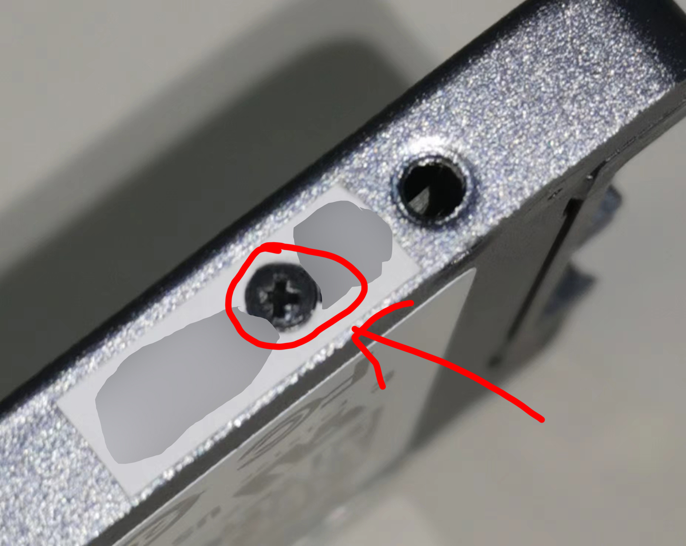

# Some Useful Links

xfjportal share MPTOOL – Smi AU IS Phision … controller   https://xfjportal.com/

SSD utils (30.03.2025)   http://vlo.name:3000/ssdtool/

http://xmrom.kmdns.net:5000/

https://flashinfo.top/FlashInfo

https://flash.microce.com.cn:8888/

SM2320G开卡工具 - EVA存储   https://www.evassd.cn/sm2320g%e5%bc%80%e5%8d%a1%e5%b7%a5%e5%85%b7/

http://tisensen.cn/index.php/archives/37/

固态开卡工具下载站 http://xmrom.kmdns.net:5000/ 

毛子镜像站 http://usbdev.diyflash.top/ 

匿名分享站 http://file.diyflash.top/

# FlashID

<em><strong>品牌选择：</strong></em> 
89 //INTEL 
2C //MICRON 
98 //TOSHIBA 
45 //SANDISK 
AD //HYNIX 
EC //SAMSUNG 
9B //YMTC 

**SpecTek**

https://www.spectek.com/menus/mark_code.aspx

https://www.mydigit.cn/thread-182785-1-1.html

原话：
Grade and Product Definition -AS = Full Spec for SSD (100%)
-AL = Full Spec for USB/SD and low end SSD (100%)
-AF = Full Spec for low end USB/SD (100%)
-AR = Relaxed Spec (see Functional Density)
-MB = Mixed Bins (35%)
-ES = Engineering Sample
-UT = Untested parts
-S5 = Partially tested, est yield of 50% (EOL 4/15/19)
-S7 = Partially tested, est yield of 75%
-S8 = Partially tested, est yield of 85% (EOL 4/15/19)
-S9 = Partially tested, est yield of 90%
-SG = Simple Test Passers/Extended Test Failures (EOL 4/15/19)
-SS = Simple Test Failures (EOL 4/15/19)

翻译过的：
等级和产品定义-AS = SSD的完整规格（100％）
-AL = USB / SD和低端SSD的完整规格（100％）
-AF =低端USB / SD的完整规格（100％）
-AR = 松弛规格（请参见功能密度）
-MB =混合料桶（35％）
-ES =工程样品-UT =未经测试的零件
-S5 =部分测试，最理想的合格率为50％（EOL 4/15/19）
-S7 =部分测试 ，最理想的合格率为75％
-S8 =部分测试，最理想的合格率为85％（EOL 4/15/19）
-S9 =唯一性测试，最理想的合格率为90％
-SG =简单测试合格者/扩展测试失败（EOL 4 / 15/19）
-SS =简单测试失败（EOL 4/15/19）

# 固态主控参数汇总

http://tisensen.cn/index.php/archives/37/

**美满电子Marvell主控资料**

| 型号                   | 等级          | 制程      | 接口                                     | 最大通道 | CE通道 | 最大速率 | 缓存 | 最大容量 |
| ---------------------- | ------------- | --------- | ---------------------------------------- | -------- | ------ | -------- | ---- | -------- |
| 88SS8014               | 消费/企业     | TSMC 90nm | SATA2                                    | 8        | 4      | 100MT/s  | DRAM | 256GB    |
| 88SS9174               | 消费/企业     | TSMC 65nm | SATA3                                    | 8        | 4      | 133MT/s  | DRAM | 1TB      |
| 88SS9175               | 消费          | TSMC 65nm | SATA3                                    | 4        | 4      | 133MT/s  | DRAM | 512GB    |
| 88SS9187               | 消费/企业     | TSMC 55nm | SATA3                                    | 8        | 4      | 200MT/s  | DRAM | 2TB      |
| 88SS9188               | 消费          | TSMC 55nm | SATA3                                    | 4        | 4      | 200MT/s  | DRAM | 1TB      |
| 88SS9189               | 消费/企业     | TSMC 55nm | SATA3                                    | 8        | 4      | 200MT/s  | DRAM | 2TB      |
| 88SS9190               | 消费          | TSMC 55nm | SATA3                                    | 4        | 4      | 200MT/s  | DRAM | 1TB      |
| 88SS9192               | 企业(Sandisk) | -         | SATA3                                    | 8        | 4      | 200MT/s  | DRAM | 2TB      |
| 88SS1074               | 消费/企业     | TSMC 28nm | SATA3                                    | 4        | 8      | 400MT/s  | DRAM | 8TB      |
| 88SS1079               | 消费          | TSMC 28nm | SATA3                                    | 4        | 8      | -        | DRAM | 8TB      |
| 88SS1080               | 消费/企业     | TSMC 28nm | SATA3                                    | 4        | 8      | -        | DRAM | 8TB      |
| 88NV1120               | 消费          | TSMC 28nm | SATA3                                    | 2        | 4      | 400MT/s  | X    | 1TB      |
| 88SS9032               | 企业(Toshiba) | -         | SAS2                                     | 8        | -      | -        | DRAM | 512GB    |
| 88SS9036               | 企业(Toshiba) | -         | SAS2                                     | 8        | -      | -        | DRAM | 512GB    |
| 88i1066                | 企业(Seagate) | -         | SAS3                                     | 8        | -      | -        | DRAM | 1TB      |
| 88SS9185               | 企业(SMART)   | TSMC 55nm | SAS2                                     | 8        | -      | -        | DRAM | 4TB      |
| 88SS1085               | 企业(Sandisk) | TSMC 28nm | SAS3                                     | 8        | -      | -        | DRAM | 8TB      |
| 88NV8120               | 消费          | -         | PCIe                                     | -        | -      | -        | DRAM | -        |
| 88NV9145               | 企业          | TSMC 65nm | PCIe Gen2x1 (AHCI)                       | 4        | 4      | 200MT/s  | DRAM | 128GB    |
| 88SS9183               | 消费          | TSMC 55nm | PCIe Gen2x2 (AHCI)                       | 8        | 4      | 400MT/s  | DRAM | 512GB    |
| 88SS9293               | 消费/企业     | TSMC 40nm | PCIe Gen2x4 (AHCI)                       | 8        | 4      | 400MT/s  | DRAM | 1TB      |
| 88SS1083               | 消费          | TSMC 28nm | PCIe Gen2x2 (AHCI)SATA                   | 8        | -      | 400MT/s  | DRAM | -        |
| 88SS1090               | 消费          | TSMC 28nm | PCIe Gen3x4 (NVMe 1.1)                   | 2        | -      | -        | -    | -        |
| 88SS1093               | 消费/企业     | TSMC 28nm | PCIe Gen3x4 (NVMe 1.2)                   | 8        | 8      | 533MT/s  | DRAM | 4TB      |
| 88SS1095               | 消费/企业     | TSMC 28nm | PCIe Gen3x4 (NVMe 1.2)                   | 4        | 8      | 533MT/s  | DRAM | 2TB      |
| 88SS1092               | 消费/企业     | TSMC 28nm | PCIe Gen3x4 (NVMe 1.3)                   | 8        | 8      | 533MT/s  | DRAM | 8TB      |
| 88NV1140               | 消费          | TSMC 28nm | PCIe Gen3x1 (NVMe 1.3)                   | 2        | 4      | 400MT/s  | HMB  | 1TB      |
| 88NV1160               | 消费          | TSMC 28nm | PCIe Gen3x2 (NVMe 1.3)                   | 4        | 4      | 533MT/s  | HMB  | 1TB      |
| 88SS1032 TC58NC1032GTC | 企业(Toshiba) | -         | PCIe Gen3x4 (NVMe 1.0) SAS3              | -        | -      | -        | DRAM | 4TB      |
| 88SS1033 TC58NC1033GTC | 企业(Toshiba) | -         | PPCIe Gen3x4 PCIe Gen2x2 (NVMe 1.3) SAS3 | 16       | -      | -        | DRAM | 32TB     |
| 88SS1087               | 企业(Sandisk) | TSMC 28nm | PCIe Gen3x4 (NVMe 1.2)                   | -        | -      | -        | DRAM | 4TB      |
| 88SS1098               | 企业          | TSMC 28nm | PCIe Gen3x4 PCIe Gen2x2 (NVMe 1.3)       | 8        | 8      | 800MT/s  | DRAM | 8TB      |
| 88SS1088               | 企业          | TSMC 28nm | PCIe Gen3x4 PCIe Gen2x2 (NVMe 1.3)       | 16       | 8      | 800MT/s  | DRAM | 16TB     |
| 88SS1100               | 消费          | TSMC 28nm | PCIe Gen3x4 (NVMe1.3)                    | 8        | 8      | 800MT/s  | DRAM | 4TB      |
| 88SS1084               | 消费          | TSMC 28nm | PCIe Gen3x4 (NVMe1.3)                    | 4        | 8      | 800MT/s  | DRAM | 4TB      |
| 88SS1321               | 消费/企业     | TSMC 12nm | PCIe Gen4x4 (NVMe1.4)                    | 4        | 8      | 1200MT/s | DRAM | 8TB      |
| 88SS1322               | 消费/企业     | TSMC 12nm | PCIe Gen4x4 (NVMe1.4)                    | 4        | 4      | 1200MT/s | HMB  | 4TB      |
| 88SS1323               | 消费/企业     | TSMC 12nm | PCIe Gen4x2 (NVMe1.4)                    | 4        | 4      | 1200MT/s | HMB  | 4TB      |
| 88SS1132 TC58NC1132GTC | 企业(Toshiba) | TSMC 16nm | PCIe Gen4x4 PCIe Gen2x2 (NVMe1.4) SAS4   | 16       | -      | 800MT/s  | DRAM | 32TB     |
| 88SS1137               | 企业          | TSMC 16nm | PCIe Gen5x4 PCIe Gen2x2 (NVMe2.0)        | 16       | -      | -        | DRAM | 32TB     |
| MV-SS1331              | 企业          | TSMC 12nm | PCIe Gen5x4 PCIe Gen2x2 (NVMe2.0)        | 8        | 8      | 1600MT/s | DRAM | -        |
| MV-SS1333              | 企业          | TSMC 12nm | PCIe Gen5x4 PCIe Gen2x2 (NVMe2.0)        | 16       | 8      | 1600MT/s | DRAM | -        |

**群联电子Phison主控资料**

| 型号                             | 等级 | 制程      | 接口                     | 最大通道 | CE通道 | 最大速率 | 缓存   | 最大容量 |
| -------------------------------- | ---- | --------- | ------------------------ | -------- | ------ | -------- | ------ | -------- |
| S2-PS3102                        | 消费 | 160nm     | SATA2                    | 4        | 4      | -        | X      | -        |
| S3-PS3016-S3                     | 消费 | 90nm      | SATA2                    | 8        | -      | -        | DRAM   | -        |
| S5-PS3105-S5-I                   | 消费 | 90nm      | SATA2                    | 8        | 8      | -        | DRAM   | 512GB    |
| S7-PS3107-S7-D PS3107-S7-J       | 消费 | 90nm      | SATA2                    | 4        | 4      | -        | DRAM/X | 256GB    |
| S8-PS3108-S8-I                   | 消费 | UMC 55nm  | SATA3                    | 8        | 8      | -        | DRAM   | 1TB      |
| S9-PS3109-S9-J PS3109-S9-W       | 消费 | UMC 55nm  | SATA3                    | 4        | 4      | -        | DRAM/X | 256GB    |
| S10-PS3110-S10-X CB              | 消费 | UMC 55nm  | SATA3                    | 8        | 4      | -        | DRAM   | 2TB      |
| S10DC-PS3110-S10-X DC            | 企业 | UMC 55nm  | SATA3                    | 8        | 4      | -        | DRAM   | 2TB      |
| S10C-PS3110-S10C-12              | 消费 | UMC 55nm  | SATA3                    | 4        | 4      | -        | DRAM   | 1TB      |
| S11T-PS3111-S11-13               | 消费 | UMC 40nm  | SATA3                    | 2        | 8      | 533MT/s  | X      | 1TB      |
| S12-PS3112-S12-27                | 消费 | TSMC 28nm | SATA3                    | 8        | 8      | 667MT/s  | DRAM   | 16TB     |
| S12DI-PS3112-S12DI-27            | 工业 | TSMC 28nm | SATA3                    | 8        | 8      | 667MT/s  | DRAM   | 16TB     |
| S12DC-PS3112-S12DC-27            | 企业 | TSMC 28nm | SATA3                    | 8        | 8      | 667MT/s  | DRAM   | 16TB     |
| S13T-PS3113-S13-31               | 消费 | TSMC 28nm | SATA3                    | -        | -      | -        | X      | 2TB      |
| S17T-PS3117-S17 PS3117-S17-13    | 消费 | UMC 28nm  | SATA3                    | 2        | 8      | 1400MT/s | X      | 4TB      |
| S17TI-PS3117-S17TI-13            | 工业 | UMC 28nm  | SATA3                    | 2        | 8      | 1400MT/s | X      | 2TB      |
| E7-PS5007-11                     | 消费 | TSMC 28nm | PCIe Gen3x4 (NVMe1.2)    | 8        | 8      | -        | DRAM   | 4TB      |
| E7DC-PS5007-E7DC                 | 企业 | TSMC 28nm | PCIe Gen3x4 (NVMe1.2)    | 8        | 8      | -        | DRAM   | 2TB      |
| E8-PS5008-E8-10                  | 消费 | UMC 40nm  | PCIe Gen3x2 (NVMe1.2)    | 4        | 8      | -        | DRAM   | 2TB      |
| E8T-PS5008-E8-10                 | 消费 | UMC 40nm  | PCIe Gen3x2 (NVMe1.3)    | 4        | 8      | -        | HMB    | 1TB      |
| E12-PS5012-E12-27                | 消费 | TSMC 28nm | PCIe Gen3x4 (NVMe1.3)    | 8        | 4      | 667MT/s  | DRAM   | 8TB      |
| E12DI-PS5012-E12DI-27            | 工业 | TSMC 28nm | PCIe Gen3x4 (NVMe1.3)    | 8        | 4      | 667MT/s  | DRAM   | 8TB      |
| E12DC-PS5012-E12DC-27            | 企业 | TSMC 28nm | PCIe Gen3x4 (NVMe1.3)    | 8        | 4      | 667MT/s  | DRAM   | 4TB      |
| E12C-PS5012-E12C-10              | 消费 | TSMC 28nm | PCIe Gen3x4 (NVMe1.3)    | 4        | 4      | 667MT/s  | DRAM   | 2TB      |
| E12S-PS5012-E12S-32              | 消费 | TSMC 28nm | PCIe Gen3x4 (NVMe1.3)    | 8        | 4      | 667MT/s  | DRAM   | 8TB      |
| E13T-PS5013-E13-31 PS5013-E13-35 | 消费 | TSMC 28nm | PCIe Gen3x4 (NVMe1.3)    | 4        | 4      | 800MT/s  | HMB    | 2TB      |
| E13TI-PS5013-E13TI-31            | 工业 | TSMC 28nm | PCIe Gen3x4 (NVMe1.3)    | 4        | 4      | 800MT/s  | HMB    | 2TB      |
| E15T-PS5015-E15-35               | 消费 | TSMC 28nm | PCIe Gen3x4 (NVMe1.4)    | 4        | 4      | 1200MT/s | HMB    | 2TB      |
| FX-PS5901-37                     | 企业 | TSMC 28nm | PCIe Gen3x4 (NVMe1.3)    | 12       | -      | -        | DRAM   | 4TB      |
| E16-PS5016-E16-32                | 消费 | TSMC 28nm | PCIe Gen4x4 (NVMe1.3)    | 8        | 4      | 800MT/s  | DRAM   | 8TB      |
| E18-PS5018-E18-41                | 消费 | TSMC 12nm | PCIe Gen4x4 (NVMe1.4)    | 8        | 4      | 1600MT/s | DRAM   | 8TB      |
| E18DI-PS5018-E18DI-41            | 工业 | TSMC 12nm | PCIe Gen4x4 (NVMe1.4)    | 8        | 4      | 1600MT/s | DRAM   | 4TB      |
| E18DC-PS5018-E18DC-41            | 企业 | TSMC 12nm | PCIe Gen4x4 (NVMe1.4)    | 8        | 4      | 1600MT/s | DRAM   | 4TB      |
| E19T-PS5019-E19-35               | 消费 | TSMC 28nm | PCIe Gen4x4 (NVMe1.4)    | 4        | 4      | 1600MT/s | HMB    | 2TB      |
| E20-PS5020BB                     | 企业 | TSMC 12nm | PCIe Gen4x4 2x2(NVMe1.4) | 16       | -      | -        | DRAM   | 32TB     |
| E21T-PS5021-E21-48               | 消费 | TSMC 12nm | PCIe Gen4x4 (NVMe1.4)    | 4        | 4      | 1600MT/s | HMB    | 4TB      |
| E21TI-PS5021-E21TI-48            | 消费 | TSMC 12nm | PCIe Gen4x4 (NVMe1.4)    | 4        | 4      | 1600MT/s | HMB    | 2TB      |
| E22T-PS5022-E22                  | 车辆 | TSMC 12nm | PCIe Gen4x4 2x2(NVMe2.0) | 4        | 4      | 2400MT/s | HMB    | -        |
| E25-PS5025-E25-53                | 消费 | TSMC 12nm | PCIe Gen4x4 (NVMe2.0)    | 4        | 4      | 2400MT/s | DRAM   | 4TB      |
| E26-PS5026-E26-52                | 消费 | TSMC 12nm | PCIe Gen5x4 (NVMe2.0)    | 8        | 4      | 2400MT/s | DRAM   | 32TB     |
| E26DC-PS5026-E26DC-52            | 企业 | TSMC 12nm | PCIe Gen5x4 (NVMe2.0)    | 8        | 4      | 2400MT/s | DRAM   | 8TB      |
| E27T-PS5027-E27-61               | 消费 | TSMC 12nm | PCIe Gen4x4 (NVMe2.0)    | 4        | 4      | 3600MT/s | HMB    | 8TB      |
| E31T-PS5031-E31                  | 消费 | TSMC 7nm  | PCIe Gen5x4 (NVMe2.0)    | 4        | 4      | 3600MT/s | HMB    | 8TB      |

**慧荣科技SiliconMotion主控资料**

| 型号        | 等级      | 制程      | 接口                     | 最大通道 | CE通道 | 最大速率 | 缓存 | 最大容量 |
| ----------- | --------- | --------- | ------------------------ | -------- | ------ | -------- | ---- | -------- |
| SM2240      | 消费      | -         | SATA2                    | 4        | 16     | -        | X    | -        |
| SM2242      | 消费      | -         | SATA2                    | 4        | 8      | -        | X    | -        |
| SM2244      | 消费      | 130nm     | SATA2                    | 4        | 8      | 200MT/s  | DRAM | -        |
| SM2244LT    | 消费      | 130nm     | SATA2                    | 2/4      | 4/8    | 200MT/s  | X    | -        |
| SM2246      | 消费      | TSMC 55nm | SATA3                    | 4        | 1      | 400MT/s  | DRAM | 128G     |
| SM2246EN    | 消费      | TSMC 55nm | SATA3                    | 4        | 8      | 400MT/s  | DRAM | 1TB      |
| SM2246XT    | 消费      | TSMC 55nm | SATA3                    | 2/4      | 2/4    | 400MT/s  | X    | 512GB    |
| SM2250      | 消费      | -         | SATA2                    | 8        | 8      | 200MT/s  | DRAM | -        |
| SM2254      | 消费      | TSMC 40nm | SATA3                    | 4        | 8      | 400MT/s  | DRAM | -        |
| SM2256      | 消费      | TSMC 55nm | SATA3                    | 4        | 8      | 400MT/s  | DRAM | 2TB      |
| SM2258      | 消费      | TSMC 40nm | SATA3                    | 4        | 8      | 400MT/s  | DRAM | 2TB      |
| SM2258XT    | 消费      | TSMC 40nm | SATA3                    | 4        | 4      | 400MT/s  | X    | 2TB      |
| SM2259      | 消费      | TSMC 40nm | SATA3                    | 4        | 8      | 800MT/s  | DRAM | 4TB      |
| SM2259XT    | 消费      | TSMC 28nm | SATA3                    | 4        | 4      | 800MT/s  | X    | 2TB      |
| SM2259XT2   | 消费      | TSMC 28nm | SATA3                    | 2        | 8      | 800MT/s  | X    | 2TB      |
| SM2271      | 企业      | TSMC 28nm | SATA3                    | 8        | 8      | 800MT/s  | DRAM | 16TB     |
| SM2260      | 消费/企业 | TSMC 40nm | PCIe Gen3x4 (NVMe1.2)    | 8        | 4      | 533MT/s  | DRAM | 2TB      |
| SM2261XT    | 消费      | TSMC 28nm | PCIe Gen3x2 (NVMe1.4)    | 2        | 8      | 1200MT/s | HMB  | 2TB      |
| SM2262      | 消费      | TSMC 28nm | PCIe Gen3x4 (NVMe1.3)    | 8        | 4      | 800MT/s  | DRAM | 2TB      |
| SM2262EN    | 消费      | TSMC 28nm | PCIe Gen3x4 (NVMe1.3)    | 8        | 4      | 800MT/s  | DRAM | 2TB      |
| SM2263      | 消费      | TSMC 28nm | PCIe Gen3x4 (NVMe1.3)    | 4        | 4      | 667MT/s  | DRAM | 2TB      |
| SM2263EN    | 消费      | TSMC 28nm | PCIe Gen3x4 (NVMe1.3)    | 4        | 4      | 800MT/s  | DRAM | 2TB      |
| SM2263XT    | 消费      | TSMC 28nm | PCIe Gen3x4 (NVMe1.3)    | 4        | 4      | 800MT/s  | HMB  | 2TB      |
| SM2263XT-AT | 车载      | TSMC 28nm | PCIe Gen3x4 (NVMe1.3)    | 4        | -      | -        | HMB  | 1TB      |
| SM2264      | 消费      | TSMC 12nm | PCIe Gen4x4 (NVMe1.4)    | 8        | 8      | 1600MT/s | DRAM | 16TB     |
| SM2264XT-AT | 车载      | TSMC 12nm | PCIe Gen4x4 (NVMe1.4)    | 8        | -      | 1600MT/s | HMB  | 1TB      |
| SM2265      | 消费      | TSMC 28nm | PCIe Gen3x4 (NVMe1.4)    | 4        | 8      | 1200MT/s | DRAM | 4TB      |
| SM2267      | 消费      | TSMC 28nm | PCIe Gen4x4 (NVMe1.4)    | 4        | 8      | 1200MT/s | DRAM | 4TB      |
| SM2267XT    | 消费      | TSMC 28nm | PCIe Gen4x4 (NVMe1.4)    | 4        | 4      | 1200MT/s | HMB  | 4TB      |
| SM2268XT    | 消费      | TSMC 12nm | PCIe Gen4x4 (NVMe2.0)    | 4        | 4      | 3200MT/s | HMB  | 4TB      |
| SM2268XT-AT | 车载      | TSMC 12nm | PCIe Gen4x4 (NVMe2.0)    | 4        | -      | -        | HMB  | 1TB      |
| SM2269XT    | 消费      | TSMC 12nm | PCIe Gen4x4 (NVMe2.0)    | 4        | 4      | 1600MT/s | HMB  | 4TB      |
| SM2270      | 企业      | TSMC 28nm | PCIe Gen3x4 3x8(NVMe1.3) | 16       | 8      | 800MT/s  | DRAM | 16TB     |
| SM8108      | 企业      | TSMC 28nm | PCIe Gen3x4 (NVMe1.3)    | 8        | 8      | 800MT/s  | DRAM | 16TB     |
| SM8266      | 企业      | -         | PCIe Gen4x4 (NVMe1.4)    | 16       | 8      | 1200MT/s | DRAM | 16TB     |
| SM8208      | 企业      | -         | PCIe Gen4x4 (NVMe1.4)    | 8        | -      | 1200MT/s | DRAM | 16TB     |
| SM8366      | 企业      | TSMC 12nm | PCIe Gen5x4 2x2(NVMe2.0) | 16       | -      | 2400MT/s | DRAM | 128TB    |
| SM8308      | 企业      | TSMC 12nm | PCIe Gen5x4 2x2(NVMe2.0) | 8        | -      | 2400MT/s | DRAM | 128TB    |
| SM2508      | 消费      | TSMC 6nm  | PCIe Gen5x4 (NVMe2.0)    | 8        | -      | 3600MT/s | DRAM | -        |
| SM2504XT    | 消费      | TSMC 7nm  | PCIe Gen5x4 (NVMe2.0)    | 4        | 4      | 3600MT/s | HMB  | -        |

**联芸科技Maxio主控资料**

| 型号      | 等级      | 制程      | 接口                  | 最大通道 | CE通道 | 最大速率 | 缓存 | 最大容量 |
| --------- | --------- | --------- | --------------------- | -------- | ------ | -------- | ---- | -------- |
| MAS0601-C | 消费      | TSMC 40nm | SATA3                 | 4        | 8      | 400MT/s  | DRAM | 512GB    |
| MAS0801-C | 消费      | TSMC 40nm | SATA3                 | 4        | 8      | 400MT/s  | DRAM | 2TB      |
| MAS0802-C | 消费      | TSMC 40nm | SATA3                 | 4        | 8      | 400MT/s  | X    | 2TB      |
| MAS0901-C | 消费      | GF 40nm   | SATA3                 | 4        | 8      | 667MT/s  | DRAM | 4TB      |
| MAS0901-I | 工业      | GF 40nm   | SATA3                 | 4        | 8      | 667MT/s  | DRAM | 4TB      |
| MAS0901-E | 企业      | GF 40nm   | SATA3                 | 4        | 8      | 667MT/s  | DRAM | 4TB      |
| MAS0902-C | 消费      | GF 40nm   | SATA3                 | 4        | 8      | 667MT/s  | X    | 4TB      |
| MAS0902-I | 工业      | GF 40nm   | SATA3                 | 4        | 8      | 667MT/s  | X    | 4TB      |
| MAS1101-E | 企业      | -         | SATA3                 | 8        | 4/8    | 1200MT/s | DRAM | 8TB      |
| MAS1102-C | 消费      | -         | SATA3                 | 2        | 8      | 667MT/s  | X    | 4TB      |
| MAS1102-I | 工业      | -         | SATA3                 | 2        | 8      | 667MT/s  | X    | 4TB      |
| MAP0901-C | 消费      | GF 40nm   | PCIe Gen3x4 (NVMe1.2) | -        | -      | 667MT/s  | DRAM | 4TB      |
| MAP0902-C | 消费      | GF 40nm   | PCIe Gen3x4 (NVMe1.2) | -        | -      | 667MT/s  | HMB  | 4TB      |
| MAP1001-C | 消费      | TSMC 28nm | PCIe Gen3x4 (NVMe1.3) | 8        | 4      | 800MT/s  | DRAM | 8TB      |
| MAP1002-C | 消费      | TSMC 28nm | PCIe Gen3x4 (NVMe1.3) | 4        | 4      | 800MT/s  | HMB  | 2TB      |
| MAP1002-I | 工业      | TSMC 28nm | PCIe Gen3x4 (NVMe1.3) | 4        | 4      | 800MT/s  | HMB  | 2TB      |
| MAP1003-C | 消费      | TSMC 28nm | PCIe Gen3x4 (NVMe1.3) | 4        | 4      | 800MT/s  | DRAM | 2TB      |
| MAP1201-E | 企业      | TSMC 22nm | PCIe Gen3x4 (NVMe1.3) | 8        | 4/8    | 1600MT/s | DRAM | 8TB      |
| MAP1202-C | 消费      | TSMC 22nm | PCIe Gen3x4 (NVMe1.4) | 4        | 4      | 1600MT/s | HMB  | 4TB      |
| MAP1202-I | 工业      | TSMC 22nm | PCIe Gen3x4 (NVMe1.4) | 4        | 4      | 1600MT/s | HMB  | 4TB      |
| MAP1601-E | 企业      | TSMC 12nm | PCIe Gen4x4 (NVMe2.0) | 8        | 4/8    | 2400MT/s | DRAM | 8TB      |
| MAP1602-C | 消费      | TSMC 12nm | PCIe Gen4x4 (NVMe2.0) | 4        | 4/8    | 2400MT/s | HMB  | 4TB      |
| MAP1602-I | 工业      | TSMC 12nm | PCIe Gen4x4 (NVMe2.0) | 4        | 4/8    | 2400MT/s | HMB  | 4TB      |
| MAP1802   | 消费/工业 | -         | PCIe Gen5x4 (NVMe2.0) | 4        | 8      | 4800MT/s | HMB  | 8TB      |
| MAP1806   | 消费/工业 | -         | PCIe Gen5x4 (NVMe2.0) | 8        | 4      | 3600MT/s | HMB  | 16TB     |
| MAP1803   | 企业      | -         | PCIe Gen5x4 (NVMe2.0) | 16       | 8      | 3200MT/s | DRAM | 64TB     |

**英韧科技InnoGrit主控资料**

| 型号   | 等级 | 制程      | 接口                  | 最大通道 | CE通道 | 最大速率 | 缓存 | 最大容量 |
| ------ | ---- | --------- | --------------------- | -------- | ------ | -------- | ---- | -------- |
| IG5600 | 企业 | TSMC 12nm | SATA3                 | 8        | 8      | 1200MT/s | DRAM | 16TB     |
| IG5208 | 消费 | TSMC 28nm | PCIe Gen3x2 (NVMe1.3) | 4        | 4      | 800MT/s  | HMB  | 2TB      |
| IG5216 | 消费 | TSMC 28nm | PCIe Gen3x4 (NVMe1.4) | 4        | 4      | 1200MT/s | HMB  | 2TB      |
| IG5220 | 消费 | TSMC 12nm | PCIe Gen4x4 (NVMe1.4) | 4        | 4/8    | 2400MT/s | HMB  | 4TB      |
| IG5221 | 消费 | TSMC 12nm | PCIe Gen4x4 (NVMe1.4) | 4        | 4/8    | 2400MT/s | DRAM | 8TB      |
| IG5236 | 消费 | TSMC 12nm | PCIe Gen4x4 (NVMe1.4) | 8        | 4/8    | 1200MT/s | DRAM | 8TB      |
| IG5238 | 消费 | TSMC 12nm | PCIe Gen4x4 (NVMe1.4) | 8        | -      | -        | DRAM | -        |
| IG5636 | 企业 | TSMC 12nm | PCIe Gen4x4 (NVMe1.4) | 8        | 8      | 1200MT/s | DRAM | 16TB     |
| IG5638 | 企业 | TSMC 12nm | PCIe Gen4x4 (NVMe1.4) | 8        | 8      | 2400MT/s | DRAM | 16TB     |
| IG5666 | 消费 | TSMC 12nm | PCIe Gen5x4 (NVMe2.0) | 8        | 8      | 2400MT/s | DRAM | 16TB     |
| IG5668 | 企业 | TSMC 12nm | PCIe Gen4x4 (NVMe1.4) | 16       | -      | 1200MT/s | DRAM | 32TB     |
| IG5669 | 企业 | TSMC 12nm | PCIe Gen5x4 (NVMe2.0) | 16/18    | -      | 2667MT/s | DRAM | 32TB     |
| YRS820 | 消费 | -         | PCIe Gen5x4 (NVMe2.0) | 8        | -      | 2667MT   | DRAM | 8TB      |
| YRS900 | 企业 | -         | PCIe Gen5x4 (NVMe2.0) | 16       | -      | 2667MT   | DRAM | 32TB     |

**瑞昱半导体Realtek主控资料**

| 型号       | 等级      | 制程 | 接口                        | 最大通道 | CE通道 | 最大速率 | 缓存 | 最大容量 |
| ---------- | --------- | ---- | --------------------------- | -------- | ------ | -------- | ---- | -------- |
| RTS5731    | 消费      | 55nm | SATA3                       | 8        | -      | -        | DRAM | 2TB      |
| RTS5732DL  | 消费      | -    | SATA3                       | 2        | -      | -        | X    | -        |
| RTS5732DLQ | 消费      | -    | SATA3                       | 2        | -      | -        | X    | -        |
| RTS5733DMQ | 消费      | -    | SATA3                       | 2        | -      | -        | X    | 4TB      |
| RTS5735DLQ | 消费      | -    | SATA3                       | 2        | 8      | 533MT/s  | X    | -        |
| RTS5735DLT | 消费      | -    | SATA3                       | 2        | -      | -        | X    | -        |
| RTS5760    | 消费      | 55nm | PCIe Gen3x2 (NVMe1.2)       | 4        | 8      | -        | DRAM | -        |
| RTS5761    | 消费/企业 | 55nm | PCIe Gen3x4 (NVMe1.2)&SATA3 | 8        | 8      | -        | DRAM | -        |
| RTS5762    | 消费      | 28nm | PCIe Gen3x4 (NVMe1.3)       | 8        | 4      | 667MT/s  | DRAM | -        |
| RTS5762DL  | 消费      | 28nm | PCIe Gen3x4 (NVMe1.3)       | 4        | -      | 667MT/s  | HMB  | -        |
| RTS5763DL  | 消费      | 28nm | PCIe Gen3x4 (NVMe1.3)       | 4        | -      | -        | HMB  | -        |
| RTS5765DL  | 消费      | -    | PCIe Gen3x4 (NVMe1.4)       | 4        | -      | 1200MT/s | HMB  | -        |
| RTS5766DL  | 消费      | -    | PCIe Gen3x4 (NVMe1.4)       | 4        | 4      | 1066MT/s | HMB  | -        |
| RTS5768DL  | 消费      | -    | PCIe Gen3x4 (NVMe1.4)       | 4        | -      | -        | HMB  | -        |
| RTS5771    | 消费      | -    | PCIe Gen4x4 (NVMe1.3)       | 8        | -      | 1200MT/s | DRAM | -        |
| RTS5771DL  | 消费      | -    | PCIe Gen4x4 (NVMe1.4)       | 4        | 4      | 1600MT/s | HMB  | -        |
| RTS5772DL  | 消费      | -    | PCIe Gen4x4 (NVMe1.4)       | 8        | 4      | 1600MT/s | HMB  | -        |
| RTS5776DL  | 消费      | -    | PCIe Gen4x4 (NVMe1.4)       | 4        | 4      | 3600MT/s | HMB  | -        |
| RTS5781DL  | 消费      | -    | PCIe Gen5x4                 | 4        | 4      | 3600MT/s | HMB  | -        |
| RTS5782    | 消费      | -    | PCIe Gen5x4                 | 8        | -      | 3600MT/s | DRAM | -        |

**智微科技JMicron主控资料**

| 型号    | 等级 | 制程      | 接口                  | 最大通道 | CE通道 | 最大速率 | 缓存 | 最大容量 |
| ------- | ---- | --------- | --------------------- | -------- | ------ | -------- | ---- | -------- |
| JMF601  | 消费 | UMC 180nm | SATA2/USB2.0          | 4        | 16     | -        | X    | 64GB     |
| JMF602  | 消费 | UMC 180nm | SATA2/USB2.0          | 8        | 32     | -        | X    | 256GB    |
| JMF604  | 消费 | UMC 130nm | SATA2/USB2.0          | 8        | 16     | -        | DRAM | 256GB    |
| JMF605  | 消费 | UMC 130nm | SATA2                 | 4        | 4      | -        | X    | 128GB    |
| JMF606  | 消费 | -         | SATA3                 | 4        | 4      | 200MT/s  | X    | 256GB    |
| JMF607  | 消费 | -         | SATA3                 | 2        | 4      | 200MT/s  | X    | 128GB    |
| JMF608  | 消费 | TSMC 55nm | SATA3                 | 4        | 4      | 400MT/s  | X    | 128GB    |
| JMF609  | 消费 | TSMC 55nm | SATA3                 | 2        | 4      | 400MT/s  | X    | 128GB    |
| JMF60F  | 消费 | TSMC 55nm | SATA3                 | 2        | -      | 400MT/s  | X    | 256GB    |
| JMF611  | 消费 | UMC 130nm | SATA2/USB2.0          | 4        | -      | -        | DRAM | -        |
| JMF612  | 消费 | UMC 130nm | SATA2/USB2.0          | 8        | 16     | -        | DRAM | 512GB    |
| JMF616  | 消费 | UMC 130nm | SATA2/USB2.0          | 8        | 16     | -        | DRAM | 512GB    |
| JMF618  | 消费 | UMC 130nm | SATA2                 | 8        | 16     | -        | DRAM | 256GB    |
| JMF661  | 消费 | -         | SATA3                 | 4        | 16     | 200MT/s  | DRAM | 512GB    |
| JMF662  | 消费 | -         | SATA3                 | 8        | 16     | 200MT/s  | DRAM | 512GB    |
| JMF665  | 消费 | -         | SATA3                 | -        | -      | -        | DRAM | -        |
| JMF667  | 消费 | TSMC 55nm | SATA3                 | 4        | 1      | 400MT/s  | DRAM | 32GB     |
| JMF667H | 消费 | TSMC 55nm | SATA3                 | 4        | 8      | 400MT/s  | DRAM | 256GB    |
| JMF668  | 消费 | -         | SATA3                 | 4        | 16     | 200MT/s  | DRAM | 256GB    |
| JMF670H | 消费 | TSMC 55nm | SATA3                 | 4        | 8      | 667MT/s  | DRAM | 512GB    |
| JMF680H | 消费 | -         | SATA3                 | 4        | -      | 667MT/s  | DRAM | 2TB      |
| JMF810  | 消费 | -         | PCIe Gen2x2 AHCI&SATA | 8        | -      | -        | DRAM | 512GB    |
| JMF811  | 消费 | -         | PCIe Gen2x4 (AHCI)    | 8        | -      | -        | DRAM | 512GB    |
| JMF815  | 消费 | -         | PCIe Gen3x2 (AHCI)    | 4        | -      | 667MT/s  | DRAM | 2TB      |

**得一微电子Yeestor主控资料**

硅格半导体SiliconGo/大心电子EpoStar

| 型号              | 等级      | 制程      | 接口                  | 最大通道 | CE通道 | 最大速率 | 缓存 | 最大容量 |
| ----------------- | --------- | --------- | --------------------- | -------- | ------ | -------- | ---- | -------- |
| YS9081XT SG9081XT | 消费      | TSMC 55nm | SATA3                 | 4        | 4      | 400MT/s  | X    | -        |
| YS9083XT          | 消费      | TSMC 55nm | SATA3                 | 2        | 4      | 400MT/s  | X    | -        |
| YS9085N           | 消费      | TSMC 40nm | SATA3                 | 2        | 4      | 400MT/s  | X    | -        |
| YS9082HC          | 消费      | TSMC 40nm | SATA3                 | 4        | 4      | 400MT/s  | X    | -        |
| YS9082HP          | 消费      | TSMC 40nm | SATA3                 | 4        | 4      | 400MT/s  | X    | -        |
| YS9082HT          | 消费      | TSMC 28nm | SATA3                 | 4        | 4      | 400MT/s  | X    | -        |
| YS9201 EP160      | 消费      | TSMC 40nm | PCIe Gen3x2 (NVMe1.3) | 4        | 8      | 800MT/s  | DRAM | -        |
| YS9203 EP280      | 消费/企业 | TSMC 28nm | PCIe Gen3x4 (NVMe1.3) | 8        | 8      | 800MT/s  | DRAM | -        |
| YS9205            | 消费/企业 | TSMC 28nm | PCIe Gen3x4 (NVMe1.4) | 4        | 4      | 800MT/s  | DRAM | -        |
| YS9301            | 消费      | TSMC 16nm | PCIe Gen4x4 (NVMe1.4) | 4        | 4      | 1200MT/s | HMB  | -        |
| YS9303            | 消费      | TSMC 12nm | PCIe Gen4x4 (NVMe2.0) | 4        | 4      | 3200MT/s | HMB  | -        |
| YS9501            | 企业      | -         | PCIe Gen5x4 (NVMe2.0) | 16       | 8      | 2400MT/s | DRAM | -        |

**沛睿微电子RayMX(瑞昱Realtek)主控资料**

| 型号    | 等级 | 制程 | 接口                  | 最大通道 | CE通道 | 最大速率 | 缓存 | 最大容量 |
| ------- | ---- | ---- | --------------------- | -------- | ------ | -------- | ---- | -------- |
| RM1135  | 消费 | -    | SATA3                 | 2        | 8      | 533MT/s  | X    | -        |
| RM1362  | 消费 | -    | PCIe Gen3x4 (NVMe1.3) | 8        | 8      | 667MT/s  | DRAM | -        |
| RM1366  | 消费 | -    | PCIe Gen3x4 (NVMe1.4) | 4        | 4      | 1066MT/s | HMB  | -        |
| RMS5771 | 消费 | -    | PCIe Gen4x4 (NVMe1.4) | 4        | 4      | 1600MT/s | HMB  | -        |
| RMS5772 | 消费 | -    | PCIe Gen4x4 (NVMe1.4) | 8        | 4      | 1600MT/s | HMB  | -        |

**国科微电子Goke(芯盛智能XITC)主控资料**

| 型号               | 等级      | 制程      | 接口                  | 最大通道 | CE通道 | 最大速率 | 缓存 | 最大容量 |
| ------------------ | --------- | --------- | --------------------- | -------- | ------ | -------- | ---- | -------- |
| GK2101             | 企业      | 40nm      | PCIe Gen2x4(NVMe1.0)  | 8        | 8      | 333MT/s  | X    | 2TB      |
| GK2102             | 企业      | 40nm      | SATA3                 | 8        | 8      | 333MT/s  | X    | 2TB      |
| GK2301             | 消费/企业 | 40nm      | SATA3                 | 4        | 8      | 400MT/s  | DRAM | 4TB      |
| GK2302             | 消费/企业 | SMIC 40nm | SATA3                 | 4        | 8      | 400MT/s  | DRAM | 4TB      |
| GK2302v200         | 消费/企业 | SMIC 40nm | SATA3                 | 2        | 8      | 533MT/s  | X    | 4TB      |
| XT6110             | 消费/企业 | UMC 40nm  | SATA3                 | 4        | 8      | -        | DRAM | 4TB      |
| XT6111 PS3111-S11  | 消费      | UMC 40nm  | SATA3                 | 2        | 8      | 533MT/s  | X    | 4TB      |
| XT6120             | 消费/企业 | TSMC 12nm | SATA3                 | 8        | 4      | -        | DRAM | 8TB      |
| XT6121             | 消费      | TSMC 12nm | SATA3                 | 2        | 8      | -        | X    | 2TB      |
| XT6130             | 消费/企业 | TSMC 12nm | SATA3                 | 8        | 4      | 1600MT/s | DRAM | 16TB     |
| GK2311 GOKE2311G   | 消费/企业 | TSMC 28nm | PCIe Gen3x4 (NVMe1.3) | 4        | 8      | 800MT/s  | DRAM | 4TB      |
| XITC2311 XITC2311G | 消费/企业 | TSMC 28nm | PCIe Gen3x4 (NVMe1.3) | 4        | 8      | 800MT/s  | DRAM | 8TB      |
| XT8110 PS5012-E12S | 消费      | TSMC 28nm | PCIe Gen3x4 (NVMe1.3) | 8        | 4      | 667MT/s  | DRAM | 8TB      |
| XT8111 PS5013-E13  | 消费      | TSMC 28nm | PCIe Gen3x4 (NVMe1.3) | 4        | 4      | 800MT/s  | HMB  | 2TB      |
| XT8210             | 消费/企业 | TSMC 12nm | PCIe Gen4x4 (NVMe1.4) | 8        | 4      | 1600MT/s | DRAM | 16TB     |

**云莲科技Maxiotek主控资料**

| 型号   | 等级 | 制程      | 接口  | 最大通道 | CE通道 | 最大速率 | 缓存 | 最大容量 |
| ------ | ---- | --------- | ----- | -------- | ------ | -------- | ---- | -------- |
| MK8113 | 消费 | TSMC 40nm | SATA3 | 4        | 8      | 400MT/s  | DRAM | 2TB      |
| MK8115 | 消费 | TSMC 40nm | SATA3 | 4        | 8      | 400MT/s  | X    | 2TB      |
| MK8213 | 消费 | GF 40nm   | SATA3 | 4        | 8      | 667MT/s  | DRAM | 2TB      |
| MK8215 | 消费 | GF 40nm   | SATA3 | 4        | 8      | 667MT/s  | X    | 2TB      |

**忆芯科技StarBlaze主控资料**

| 型号        | 等级      | 制程      | 接口                     | 最大通道 | CE通道 | 最大速率 | 缓存 | 最大容量 |
| ----------- | --------- | --------- | ------------------------ | -------- | ------ | -------- | ---- | -------- |
| MB1000      | 企业      | TSMC 28nm | PCIe Gen3x4 2x2(NVMe1.2) | -        | -      | -        | -    | -        |
| STAR1000    | 消费      | TSMC 28nm | PCIe Gen3x4 (NVMe1.2)    | 8        | -      | 800MT/s  | DRAM | 32TB     |
| STAR1000P   | 消费/企业 | TSMC 28nm | PCIe Gen3x4 (NVMe1.4)    | 8        | -      | 800MT/s  | DRAM | 32TB     |
| STAR1000t-L | 消费      | TSMC 28nm | PCIe Gen3x4 (NVMe1.2)    | 8        | -      | 800MT/s  | HMB  | 2TB      |
| STAR2000    | 企业      | TSMC 12nm | PCIe Gen4x4 2x2(NVMe2.0) | 16       | -      | -        | DRAM | 128TB    |
| STAR1500    | 消费      | SS 8nm    | PCIe Gen5x4 (NVMe2.0)    | 8        | -      | 3600MT/s | DRAM | -        |
| STAR1516    | 企业      | SS 8nm    | PCIe Gen5x4 (NVMe2.0)    | 16       | -      | 3600MT/s | DRAM | -        |

**矽统科技SiS主控资料(联钜科技LinkVast)**

| 型号     | 等级 | 制程  | 接口                  | 最大通道 | CE通道 | 最大速率 | 缓存 | 最大容量 |
| -------- | ---- | ----- | --------------------- | -------- | ------ | -------- | ---- | -------- |
| LVT815   | 消费 | 110nm | SATA2                 | 4        | 8      | -        | DRAM | -        |
| LVT820   | 消费 | 110nm | SATA2                 | 8        | 8      | -        | DRAM | -        |
| SiS750GT | 消费 | -     | SATA3                 | 4        | -      | -        | DRAM | -        |
| SiS750   | 消费 | -     | SATA3                 | 4        | -      | -        | X    | -        |
| SiS810   | 消费 | -     | PCIe Gen3x2 (NVMe1.3) | 4        | -      | -        | DRAM | -        |
| SiS832   | 消费 | -     | PCIe Gen3x4 (NVMe1.3) | 4        | -      | -        | DRAM | -        |
| SiS850   | 消费 | -     | PCIe Gen3x4 (NVMe1.3) | 8        | -      | -        | DRAM | -        |

**点序科技ASolid主控资料**

| 型号   | 等级 | 制程     | 接口                  | 最大通道 | CE通道 | 最大速率 | 缓存 | 最大容量 |
| ------ | ---- | -------- | --------------------- | -------- | ------ | -------- | ---- | -------- |
| AS2258 | 消费 | UMC 40nm | SATA3                 | 2        | 8      | 800MT/s  | X    | -        |
| AS2263 | 消费 | -        | PCIe Gen3x4 (NVMe1.4) | 4        | 4      | 800MT/s  | HMB  | 2TB      |

**特纳飞电子TenaFe主控资料**

| 型号   | 等级 | 制程      | 接口                  | 最大通道 | CE通道 | 最大速率 | 缓存 | 最大容量 |
| ------ | ---- | --------- | --------------------- | -------- | ------ | -------- | ---- | -------- |
| TC2200 | 消费 | TSMC 12nm | PCIe Gen4x4 (NVMe1.4) | 4        | 4      | 1600MT/s | HMB  | -        |
| TC2201 | 消费 | TSMC 12nm | PCIe Gen4x4 (NVMe1.4) | 4        | 4      | 2400MT/s | HMB  | -        |

# 3D NAND颗粒对比

长江存储,三星,海力士,镁光的3D NAND颗粒参数对比，因为各家技术路线不同，该表仅供参考不能反映技术高低

| 名称          | 封装面积(mm²) | 容量(Gb) | 密度(Gb/mm²) | 堆叠层数 | 串叠数 | WL间距(nm) | BL间距(nm) | VC高度(μm) | 填充深度(μm) |
| ------------- | ------------- | -------- | ------------ | -------- | ------ | ---------- | ---------- | ---------- | ------------ |
| YMTC-128L     | 60.42         | 512      | 8.47         | 128      | 2      | 58         | 39         | 8.5        | 8.8          |
| YMTC-232L     | 68.15         | 1024     | 15.03        | 232      | 2      | 48         | 39         | 12.4       | 12.7         |
| Samsumg-128L  | 73.60         | 512      | 6.96         | 128      | 1      | 44         | 38         | 6.6        | 6.7          |
| Samsumg-176L  | 47.10         | 512      | 10.87        | 176      | 2      | 43         | 38         | 8.9        | 9.2          |
| SK Hynix-128L | 63.00         | 512      | 8.13         | 128      | 2      | 52         | 39         | 8.1        | 8            |
| SK Hynix-176L | 46.50         | 512      | 11.01        | 176      | 2      | 45         | 38         | 9.4        | 9.3          |
| Micron-128L   | 66.08         | 512      | 7.75         | 128      | 2      | 56         | 38         | 8.6        | 9            |
| Micron-176L   | 49.84         | 512      | 10.27        | 176      | 2      | 56         | 38         | 10.7       | 11           |

------

**长江YMTC存储3D NAND颗粒资料**

| 名称      | 代号    | 类型 | 层数 | Die容量  | 架构        | 接口              | 最大封装   |
| --------- | ------- | ---- | ---- | -------- | ----------- | ----------------- | ---------- |
| DBS大别山 | X0-A030 | MLC  | 32   | 64Gbit   | TCAT        | ONFI3.0(400MT/s)  | 4Die32GB   |
| JGS井冈山 | X1-9050 | TLC  | 64   | 256Gbit  | Xtacking1.0 | ONFI4.0(800MT/s)  | 16Die512GB |
| TAS泰山   | X2-9060 | TLC  | 128  | 512Gbit  | Xtacking2.0 | ONFI4.2(1600MT/s) | 16Die1TB   |
| HUS黄山   | X2-6070 | QLC  | 128  | 1.33Tbit | Xtacking2.0 | ONFI4.2(1600MT/s) | 3Die512GB  |
| WYS武夷山 | X3-9060 | TLC  | 128  | 512Gbit  | Xtacking3.0 | ONFI5.0(2400MT/s) | 16Die1TB   |
| WDS武当山 | X3-9070 | TLC  | 232  | 1Tbit    | Xtacking3.0 | ONFI5.0(2400MT/s) | 16Die2TB   |
| EMS峨眉山 | X3-6070 | QLC  | 232  | 1Tbit    | Xtacking3.0 | ONFI5.0(2400MT/s) | 8Die1TB    |
| WT五台山  | X4-9060 | TLC  | 128  | 512Gbit  | Xtacking4.0 | ONFI5.1(3600MT/s) | -          |

**SAMSUMG三星存储3D V-NAND颗粒资料**

| 名称      | 代号   | 量产时间 | 层数 | Die容量         | 接口                | Die标识                     |
| --------- | ------ | -------- | ---- | --------------- | ------------------- | --------------------------- |
| SSV1      | V1 MLC | 2013     | 24   | 128Gbit         | Toggle2.0(533MT/s)  | K9GDGD8S/U0M                |
| SSV2      | V2 MLC | 2015     | 32   | 128Gbit         | Toggle3.0(1000MT/s) | K9GDGD8U0A                  |
| SSV2      | V2 TLC | 2014     | 32   | 128Gbit         | Toggle3.0(1000MT/s) | K9ADGD8S0A K9ADGD8U0C       |
| SSV3      | V3 MLC | 2016     | 48   | 256Gbit         | Toggle3.0(1000MT/s) | K9GFGD8F/U0M                |
| SSV3      | V3 TLC | 2015     | 48   | 128Gbit 256Gbit | Toggle3.0(1000MT/s) | K9ADGD8U0E K9AFGD8U0M       |
| SSV4      | V4 MLC | 2017     | 64   | 256Gbit         | Toggle3.0(1000MT/s) | K9GFGD8H/J0A                |
| SSV4      | V4 TLC | 2017     | 64   | 256Gbit 512Gbit | Toggle3.0(1000MT/s) | K9AFGD8H0A K9AHGD8H/J/U0M   |
| SSV4      | V4 QLC | 2018     | 64   | 1Tbit           | Toggle3.0(1000MT/s) | K93KGD8U0M                  |
| SSV5      | V5 TLC | 2018     | 92   | 256Gbit 512Gbit | Toggle4.0(1400MT/s) | K9AFGD8H/J0B K9AHGD8H/J0A   |
| SSV5      | V5 QLC | 2020     | 92   | 1Tbit           | Toggle4.0(1200MT/s) | K93KGD8J0A                  |
| SSV6      | V6 TLC | 2020     | 128  | 256Gbit 512Gbit | Toggle4.0(1400MT/s) | K9AFGD8J/U0C K9AHGD8H/J/U0B |
| SSV6P     | V6 TLC | 2022     | 133  | 512Gbit         | Toggle4.0(1600MT/s) | K9AHGD8J0E                  |
| SSV7      | V7 TLC | 2022     | 176  | 512Gbit         | Toggle5.0(2000MT/s) | K9AHGD8J/U0D                |
| SSV7      | V7 QLC | 2023     | 176  | 1Tbit           | Toggle4.0(1600MT/s) | K93KGD8J0C                  |
| SSV8      | V8 TLC | 2023     | 236  | 512Gbit 1Tbit   | Toggle5.0(2400MT/s) | K9AHGD8J0F K9AKGD8J0B       |
| Z-NAND G1 | SLC    | 2018     | 48   | 64Gbit          | Toggle3.0(1000MT/s) | K9FCGD8J0M                  |

**KIOXIA铠侠存储3D NAND颗粒资料**

| 名称        | 代号                | 量产时间 | 类型    | 层数 | Die容量                 | 接口                 | Die标识                       |
| ----------- | ------------------- | -------- | ------- | ---- | ----------------------- | -------------------- | ----------------------------- |
| BiCS2       | BiCS2M BiCS2 X2     | 2016     | MLC     | 48   | 128Gbit                 | Toggle2.0 (533MT/s)  | -                             |
| BiCS2       | BiCS2 BiCS2 X3      | 2016     | TLC     | 48   | 256Gbit                 | Toggle2.0 (533MT/s)  | FPL9 256G                     |
| BiCS3       | BiCS3 BiCS3 X3      | 2017     | TLC     | 64   | 128Gbit 256Gbit 512Gbit | Toggle2.0 (533MT/s)  | FRN2 128G FRN1 256G FRN4 512G |
| BiCS3       | BiCS3Q BiCS3 X4     | -        | QLC     | 64   | 768Gbit                 | Toggle2.0 (533MT/s)  | -                             |
| BiCS3       | BiCS3 HDR BiCS3 eX3 | 2018     | TLC     | 64   | 128Gbit 256Gbit 512Gbit | Toggle3.0 (800MT/s)  | -                             |
| BiCS4       | BiCS4 BiCS4 X3      | 2018     | TLC     | 96   | 256Gbit 512Gbit         | Toggle3.0 (800MT/s)  | FST0 256G FSK3 512G           |
| BiCS4       | BiCS4Q BiCS4 X4     | 2019     | QLC     | 96   | 1.33Tbit                | Toggle3.0 (800MT/s)  | FSPO 1.33T                    |
| BiCS4       | BiCS4 HDR BiCS4 eX3 | 2020     | TLC     | 96   | 256Gbit 512Gbit         | Toggle4.0 (1200MT/s) | FSPO 1.33T                    |
| BiCS4.5     | BiCS4.5 BiCS4.5 X3  | 2020     | TLC     | 96   | 256Gbit 512Gbit         | Toggle4.0 (1200MT/s) | FXE4 256G FXE5 512G           |
| BiCS5       | BiCS5 BiCS5 X3      | 2020     | TLC     | 112  | 512Gbit 1Tbit           | Toggle4.0 (1200MT/s) | FXH8 512G FXN6 1TX3           |
| BiCS5       | BiCS5Q BiCS5 X4     | 2020     | QLC     | 112  | 1Tbit 1.33 Tbit         | Toggle4.0 (1200MT/s) | FXM9 1TX4                     |
| BiCS5       | BiCS5 HDR BiCS5 eX3 | 2022     | TLC     | 112  | 512Gbit 1Tbit           | Toggle4.0 (1600MT/s) | -                             |
| BiCS6       | BiCS6               | 2023     | TLC&QLC | 162  | 512Gbit 1Tbit           | Toggle5.0 (2400MT/s) | -                             |
| XL-FLASH G1 | LLF G1              | 2020     | SLC     | 96   | 128Gbit                 | Toggle4.0 (1200MT/s) | FSN9 128G                     |
| XL-FLASH G2 | LLF G2              | 2023     | MLC     | 112  | 256Gbit                 | Toggle4.0 (1600MT/s) | -                             |

**SKhynix海力士存储3D NAND颗粒资料**

| 名称 | 代号  | 类型 | 层数 | Die容量         | 架构          | 接口                | Die标识               |
| ---- | ----- | ---- | ---- | --------------- | ------------- | ------------------- | --------------------- |
| HYV2 | 3D V2 | MLC  | 36   | 128Gbit         | SP-BiCS       | Toggle2.0(400MT/s)  | H27DGS8               |
| HYV3 | 3D V3 | MLC  | 48   | 64Gbit          | DP-BiCS G1    | Toggle2.0(400MT/s)  | -                     |
| HYV3 | 3D V3 | TLC  | 48   | 128Gbit 256Gbit | DP-BiCS G1    | Toggle2.0(400MT/s)  | H27DGLG H27EGLM       |
| HYV4 | 3D V4 | MLC  | 76   | 256Gbit         | DP-BiCS G2    | Toggle2.0(800MT/s)  | H25EMB0               |
| HYV4 | 3D V4 | TLC  | 72   | 256Gbit 512Gbit | DP-BiCS G2    | Toggle2.0(800MT/s)  | H27EGLM_72L H25FT4MA0 |
| HYV5 | 4D V5 | TLC  | 96   | 512Gbit         | CTF 4D PuC G1 | Toggle3.0(1200MT/s) | H25FT4MM1             |
| HYV5 | 4D V5 | QLC  | 96   | 1Tbit           | CTF 4D PuC G1 | Toggle3.0(800MT/s)  | H25GQM0               |
| HYV6 | 4D V6 | TLC  | 128  | 512Gbit 1Tbit   | CTF 4D PuC G2 | Toggle4.0(1400MT/s) | H25FTB0 H25GTM0       |
| HYV7 | 4D V7 | TLC  | 176  | 512Gbit         | CTF 4D PuC G3 | Toggle4.0(1600MT/s) | H25FTC0               |
| HYV7 | 4D V7 | QLC  | 176  | 1Tbit           | CTF 4D PuC G3 | Toggle4.0(1600MT/s) | H25GQA0               |
| HYV8 | 4D V8 | TLC  | 238  | 512Gbit 1Tbit   | CTF 4D PuC G3 | Toggle5.0(2400MT/s) | H25FTD0               |
| HYV8 | 4D V8 | QLC  | 238  | 1Tbit           | CTF 4D PuC G3 | Toggle5.0(2400MT/s) | -                     |

**Micron美光存储3D NAND颗粒资料**

| 名称              | 代号 | 类型 | 层数 | Die容量 | 架构      | 接口              | Die标识        |
| ----------------- | ---- | ---- | ---- | ------- | --------- | ----------------- | -------------- |
| G1(IMFT)          | 100s | MLC  | 32   | 64Gbit  | FG CuA G1 | ONFI4.0(667MT/s)  | L04A           |
| G1(IMFT)          | 100s | MLC  | 32   | 128Gbit | FG CuA G1 | ONFI4.0(667MT/s)  | L05B           |
| G1(IMFT)          | 100s | pMLC | 32   | 256Gbit | FG CuA G1 | ONFI4.0(667MT/s)  | L06B           |
| G1(IMFT)          | 100s | TLC  | 32   | 128Gbit | FG CuA G1 | ONFI4.0(667MT/s)  | B05A           |
| G1(IMFT)          | 100s | TLC  | 32   | 384Gbit | FG CuA G1 | ONFI4.0(667MT/s)  | B0KB           |
| G2(IMFT)          | 110s | TLC  | 64   | 256Gbit | FG CuA G2 | ONFI4.0(800MT/s)  | B16A/B16C      |
| G2(IMFT)          | 110s | TLC  | 64   | 512Gbit | FG CuA G2 | ONFI4.0(800MT/s)  | B17A           |
| G2(IMFT)          | 110s | pSLC | 64   | 256Gbit | FG CuA G2 | ONFI4.0           | M16A (SpecTek) |
| G2(IMFT)          | 110s | QLC  | 64   | 1Tbit   | FG CuA G2 | ONFI4.0(667MT/s)  | N18A           |
| G3(IMFT)          | 120s | TLC  | 96   | 512Gbit | FG CuA G3 | ONFI4.1(800MT/s)  | B27A           |
| G3(IMFT)          | 120s | TLC  | 96   | 512Gbit | FG CuA G3 | ONFI4.1(1200MT/s) | B27B/B27C      |
| G3(IMFT)          | 120s | pSLC | 96   | 256Gbit | FG CuA G3 | ONFI4.1           | M26A (SpecTek) |
| G3(IMFT)          | 120s | QLC  | 96   | 1Tbit   | FG CuA G3 | ONFI4.1(800MT/s)  | N28A           |
| G4(CT transition) | 130s | TLC  | 128  | 256Gbit | RG CuA G1 | ONFI4.1(1200MT/s) | B36R           |
| G4(CT transition) | 130s | TLC  | 128  | 512Gbit | RG CuA G1 | ONFI4.1(1200MT/s) | B37R           |
| G5                | 140s | TLC  | 176  | 512Gbit | RG CuA G2 | ONFI4.2(1600MT/s) | B37R           |
| G5                | 140s | QLC  | 176  | 1Tbit   | RG CuA G2 | ONFI4.2(1600MT/s) | N48R           |
| G6                | 150s | TLC  | 232  | 512Gbit | RG CuA G3 | ONFI5.0(2400MT/s) | B57R/B57T      |
| G6                | 150s | TLC  | 232  | 1Tbit   | RG CuA G3 | ONFI5.0(2400MT/s) | B58R           |
| G6                | 150s | QLC  | 232  | 1Tbit   | RG CuA G3 | ONFI5.0           | N58R           |

**Intel英特尔存储3D NAND颗粒资料**

| 名称         | 代号 | 类型     | 层数 | Die容量  | 架构      | 接口               | Die标识       |
| ------------ | ---- | -------- | ---- | -------- | --------- | ------------------ | ------------- |
| G1(IMFT)     | 3D1  | pMLC     | 32   | 256Gbit  | FG CuA G1 | ONFI4.0 (667MT/s)  | L06B          |
| G1(IMFT)     | 3D1  | TLC      | 32   | 384Gbit  | FG CuA G1 | ONFI4.0 (667MT/s)  | B0KB          |
| G2(IMFT)     | 3D2  | TLC      | 64   | 256Gbit  | FG CuA G2 | ONFI4.0 (800MT/s)  | B16A/B16C     |
| G2(IMFT)     | 3D2  | TLC      | 64   | 512Gbit  | FG CuA G2 | ONFI4.0 (800MT/s)  | B17A          |
| G2(IMFT)     | 3D2  | QLC      | 64   | 1Tbit    | FG CuA G2 | ONFI4.0 (667MT/s)  | N18A          |
| G3(IMFT)     | 3D3  | TLC      | 96   | 512Gbit  | FG CuA G3 | ONFI4.1 (800MT/s)  | B27A          |
| G3(IMFT)     | 3D3  | QLC      | 96   | 1Tbit    | FG CuA G3 | ONFI4.1 (800MT/s)  | N28A          |
| G4(Intel)    | 3D4  | QLC&pTlC | 144  | 1Tbit    | FG CuA G4 | ONFI4.1 (1200MT/s) | N38A/N38BS    |
| G4(Solidigm) | 3D4  | QLC&pTLC | 144  | 1Tbit    | FG CuA G4 | ONFI4.1 (1200MT/s) | Q4128A/Q4128B |
| G5           | 3D5  | QLC&pTLC | 192  | 1.33Tbit | FG CuA G5 | ONFI4.2 (1600MT/s) | Q5171A        |

# 致钛 SC001 Active 掉盘修复指南（MAS0902A-B2C 开卡教程）

最近在使用某品牌的 RTL9201R 主控透明硬盘盒时，我的 512GB 致钛 SC001 固态硬盘出现了掉盘问题。这款硬盘盒虽然价格便宜，但供电设计存在缺陷，在接入 USB 3.0 或 USB 2.0 接口并进行大文件读写时，容易导致硬盘掉盘。具体表现为硬盘突然消失，有时重新插拔或更换电脑也无法识别，而使用其他主控的硬盘盒则能正常工作。

在一次写入约 90GB 电视剧文件时，硬盘再次掉盘，且更换其他桥接芯片的硬盘盒也无法识别。由于硬盘已过三年质保期，我决定尝试使用网上流传的开卡工具自行修复。

## 准备工作

1. **开卡工具**：我测试了两个版本：

   - `A2-YMTC-0x39-A0.09.017c-SN08413-V2`：多次尝试均失败
   - `A2-YMTC-0x39-A.0.09.019(RC16)-H200807a-V2`：成功完成开卡

   建议将工具解压至不含空格和中文字符的目录。

2. **转接板推荐**：JMS578、JMS576 或 ASM225CM 桥接芯片的转接板（我使用的是 JMS578和ASM225CM ）

## 操作步骤

**1. 拆卸硬盘**

**注意**：拆卸会使易碎贴损坏，导致失去官方保修资格。

- 拧下侧面易碎贴下的螺丝
- 
- 使用尖头工具（如螺丝刀）从 SATA 接口旁轻轻撬开电路板
- 
- 操作时需控制力度，避免损坏电子元件

### 2. 进入开卡模式

- 找到电路板上的短接点
- 使用金属物体（如镊子）短接该点
- 
- 保持短接状态，将硬盘通过转接板连接至电脑
- 连接成功后移除短接物

**3. 软件设置**

**主界面操作**：

- 以管理员身份运行 `MXMPSORT_MAS090x_V2.exe`
- 点击左下角 `Refresh` 按钮
- 
- 设备列表中出现硬盘后，点击 `Auto Detect` 自动识别闪存型号
- 确认弹出的识别结果后关闭窗口
- 

**Test Items 选项卡**：

![sshot-2025-10-24-[18-45-32]](./img/sshot-2025-10-24-[18-45-32].png)

- Tool Type 选择 `MPT`
- 取消勾选 `Check GPIO`
- 由于 SC001 是无缓存设计，不勾选 `Dram Test`
- Preformat Mode 选择 `Inherit Sorting BB`
- 其他选项保持默认

**Device Setting 选项卡**：

![sshot-2025-10-24-[18-47-26]](./img/sshot-2025-10-24-[18-47-26].png)

- 在 Identify Info 部分填写：
  - Model Number(40)：`ZHITAI SC001 Active 512GB SSD`
  - Firmware Version：如 `ZT013200`
  - Serial Number：输入硬盘外壳上的序列号
  - 勾选 `Don't Auto Increase`
  - 根据实际情况设置 Length、Start SN 和 SN Mask

**其他选项卡**：

- SYS FW Setting：保持默认
- SORT Setting：如不进行 RDT 测试，无需修改

**4. 读取出厂信息**

- 进入 Port SortResult 选项卡
- 点击 `Scan Sort Result` 读取出厂 RDT 数据
- ![sshot-2025-10-24-[18-49-37]](./img/sshot-2025-10-24-[18-49-37].png)
- 可点击 `Save All Disk Result` 保存结果
- 通过 Result 按钮查看详细 RDT 信息

**5. 开始开卡**

- 返回 Flash Setting 界面
- 点击左下角 `START` 开始开卡
- **注意**：开始后无法中断操作

开卡过程约需 1 分钟，成功后会有提示。断开硬盘连接后重新接入电脑，使用 Crystal Disk Info 等工具即可看到硬盘已恢复正常状态。

## 注意事项

- 操作前请备份重要数据，开卡过程会清除所有数据
- 确保供电稳定，避免在开卡过程中断电
- 如遇问题可尝试更换开卡工具版本或转接板

**免责声明**：本教程仅提供技术参考，操作有风险，请谨慎进行。如硬盘仍在保修期内，建议优先联系官方售后。

# SM2263EN开卡

慧荣SM2263EN（SM2263AA）开卡，以忆联（Union Memory）AM620 128g版本为例，此版本采用SM2263EN+BiCS4 TLC+Nanya 128M DDR3 DRAM方案。

**注：开卡推荐使用JMicron JMS583转接板/硬盘盒，以USB接口形式进行。**

## 1.短接，插电上机

使用金属物体短接（连接）硬盘尾端的端接孔（一个圆孔，另一个是方孔），这里我使用一小段网线铜芯。确认短接好，将转接板连接到电脑后，即可将金属导体移除。

进入Windows的磁盘管理，会弹出窗口初始化磁盘，点击取消 。可以看到有个1GB的未初始化分区。

使用Crystal Disk Info则可以看到一块显示未知状态的SM2263磁盘。

以上操作如果无误，则说明成功进入了主控的ROM模式。

## 2.量产

解压量产工具至某个特定目录。

首先进入`FAE_Authorization`文件夹内，运行`PubKeyInstaller.exe`安装证书。安装完成后 ，运行`MPTool`文件夹下的`TestAP_SM2263EN_BiCS_Security.exe`，打开量产工具。主界面如下：

