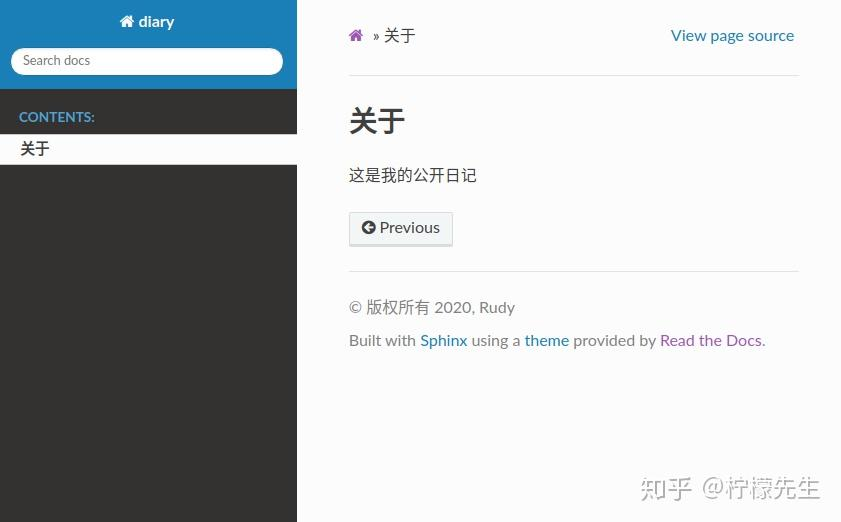

# Windows版微信WechatAppEx等进程占用内存多，干掉对应的exe

对应的exe通常是在`C:\Users\George\AppData\Roaming\Tencent\WeChat\XPlugin\Plugins\RadiumWMPF\9105\extracted\runtime`目录下。

删除该文件夹，然后重新新建一个同名文件夹/文件。右键修改该文件属性：安全性-》选项-》停用继承。然后修改所有者为：`NT SERVICE\TrustedInstaller`。

对应的，删除`C:\Users\George\AppData\Roaming\Tencent\WeChat\XPlugin\Plugins`目录下的其他组件文件夹，修改为空白文件，并**修改权限为TrustedInstaller**使其无法被读取、修改。


# Adobe提示非正版软件弹窗

用FAB（Firewall App Blocker）直接添加防火墙，把这玩意禁止联网。也可以手动添加防火墙。

```bash
C:\Program Files (x86)\Common Files\Adobe\
#C:\Program Files (x86)\Common Files\Adobe\AdobeGCClient\
```

最好把Adobe软件其他文件夹也给禁止联网：

```
C:\Program Files (x86)\Adobe\
C:\Program Files\Adobe\
```


# Localsend提示报错

(10013): 以一种访问权限不允许的方式做了一个访问套接字的尝试

```powershell
net stop winnat
netsh interface ipv4 show excludedportrange protocol=tcp
net start winnat
netsh interface ipv4 show excludedportrange protocol=tcp
```


# mkdocs

```bash
pip install mkdocs
#conda install mkdocs

mkdocs serve
mkdocs build
```


# Sphinx

https://zhuanlan.zhihu.com/p/264647009

安装最新版本的 Sphinx 及依赖。

```text
 pip3 install -U Sphinx
```

为了完成本示例，还需要安装以下软件包。

```text
 pip3 install sphinx-autobuild
 pip3 install sphinx_rtd_theme
 pip3 install recommonmark
 pip3 install sphinx_markdown_tables
```

安装完成后，系统会增加一些 `sphinx-` 开头的命令。

```text
 sphinx-apidoc    sphinx-autobuild    sphinx-autogen    sphinx-build    sphinx-quickstart
```

**3. 快速开始**

**3.1 创建项目**

我们以建立 diary 日记文档系统为例，先创建并进入 diary 文件夹（后续所有操作都在该文件夹内）。执行 `sphinx-quickstart` 构建项目框架，将会出现如下对话窗口。

```text
 欢迎使用 Sphinx 3.2.1 快速配置工具。
 
 Please enter values for the following settings (just press Enter to
 accept a default value, if one is given in brackets).
 
 Selected root path: .
 
 You have two options for placing the build directory for Sphinx output.
 Either, you use a directory "_build" within the root path, or you separate
 "source" and "build" directories within the root path.
 > 独立的源文件和构建目录（y/n） [n]: 
```

首先，询问你是否要创建独立的源文件和构建目录。实际上对应两种目录结构，一种是在根路径下创建“_build”目录，另一种是在根路径下创建“source”和“build”两个独立的目录，前者用于存放文档资源，后者用于保存构建生成的各种文件。根据个人喜好选择即可，比如我更倾向于独立目录，因此输入 `y`。

接着，需要输入项目名称、作者等信息。

```text
 The project name will occur in several places in the built documentation.
 > 项目名称: diary
 > 作者名称: Rudy
 > 项目发行版本 []: v1
```

然后，可以设置项目的语言，我们这里选择简体中文。

```text
 If the documents are to be written in a language other than English,
 you can select a language here by its language code. Sphinx will then
 translate text that it generates into that language.
 
 For a list of supported codes, see
 https://www.sphinx-doc.org/en/master/usage/configuration.html#confval-language.
 > 项目语种 [en]: zh_CN
```

OK，项目创建完成！（两种目录结构分别如下）


- `Makefile`：可以看作是一个包含指令的文件，在使用 make 命令时，可以使用这些指令来构建文档输出。
- `build`：生成的文件的输出目录。
- `make.bat`：Windows 用命令行。
- `_static`：静态文件目录，比如图片等。
- `_templates`：模板目录。
- `conf.py`：存放 Sphinx 的配置，包括在 `sphinx-quickstart` 时选中的那些值，可以自行定义其他的值。
- `index.rst`：文档项目起始文件。

此时我们在 diary 目录中执行 `make html`，就会在 build/html 目录生成 html 相关文件。


在浏览器中打开 index.html，将会看到如下页面。


当然，直接访问 html 文件不是很方便，所以我们借助 `sphinx-autobuild` 工具启动 HTTP 服务。

```text
 sphinx-autobuild source build/html
```

默认启动 8000 端口，在浏览器输入 [http://127.0.0.1:8000](https://link.zhihu.com/?target=http%3A//127.0.0.1%3A8000/) 。但是看到的页面跟上图一样，那换个主题吧！

**3.2 修改主题**

打开 conf.py 文件，找到 html_theme 字段，修改为“classic”主题。

```text
 #html_theme = 'alabaster'
 html_theme = 'classic'
```

保存！可以看到网页变成这样了


Sphinx 为我们提供了好多可选的主题，在 [Sphinx Themes](https://link.zhihu.com/?target=https%3A//sphinx-themes.org/) 都可以找到。大家最熟悉的应该是 sphinx_rtd_theme 主题，其实我们前面已经安装好了。

```text
 html_theme = 'sphinx_rtd_theme'
```

那就用这个主题吧！


**4. 最佳实践**

**4.1 index.rst 语法**

受篇幅限制，本文无法详细介绍 reST 语法，具体可查看官方文档 [RESTRUCTUREDTEXT 简介](https://link.zhihu.com/?target=https%3A//zh-sphinx-doc.readthedocs.io/en/latest/rest.html)，这里主要分析 index.rst 的内容。

```text
 .. diary documentation master file, created by
    sphinx-quickstart on Sat Oct 10 22:31:33 2020.
    You can adapt this file completely to your liking, but it should at least
    contain the root `toctree` directive.
 
 Welcome to diary's documentation!
 =================================
 
 .. toctree::
    :maxdepth: 2
    :caption: Contents:
 
 
 
 Indices and tables
 ==================
 
 * :ref:`genindex`
 * :ref:`modindex`
 * :ref:`search`
```

- 第1-4行由 `..` + 空格开头，属于多行评论（类似于注释），不会显示到网页上。
- 第6-7行是标题，reST 的标题需要被双下划线（或单下划线）包裹，并且符号的长度不能小于文本的长度。
- 第9-11行是文档目录树结构的描述，`.. toctree::` 声明了一个树状结构（toc 即 Table of Content），`:maxdepth: 2` 表示目录的级数（页面最多显示两级），`:caption: Contents:` 用于指定标题文本（可以暂时去掉）。
- 第15-20行是索引标题以及该标题下的三个索引和搜索链接。

**4.2 《我的日记》**

我们进入 source 目录，修改 index.rst 文件，将标题改为“我的日记”，并添加一个 about 页面。

```text
我的日记
=================================

.. toctree::
   :maxdepth: 2
   :caption: Contents:

   about
```

因此我们需要在 source 目录下新建一个 about.rst 文件，并写下内容：

```text
 关于
 ========
 
 这是我的公开日记
```

打开浏览器，输入 [http://127.0.0.1:8000](https://link.zhihu.com/?target=http%3A//127.0.0.1%3A8000/)，将会看到如下页面。




接下来，我们为日记添加一级子目录。先在 source/index.rst 中添加路径信息。

```text
 我的日记
 =================================
 
 .. toctree::
    :maxdepth: 2
    :caption: Contents:
 
    2020/index
    about
```

在 source 目录下新建一个名为“2020”的文件夹，在“2020”文件夹中再创建“春、夏、秋、冬”四个文件夹，并且在其中分别创建 contents.rst 文件。最后，别忘了还有要新建一个 index.rst 文件。这一步完成后，2020 目录结构如下：

```text
 2020
 ├── index.rst
 ├── 春
 │   └── contents.rst
 ├── 冬
 │   └── contents.rst
 ├── 秋
 │   └── contents.rst
 └── 夏
     └── contents.rst
```

在 2020/index.rst 文件中添加如下内容。

```text
 2020年
 =================================
 
 .. toctree::
    :maxdepth: 2
 
    春/contents
    夏/contents
    秋/contents
    冬/contents
```

以及四个 contents.rst 文件的内容：

- 春/contents.rst

```text
 春季
 ========
 
 春眠不觉晓，处处闻啼鸟。
```

- 夏/contents.rst

```text
 夏季
 ========
 
 夏早日初长，南风草木香。
```

- 秋/contents.rst

```text
 秋季
 ========
 
 秋风吹不尽，总是玉关情。
```

- 冬/contents.rst

```text
 冬季
 ========
 
 冬尽今宵促，年开明日长。
```

好啦！打开浏览器看一下吧～


好啦，日记就先写到这吧！喜欢的小伙伴可以在 [luhuadong/diary](https://link.zhihu.com/?target=https%3A//github.com/luhuadong/diary) 点赞+下载。

**4.3 支持 Markdown**

前面我们都是用 reST 语法来操作，但如果我们想用 Markdown 写，或者有大量 Markdown 文档需要迁移怎么办呢？

虽然 Sphinx 默认不支持 Markdown 语法，但可以通过 recommonmark 插件来支持。另外，如果需要支持 markdown 的表格语法，还需要安装 sphinx-markdown-tables 插件。这两个插件其实我们前面已经安装好了，现在只需要在 conf.py 配置文件中添加扩展支持即可。

```python
 extensions = [
     'recommonmark',
     'sphinx_markdown_tables'
 ]
```

我们以“秋”为例，将 rst 文件修改为 md 文件。

```text
 cd 秋
 mv contents.rst contents.md
```

修改 contents.md 文件，增加一些 Markdown 语法内容：

```text
 # 秋季
 
 秋风吹不尽，总是玉关情。
 
 ## 二级标题
 
 
 ### 三级标题
 
 
 #### 四级标题
 
 
 这是一个**段落**
 
 | 作者 | 朝代 | 评分 |
 | :--: | :--: | :--: |
 | 李白 |  唐  | 100  |
 
```

噔噔！打开浏览器，完美～


# [Navicat连接postgresql时出现‘datlastsysoid does not exist‘报错的问题](https://www.cnblogs.com/skyvip/p/18141140)

问题分析
`Postgres 15` 从pg_database表中删除了 datlastsysoid 字段引发此错误。
决绝方案

1. 升级navicat
2. 降级pgsql
3. 修改dll

实操演示

1 打开 `Navicat` 安装目录，找到libcc.dll文件

2 备份libcc.dll文件，将其复制并粘贴为“libcc.dll.bak”或任何其他名称

3 在任何十六进制编辑器中打开此文件，如果需要，您可以使用在线工具，例如 [https://hexed.it](https://hexed.it/)。这里使用vscode，vscode有个插件`Hex Editor`,安装插件`Hex Editor`。也可以用WinHex。

4 使用vscode右键打开`Navicat`安装目录，找到libcc.dll，点击仍然打开，然后选择十六进制编辑器打开，按住`ctrl+F`搜索在文件中搜索“SELECT DISTINCT datlastsysoid”

5 将“SELECT DISTINCT datlastsysoid”，替换为“SELECT DISTINCT dattablespace”，替换完成按`ctrl+S`保存

6 重启navicat，可以发现，无论老和新版本的pgsql，都可以正常访问了


