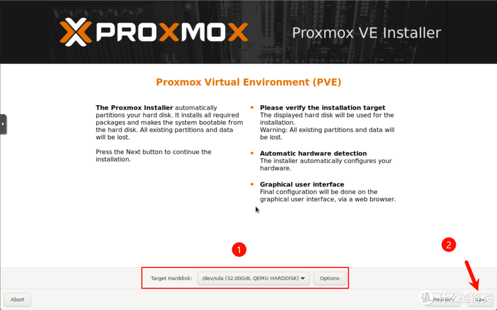
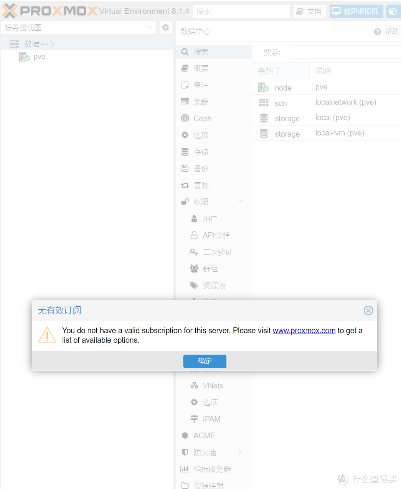
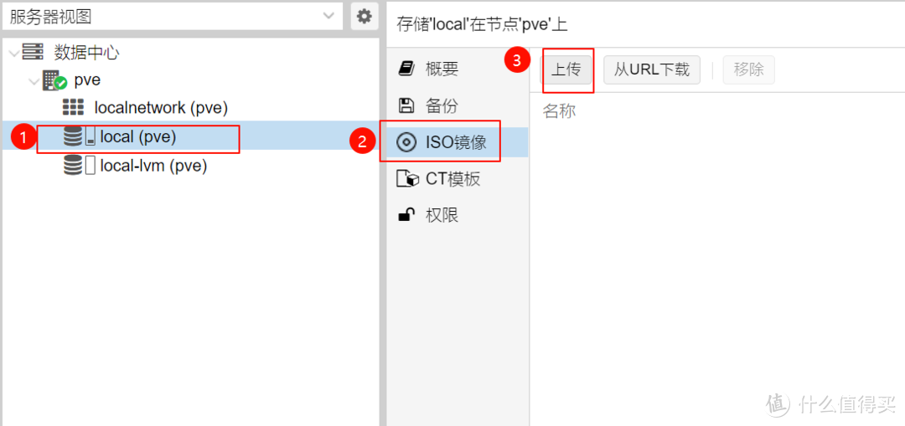
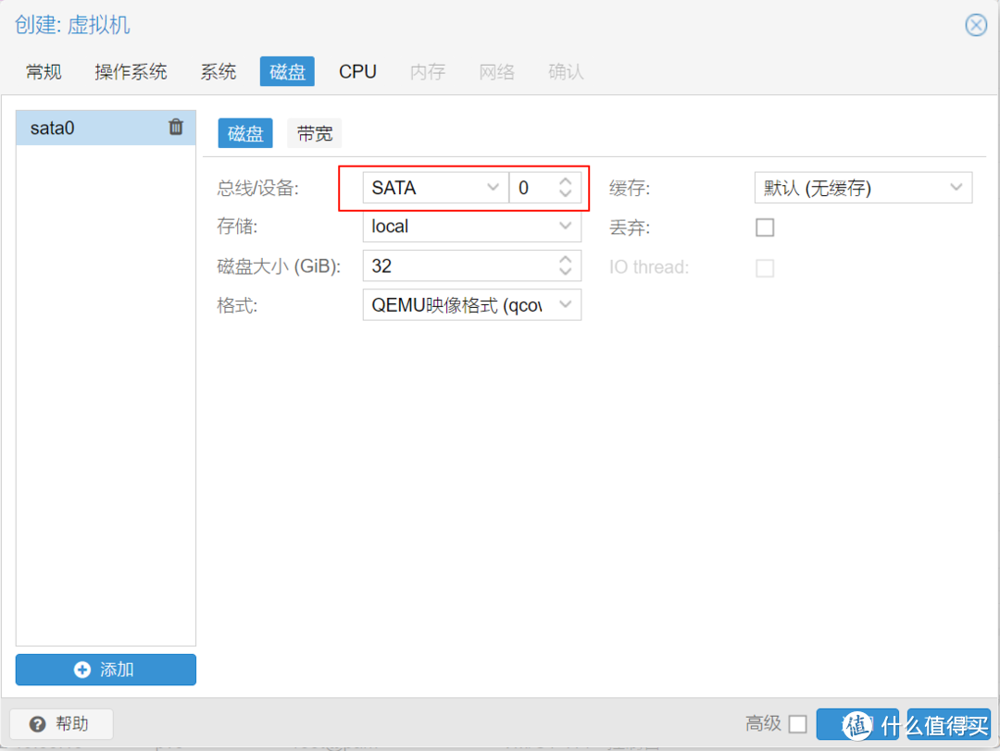
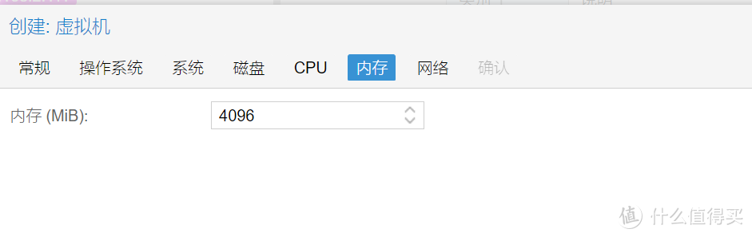

# ESXi7 VMFSL虚拟内存占用120g空间

1、开始安装ESXI7.0，第一次进入安装时，抢在倒计时5秒之内 按shift + O 【是字母不是数字0】如下图：

2、在**`cdromBoot runweasel`**后输入autoPartitionOSDataSize=5120 【注意大小写】【注意有可能开头默认非`cdromBoot runweasel`，如果不是的话需要自己修改】
5120表示指定OSDataSzie为5GB，再按enter回车进行正常安装即可；当然了，如果觉得5G小了点，那就分8G 10G都可以。


# PVEtools

https://github.com/ivanhao/pvetools


# Proxmox Virtual Environment（PVE）安装、docker配置等

## 1.镜像下载

https://www.proxmox.com/en/downloads

https://enterprise.proxmox.com/iso/proxmox-ve_8.3-1.iso

https://www.proxmox.com/images/download/pve/iso/proxmox-ve_8.3-1.torrent

清华tuna：

https://mirrors.tuna.tsinghua.edu.cn/proxmox/iso/

## 2.安装

略。

## 3.proxmox软件仓库、apt软件仓库配置

### 3.1.使用清华源配置proxmox软件仓库

https://mirrors.tuna.tsinghua.edu.cn/help/proxmox/

新建 `/etc/apt/sources.list.d/pve-no-subscription.list`（如果选择的不是 pve，需要使用另一个文件名），内容为：

Debian 版本Debian 12 (bookworm)，服务Proxmox Virtual Environment (PVE)

```
deb https://mirrors.tuna.tsinghua.edu.cn/proxmox/debian/pve bookworm pve-no-subscription
```

注意快速配置中的文件名需要根据需求而修改。

### 3.2.使用清华源/阿里云源配置apt软件仓库

先备份原有的：

```bash
cd /etc/apt/
cp sources.list sources.list.BAK
cp sources.list sources.list.original
```

##### **阿里云：**

```bash
rm sources.list
touch sources.list
nano sources.list
```

复制粘贴以下内容（Ctrl+Shift+V），下面给出两种写法：

（1）cnblogs，实测有效：

https://www.cnblogs.com/smlile-you-me/p/17727308.html

```sh
deb https://mirrors.aliyun.com/debian/ bookworm main non-free non-free-firmware contrib
deb-src https://mirrors.aliyun.com/debian/ bookworm main non-free non-free-firmware contrib
deb https://mirrors.aliyun.com/debian-security/ bookworm-security main
deb-src https://mirrors.aliyun.com/debian-security/ bookworm-security main
deb https://mirrors.aliyun.com/debian/ bookworm-updates main non-free non-free-firmware contrib
deb-src https://mirrors.aliyun.com/debian/ bookworm-updates main non-free non-free-firmware contrib
deb https://mirrors.aliyun.com/debian/ bookworm-backports main non-free non-free-firmware contrib
deb-src https://mirrors.aliyun.com/debian/ bookworm-backports main non-free non-free-firmware contrib
```

（2）aliyun官方，只给了**debian 11.x (bullseye)**：

https://developer.aliyun.com/mirror/debian

```sh
deb https://mirrors.aliyun.com/debian/ bullseye main non-free contrib
deb-src https://mirrors.aliyun.com/debian/ bullseye main non-free contrib
deb https://mirrors.aliyun.com/debian-security/ bullseye-security main
deb-src https://mirrors.aliyun.com/debian-security/ bullseye-security main
deb https://mirrors.aliyun.com/debian/ bullseye-updates main non-free contrib
deb-src https://mirrors.aliyun.com/debian/ bullseye-updates main non-free contrib
deb https://mirrors.aliyun.com/debian/ bullseye-backports main non-free contrib
deb-src https://mirrors.aliyun.com/debian/ bullseye-backports main non-free contrib
```

按Ctrl+X保存，输入大写Y回车保存。

备份配置文件：

```bash
cp sources.list sources.list.aliyun
```

##### **清华tuna：**

https://mirrors.tuna.tsinghua.edu.cn/help/debian/

```bash
rm sources.list
touch sources.list
nano sources.list
```

复制粘贴以下内容（Ctrl+Shift+V）：

```sh
# 默认注释了源码镜像以提高 apt update 速度，如有需要可自行取消注释
deb https://mirrors.tuna.tsinghua.edu.cn/debian/ bookworm main contrib non-free non-free-firmware
# deb-src https://mirrors.tuna.tsinghua.edu.cn/debian/ bookworm main contrib non-free non-free-firmware

deb https://mirrors.tuna.tsinghua.edu.cn/debian/ bookworm-updates main contrib non-free non-free-firmware
# deb-src https://mirrors.tuna.tsinghua.edu.cn/debian/ bookworm-updates main contrib non-free non-free-firmware

deb https://mirrors.tuna.tsinghua.edu.cn/debian/ bookworm-backports main contrib non-free non-free-firmware
# deb-src https://mirrors.tuna.tsinghua.edu.cn/debian/ bookworm-backports main contrib non-free non-free-firmware

# 以下安全更新软件源包含了官方源与镜像站配置，如有需要可自行修改注释切换
deb https://mirrors.tuna.tsinghua.edu.cn/debian-security bookworm-security main contrib non-free non-free-firmware
# deb-src https://mirrors.tuna.tsinghua.edu.cn/debian-security bookworm-security main contrib non-free non-free-firmware
```

按Ctrl+X保存，输入大写Y回车保存。

备份配置文件：

```bash
cp sources.list sources.list.tuna
```

### 3.3.完成后，更新apt源

```sh
apt-get update
```

### 3.4.完成后，安装vim

如果不使用apt重新安装vim，自带的vim会有上下左右键失效的问题。

```bash
apt install vim
```

## 4.docker安装

### 4.1.使用清华tuna源

https://mirrors.tuna.tsinghua.edu.cn/help/docker-ce/

#### 手动安装—Debian用户

以下内容根据 [官方文档](https://docs.docker.com/engine/install/debian/) 修改而来。

如果你过去安装过 docker，先删掉：

```bash
for pkg in docker.io docker-doc docker-compose podman-docker containerd runc; do apt-get remove $pkg; done
```

首先安装依赖：

```bash
apt-get update
apt-get install ca-certificates curl gnupg
```

信任 Docker 的 GPG 公钥并添加仓库：

```bash
install -m 0755 -d /etc/apt/keyrings

curl -fsSL https://download.docker.com/linux/debian/gpg | gpg --dearmor -o /etc/apt/keyrings/docker.gpg

chmod a+r /etc/apt/keyrings/docker.gpg

echo \
  "deb [arch=$(dpkg --print-architecture) signed-by=/etc/apt/keyrings/docker.gpg] https://mirrors.tuna.tsinghua.edu.cn/docker-ce/linux/debian \
  "$(. /etc/os-release && echo "$VERSION_CODENAME")" stable" | \
  tee /etc/apt/sources.list.d/docker.list > /dev/null
```

最后安装

```bash
apt-get update

apt-get install docker-ce docker-ce-cli containerd.io docker-buildx-plugin docker-compose-plugin
```

#### 自动安装方式（需要使用代理，不推荐）

Docker 提供了一个自动配置与安装的脚本，支持 Debian、RHEL、SUSE 系列及衍生系统的安装。请注意，Docker 官方不建议在生产环境使用此脚本安装 Docker CE。

以下内容假定

- 您为 root 用户，或有 sudo 权限，或知道 root 密码；
- 您系统上有 curl 或 wget

```bash
export DOWNLOAD_URL="https://mirrors.tuna.tsinghua.edu.cn/docker-ce"

# 如您使用 curl
curl -fsSL https://raw.githubusercontent.com/docker/docker-install/master/install.sh | sh
# 如您使用 wget
wget -O- https://raw.githubusercontent.com/docker/docker-install/master/install.sh | sh
```

### 4.2.使用阿里云源

阿里云官方教程只给出了ubuntu的安装教程：https://developer.aliyun.com/mirror/docker-ce

### 4.3.安装后查看状态

```bash
systemctl status docker
```

## 5.cockpit安装

参考ubuntu中cockpit安装和配置的教程，过程一样。

```bash
apt install cockpit
systemctl start cockpit
systemctl status cockpit
```

修改监听端口号：

```bash
cd /etc/systemd/system/cockpit.socket.d/
cp listen.conf listen.conf.original
cp listen.conf listen.conf.bak
vi listen.conf
```

修改文件内容并保存：

```bash
[Socket]
ListenStream=
ListenStream=9091
```

完成后，重启cockpit服务：

```bash
systemctl restart cockpit
```

## 6.ssh配置、安装ufw、安装net-tools、安装neofetch等

默认自带有ssh，如果未默认启动，则设置自启：

```bash
systemctl enable sshd
systemctl start sshd
```

安装ufw：

```
apt install ufw
```

安装net-tools（ifconfig）：

```bash
apt install net-tools
```

安装neofetch、screenfetch、s-tui：

```bash
apt install neofetch
apt install screenfetch
apt install s-tui
```


# 2024年PVE8最新安装使用指南|新手入门|安装|优化|Proxmox VE 8.1

https://post.smzdm.com/p/akle62mk/

### **PVE镜像下载**

1、在浏览器输入以下网址下载pve的iso安装镜像。

https://www.proxmox.com/en/downloads

2、点击download进行下载。

[](https://post.smzdm.com/p/akle62mk/pic_2/)

3、最新的pve8.1-2镜像大小为1.2GB，接下来制作引导U盘。

[](https://post.smzdm.com/p/akle62mk/pic_3/)

### **引导U盘制作**

1、首先下载写盘工具，本文使用的写盘工具为Rufus，下载地址为https://rufus.ie/downloads/[，选择最新版本的下载。](https://rufus.ie/downloads/)

[](https://post.smzdm.com/p/akle62mk/pic_4/)

2、下载完成后直接双击运行，无需安装，设备中选择U盘，引导类型选择PVE镜像，然后点击开始，注意U盘中的原有数据会被格式化，重要数据记得备份。

[](https://post.smzdm.com/p/akle62mk/pic_5/)

3、当状态为准备就绪时，表示U盘写入成功，拔下U盘插入需要安装的机器的USB接口中（[台式机](https://www.smzdm.com/fenlei/taishiji/)推荐后置USB接口）

[](https://post.smzdm.com/p/akle62mk/pic_6/)

### **PVE安装**

1、打开主机电源，不断按键盘F12按键（不同主机的U启动按键不同，请自行百度或者询问卖家）进入PVE安装页面，选择第一个Install Proxmox VE （Graphical)，按回车。

[](https://post.smzdm.com/p/akle62mk/pic_7/)

2、 页面会进入如下的跑代码阶段，跑码时间看机器配置，跑码期间不要动键盘鼠标。

[](https://post.smzdm.com/p/akle62mk/pic_8/)

3、进入下面页面安装正式开始，首先使用协议页面点击 I agree（我同意）。

[](https://post.smzdm.com/p/akle62mk/pic_9/)

4、选择pve安装的[硬盘](https://www.smzdm.com/fenlei/yingpan/)，然后继续点击Next(下一步）。

[](https://post.smzdm.com/p/akle62mk/pic_10/)

5、设置国家、时区、键盘布局，然后点击Next(下一步）。

[](https://post.smzdm.com/p/akle62mk/pic_11/)

6、设置密码、和邮箱，继续点击Next(下一步）。

[](https://post.smzdm.com/p/akle62mk/pic_12/)

7、设置网卡、域（保持默认即可）、PVE管理地址、网关、DNS等，继续点击Next(下一步）。

[](https://post.smzdm.com/p/akle62mk/pic_13/)

8、在配置详情中检查配置信息是否有误，没有问题点击Install（安装）。

[](https://post.smzdm.com/p/akle62mk/pic_14/)

9、移除U盘，然后点击Reboot重启机器。

[](https://post.smzdm.com/p/akle62mk/pic_15/)

### **初始化**

1、重启完成之后出现如下页面，表示安装成功，记录下屏幕中出现的ip地址，接下来的配置无需使用PVE主机显示，单个[显示器](https://www.smzdm.com/fenlei/xianshiqi/)的朋友可以将显示器切换到主机了。

[](https://post.smzdm.com/p/akle62mk/pic_16/)

2、在浏览器输入[https://192.168.2.167:8006](https://192.168.2.167:8006/)[进入PVE配置页面，用户名为root，密码为在安装过程中设置的，语言为了方便设置为简体中文，然后点击登录。](https://192.168.2.167:8006/)

[](https://post.smzdm.com/p/akle62mk/pic_17/)

3、第一次登录会出现无效订阅不用管，直接点击确定，后续我们将通过设置去掉这个选项。

[](https://post.smzdm.com/p/akle62mk/pic_18/)

4、首先我们需要配置一下pve的dns来保证pve可以正确访问到网络，这里我使用了阿里云公共的DNS，223.5.5.5，223.6.6.6，然后点击ok。

[](https://post.smzdm.com/p/akle62mk/pic_19/)

5、使用pve自带的shell工具来ping百度，测试网络是否正常，出现正确的ping值表示外网访问通畅。

[](https://post.smzdm.com/p/akle62mk/pic_20/)

6、接下来还涉及到pve的换源、系统更新、直通等操作，为了方便小白和第一次接触到pve的朋友们，这里我们将使用第三方工具来实现。

### **优化（PVE_Source）**

pve_source是老虎大佬开发的pve脚本（[首发于X86派论坛](https://bbs.x86pi.cn/thread?topicId=20)），可以更方便的初始化PVE，无需使用复杂的命令，使用方法很简单，登录PVE，打开Shell粘贴如下命令。

`wget -q -O /root/pve_source.tar.gz 'https://bbs.x86pi.cn/file/topic/2023-11-28/file/01ac88d7d2b840cb88c15cb5e19d4305b2.gz' && tar zxvf /root/pve_source.tar.gz && /root/./pve_source`[](https://post.smzdm.com/p/akle62mk/pic_21/)

1、脚本加载成功出现使用协议，输入Y，然后继续按回车。

[](https://post.smzdm.com/p/akle62mk/pic_22/)

2、进入脚本优化选项，脚本覆盖了PVE的绝大部分必备优化选项，需要使用那个直接输入数字然后按回车即可。

[](https://post.smzdm.com/p/akle62mk/pic_23/)

### **更换 Proxmox VE 源**

3、为了更方便了解脚本都干了什么，建议分步执行23456，输入数字2,然后再输入1更换 PVE 软件源 + Debian 源，分别输入列表前面的数字选择PVE版本和软件源镜像站（不清楚的直接都选择清华大学源就行）。

[](https://post.smzdm.com/p/akle62mk/pic_24/)

4、选择软件源以后继续按回车执行，脚本将自动执行更换源成功后会给出提示。

[](https://post.smzdm.com/p/akle62mk/pic_25/)

5、按照以上操作继续完成PVE Ceph 源 、PVE LXC 仓库源 的更新操作（在Shell页面输入./pve_source即可再次调出pve工具小技巧直接输入./pve然后按tab按键可自动补全后面）。

[](https://post.smzdm.com/p/akle62mk/pic_26/)

### **更新软件包系统**

更新软件包有两种方法，一种是通过pve工具箱更新，另外一种因为在前面我们已经通过pve工具箱更新了软件源，所以直接在web页面更新也可以

1、点击pve节点→更新→刷新→升级，既可以完成最新软件包和组件的升级。

[](https://post.smzdm.com/p/akle62mk/pic_27/)

2、通过pve工具升级，在Shell中输入./pve_source，然后使用脚本3、4来更新软件包和系统。

[](https://post.smzdm.com/p/akle62mk/pic_28/)

### **设置系统DNS**

1、通过web页面修改，点击节点→DNS→编辑。

[](https://post.smzdm.com/p/akle62mk/pic_29/)

2、通过pve工具箱修改。

[](https://post.smzdm.com/p/akle62mk/pic_30/)

### **去除无效订阅源提示**

每次在登录pve的时候会弹出企业订阅提示，对于普通用户我们直接去除掉弹窗即可，登录PVE，在Shell窗口中输入./pve_source,进入pve工具箱，输入6，系统会自动执行去除订阅脚本，脚本运行完成后请强制刷新浏览器缓存。

[](https://post.smzdm.com/p/akle62mk/pic_31/)

### **修改PVE概要信息**

1、pve默认概要中不会显示cpu温度、硬盘信息等，通过pve工具箱可以修改信息概要页面，使其信息显示更加完善。

[](https://post.smzdm.com/p/akle62mk/pic_32/)

2、登录PVE，在Shell窗口中输入./pve_source,进入pve工具箱，按7进入pve概要信息定制向导，根据自身喜好选择合适的版本，这里我使用推荐方案1：高大全版本。

[](https://post.smzdm.com/p/akle62mk/pic_33/)

3、修改改完成后可以看到概要信息中显示的非常全面，包括CPU温度核心占用情况，以及硬盘的温度写入量等都可以很直观的显示。

[](https://post.smzdm.com/p/akle62mk/pic_34/)

### **虚拟机安装**

pve安装虚拟机还是非常简单的，本篇我们将使用pve安装win10来演示一下安装过程，其他系统安装大同小异。

1、首先需要上传安装镜像，通过local(pve)→ISO镜像→上传，将win10镜像上传到pve中。

[](https://post.smzdm.com/p/akle62mk/pic_35/)

2、回到pve首页，点击右上角的创建虚拟机，常规中自定义虚拟机的名称

[](https://post.smzdm.com/p/akle62mk/pic_36/)

3、操作系统中选择windows10镜像，然后在类型中选择安装操作系统的类型，注意版本也要选择。

[](https://post.smzdm.com/p/akle62mk/pic_37/)

4、系统保持默认即可。

[](https://post.smzdm.com/p/akle62mk/pic_38/)

5、硬盘中总线选择sata，其他保持默认。

[](https://post.smzdm.com/p/akle62mk/pic_39/)

6、CPU根据机器配置选择，插槽表示cpu个数单CPU机器输入1，核心根据CPU选择，类别使用HOST系统性能最大化。

[](https://post.smzdm.com/p/akle62mk/pic_40/)

7、[内存](https://www.smzdm.com/fenlei/neicun/)根据机器配置设置。

[](https://post.smzdm.com/p/akle62mk/pic_41/)

8、网络设置中选择兼容性最高的e1000即可。

[](https://post.smzdm.com/p/akle62mk/pic_42/)

9、最后检查配置没有，确认无误后点击完成。

[](https://post.smzdm.com/p/akle62mk/pic_43/)

10、稍等几秒，机器创建成功。

[](https://post.smzdm.com/p/akle62mk/pic_44/)

11、点击控制台启动，按照正常windows系统安装流程安装即可。

[](https://post.smzdm.com/p/akle62mk/pic_45/)


# r3g刷breed

看有人在问R3G刷Breed，所以分享出自己在用的教程。
一、刷开发版(目前最新2018.10.30，版本2.25.124)
1、下载固件(http://www.miwifi.com/miwifi_download.html)文件，miwifi_r3g_firmware_12f97_2.25.124.bin
2、备份原厂稳定版固件
3、进路由器设置，系统状态-系统版本-手动升级，上传.bin 文件，升级重启
二、开SSH权限
1、（如果app已经绑定路由器，跳过）通过手机app【小米wifi】绑定路由器
2、找到开SSH的工具包：https://d.miwifi.com/rom/ssh下载对应的工具包miwifi_ssh.bin，并保存 root 密码
3、把工具包miwifi_ssh.bin(文件名只能是这个)放入U盘(FAT/FAT32格式,U盘不能是启动盘)根目录
4、断开小米路由器电源，插入U盘到路由器
5、按住reset键开机，指示灯变黄色闪烁状态即松开 reset 键
6、待3-5秒后蓝灯亮起安装完成，路由器自动重启
7、终端ssh登录：ssh [root@192.168.31.1](mailto:root@192.168.31.1)，输入ssh权限密码
三、刷不死平台breed：(注意，原版OpenWrt不要通过 breed刷，因为，OpenWrt 原版需要上传2个文件，而breed，只能上传一个文件，如果要用原版 OpenWrt，可以scp 复制文件到/tmp 下，然后 ssh 登录后命令行安装)
1、https://breed.hackpascal.net/下载breed-mt7621-xiaomi-r3g.bin
2、用ssh工具上传.bin文件到路由器/tmp目录下：
scp -P 22 文件名路径 [root@192.168.31.1](mailto:root@192.168.31.1):/tmp
3、ssh进入小米路由器，写入 breed：
mtd -r write /tmp/breed-mt7621-xiaomi-r3g.bin Bootloader
4、刷入后，机器会重新启动。
四、进入 breed方法：
1、按住reset键开机，灯闪烁后松开reset键
2、等获取到ip，浏览器进入192.168.1.1
3、非常重要的备份：
在 Breed 页面中，先备份所有的数据，固件备份选项里能点的都点一下，备份的eeprom.bin(EEPROM)和full.bin(编程器固件)要保存好，以防止丢失了SN以后又想刷回官方版本的麻烦。

已知小米R3G需要
1、删除normal_firmware_md5=8945bfb64aa2cdc1a35dd63333b6f28f(R4是8a5ea648853b89e0936f3e2a18b31099)这个键值，否则可能会导致无法开机
2、添加环境变量xiaomi.r3g.bootfw:2


# [Proxmox VE（PVE）添加硬盘做存储](https://www.cnblogs.com/txqdm/p/17946432)

首先需要先先看下需添加硬盘的设备名称

如下图的/dev/sda(当然也可以在命令里用fdisk -l去确认)

确定好名称后打开Shell命令终端，输入

```
fdisk /dev/sda
```

这里的操作就跟Linux没什么区别了，分区格式化

先分区，输入n(分区) - 输入p(主分区) - 输入w(写入分区)

格式化(格式化为ext4格式)

```
mkfs -t ext4 /dev/sda1
```

 创建/mnt/sda1目录

```
mkdir -p /mnt/sda1
```

 将/dev/sda1分区挂载在/mnt/sda1上

```
mount -t ext4 /dev/sda1 /mnt/sda1
```

 将/mnt/sda1挂载写入到系统启动项

```
echo /dev/sda1 /mnt/sda1 ext4 defaults 1 2 >> /etc/fstab
```

选择“数据中心”(这块一定要注意不是选择PVE)存储 - 添加 - 目录

ID可以随便填，目录就是刚才创建好的/mnt/sda1，内容**全选**，其它默认点击添加。


# pve sudo(Debian12) 安装sudo权限

https://www.mulingyuer.com/archives/912/

登录root账号，安装依赖：

```bash
apt-get install sudo
```

安装完毕后我们还需要配置文件，输入命令：

```bash
visudo
```

进入到编辑状态，找到root的地址，再下面新增一个你允许提权的账号.

```ini
your_user_name  ALL=(ALL:ALL) ALL
```

改好后 `CTRL + O`保存文件，`CTRL + X`退出编辑模式。

此时我们通过ABC ssh连接服务器，输入命令：`sudo -i`，然后输入ABC账号的密码，即可提权成root账号。


