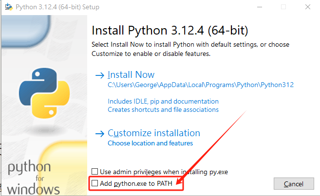

# 安装（python）**注：更推荐直接安装使用anaconda**

请到官网下载Python安装包：https://www.python.org/downloads/windows/

下载完毕后，右键->以管理员身份运行->是。



**如果你不想手动配置环境变量，请勾选上图中的“添加python.exe到环境变量”。**

其他步骤没啥技术含量。


# 安装（anaconda）

完整conda：

建议使用清华镜像站：https://mirrors.tuna.tsinghua.edu.cn/anaconda/archive/

**请下载最新安装包！**

miniconda：

建议使用清华镜像站：https://mirrors.tuna.tsinghua.edu.cn/anaconda/miniconda/

**请下载最新安装包！**

## 对于Windows用户：

安装时直接右键->以管理员身份运行->是。


**如果你不想手动配置环境变量，请勾选上图中的“添加python.exe到环境变量”。**

其他步骤没啥技术含量。

如果安装完毕使用出现错误，请参照下文“conda在windows Terminal中提示报错无法加载文件C:\XXX\WindowsPowerShell\profile.ps1”。笔者曾在2023年版本的anaconda遇到过这个问题。

### 使用pip报错“pip 不是内部或外部命令，也不是可运行的程序”

出现在“Miniconda3-py312_24.5.0-0-Windows-x86_64”版本。

请在系统环境变量中添加“`%CONDA_HOME%\Scripts`”。

### pip下载库包报错：Defaulting to user installation because normal site-packages is not writeable

1、在使用pip下载库包的时候报错：Defaulting to user installation because normal site-packages is not writeable

2、错误解决方式：

查看了下anaconda的安装路径，查看目录属性，发现是`只读属性`，因此需要修改权限，或者使用管理员权限打开命令行，具体操作步骤：

1）修改目录权限属性

2）找到site.py文件：在命令行下输入：`python -m site -help`

site.py默认是在`C:\ProgramData\miniconda3\Lib\site.py`

然后打开site.py文件，把其中的：

USER_SITE = None
USER_BASE = None

路径修改为自己的anaconda的安装路径即可：

USER_SITE = "C:\ProgramData\miniconda3\Lib\site-packages"
USER_BASE = "C:\ProgramData\miniconda3\Scripts"


# requests 使用代理报错 Cannot connect to proxy.‘,FileNotFoundError(2, ‘No such file or directory问题解决

如题，使用代理报错,降级urllib3
不要使用1.26.0版本，安装低版本。

```shell
pip install urllib3==1.25.11
```

# requests 代理设置

```python
import urllib3
urllib3.disable_warnings()

proxies={
'http': 'http://127.0.0.1:7890',
'https': 'https://127.0.0.1:7890'
}

result0=requests.get(url=url,proxies=proxies,verify=False)
```


# conda在windows Terminal中提示报错无法加载文件C:\XXX\WindowsPowerShell\profile.ps1

提示 “`无法加载文件C:\XXX\WindowsPowerShell\profile.ps1，因为在此系统上禁止运行脚本`” 的错误。

1. 以管理员身份运行`PowerShell`；

2. 执行：`get-ExecutionPolicy`，回复`Restricted`，表示状态是`禁止`的；

3. 执行：`set-ExecutionPolicy RemoteSigned`，选择`A`即可。

4. ```powershell
   PS C:\WINDOWS\system32> get-ExecutionPolicy
   Restricted
   PS C:\WINDOWS\system32> set-ExecutionPolicy RemoteSigned
   
   执行策略更改
   执行策略可帮助你防止执行不信任的脚本。更改执行策略可能会产生安全风险，如 https:/go.microsoft.com/fwlink/?LinkID=135170
   中的 about_Execution_Policies 帮助主题所述。是否要更改执行策略?
   [Y] 是(Y)  [A] 全是(A)  [N] 否(N)  [L] 全否(L)  [S] 暂停(S)  [?] 帮助 (默认值为“N”): A
   PS C:\WINDOWS\system32>
   ```


# python sql多线程

python中执行mysql查询时，需要使用线程池管理，不能直接使用pymysql，否则会报错。

```bash
conda activate py37
cd d:\d\code\github
git clone https://github.com/luvvien/pymysqlpool.git
cd pymysqlpool
python setup.py install
```

示例代码如下：

```python
from concurrent.futures import ThreadPoolExecutor
import json
from pymysqlpool import ConnectionPool
import os
import logging
logging.basicConfig(format='%(asctime)s - %(pathname)s[line:%(lineno)d] - %(levelname)s: %(message)s', level=logging.INFO)

# 连接池配置
config = {
    'pool_name': 'test',
    'host':'127.0.0.1',
    'port':3306,
    'user':'root',
    'password':'10203090',
    'database':'tmp'
}

# 建立连接池
def connection_pool():
    # Return a connection pool instance
    pool = ConnectionPool(**config)
    return pool


# 自定义的处理函数
def processFile(filepath):
    logging.info("Current file: "+filepath)
    with open(filepath,mode="r",encoding="utf-8") as f:
        data=json.load(f)
    for i in data:
        tmp=i.keys()
        try:
            if "GH" in tmp:
                GH=str(i["GH"])
            else:
                GH="NULL"
            if "ZHZT" in tmp:
                ZHZT=str(i["ZHZT"])
            else:
                ZHZT="NULL"
            if "GJ" in tmp:
                GJ=str(i["GJ"])
            else:
                GJ="NULL"
            if "IDCARD" in tmp:
                IDCARD=str(i["IDCARD"])
            else:
                IDCARD="NULL"
            if "RYZT" in tmp:
                RYZT=str(i["RYZT"])
            else:
                RYZT="NULL"
            if "XB" in tmp:
                XB=str(i["XB"])
            else:
                XB="NULL"
            if "ZHJHZT" in tmp:
                ZHJHZT=str(i["ZHJHZT"])
            else:
                ZHJHZT="NULL"
            if "pageId" in tmp:
                pageId=str(i["pageId"])
            else:
                pageId="NULL"
            if "userId" in tmp:
                userId=str(i["userId"])
            else:
                userId="NULL"
            if "SFZJLXM" in tmp:
                SFZJLXM=str(i["SFZJLXM"])
            else:
                SFZJLXM="NULL"
            if "SFLBDM" in tmp:
                SFLBDM=str(i["SFLBDM"])
            else:
                SFLBDM="NULL"
            if "BMJZRYZT" in tmp:
                BMJZRYZT=str(i["BMJZRYZT"])
            else:
                BMJZRYZT="NULL"
            if "SMZT" in tmp:
                SMZT=str(i["SMZT"])
            else:
                SMZT="NULL"
            if "XM" in tmp:
                XM=str(i["XM"])
            else:
                XM="NULL"
            if "TYSFRZH" in tmp:
                TYSFRZH=str(i["TYSFRZH"])
            else:
                TYSFRZH="NULL"
            if "USERID_1" in tmp:
                USERID_1=str(i["USERID_1"])
            else:
                USERID_1="NULL"
            if "orgInfo" in tmp:
                orgInfo=str(i["orgInfo"])
            else:
                orgInfo="NULL"
            if "personId" in tmp:
                personId=str(i["personId"])
            else:
                personId="NULL"
            if "objectId" in tmp:
                objectId=str(i["objectId"])
            else:
                objectId="NULL"
            if "CQUBM" in tmp:
                CQUBM=str(i["CQUBM"])
            else:
                CQUBM="NULL"
            if "BMPYRYZT" in tmp:
                BMPYRYZT=str(i["BMPYRYZT"])
            else:
                BMPYRYZT="NULL"
            if "CSRQ" in tmp:
                CSRQ=str(i["CSRQ"])
            else:
                CSRQ="NULL"
            if "JZBM" in tmp:
                JZBM=str(i["JZBM"])
            else:
                JZBM="NULL"
            if "SFYDK" in tmp:
                SFYDK=str(i["SFYDK"])
            else:
                SFYDK="NULL"
            if "ZHJHSMZT" in tmp:
                ZHJHSMZT=str(i["ZHJHSMZT"])
            else:
                ZHJHSMZT="NULL"
            if "DQFWRYZT" in tmp:
                DQFWRYZT=str(i["DQFWRYZT"])
            else:
                DQFWRYZT="NULL"
            if "TEL" in tmp:
                TEL=str(i["TEL"])
            else:
                TEL="NULL"
            if "JZXGH" in tmp:
                JZXGH=str(i["JZXGH"])
            else:
                JZXGH="NULL"
            if "JZORACLECOLLECT" in tmp:
                JZORACLECOLLECT=str(i["JZORACLECOLLECT"])
            else:
                JZORACLECOLLECT="NULL"
            if "USERTYPE" in tmp:
                USERTYPE=str(i["USERTYPE"])
            else:
                USERTYPE="NULL"
            if "LASTLOGINTIME" in tmp:
                LASTLOGINTIME=str(i["LASTLOGINTIME"])
            else:
                LASTLOGINTIME="NULL"
            if "QYPYRYAZT" in tmp:
                QYPYRYAZT=str(i["QYPYRYAZT"])
            else:
                QYPYRYAZT="NULL"
            if "SFYXQJZ" in tmp:
                SFYXQJZ=str(i["SFYXQJZ"])
            else:
                SFYXQJZ="NULL"
            if "RSZPRYZT" in tmp:
                RSZPRYZT=str(i["RSZPRYZT"])
            else:
                RSZPRYZT="NULL"
            try:
                with connection_pool().connection() as conn:
                    cursor = conn.cursor()
                    SQL="INSERT INTO `sso_v2` VALUES(\""+GH+"\",\""+ZHZT+"\",\""+GJ+"\",\""+IDCARD+"\",\""+RYZT+"\",\""+XB+"\",\""+ZHJHZT+"\",\""+pageId+"\",\""+userId+"\",\""+SFZJLXM+"\",\""+SFLBDM+"\",\""+BMJZRYZT+"\",\""+SMZT+"\",\""+XM+"\",\""+TYSFRZH+"\",\""+USERID_1+"\",\""+orgInfo+"\",\""+personId+"\",\""+objectId+"\",\""+CQUBM+"\",\""+BMPYRYZT+"\",\""+CSRQ+"\",\""+JZBM+"\",\""+SFYDK+"\",\""+ZHJHSMZT+"\",\""+DQFWRYZT+"\",\""+TEL+"\",\""+JZXGH+"\",\""+JZORACLECOLLECT+"\",\""+USERTYPE+"\",\""+LASTLOGINTIME+"\",\""+QYPYRYAZT+"\",\""+SFYXQJZ+"\",\""+RSZPRYZT+"\");"
                    logging.debug(SQL)
                    cursor.execute(SQL)
                    conn.commit()
            except Exception as e:
                logging.exception(e)
        except Exception as e:
            logging.exception(e)
            
            
#这里开到4线程，可以自行修改     
MAX_THREAD_NUM = 4
threadCnt = 0


def processFilesInThreadPool():
    jsonFiles = os.listdir("./data/")
    logging.info("Json Files: " + str(jsonFiles))
    
    #以下是多线程执行代码
    global threadCnt
    with ThreadPoolExecutor(max_workers=MAX_THREAD_NUM) as executor:
        futures = []
        for jsonFile in jsonFiles:
            if threadCnt < MAX_THREAD_NUM:
                threadCnt += 1
                # 这里调用自定义的处理函数
                future = executor.submit(processFile, "./data/" + jsonFile)
                futures.append(future)
            else:
                # 等待当前所有线程完成
                for future in futures:
                    future.result()
                futures = []
                threadCnt = 0
        # 确保所有线程都完成
        for future in futures:
            future.result()


processFilesInThreadPool()
```

