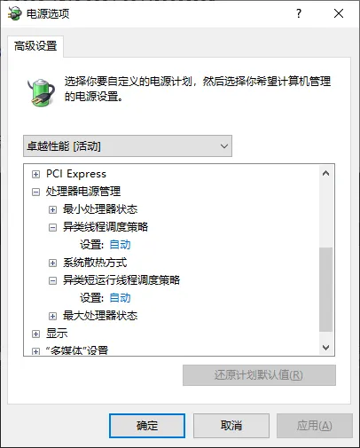
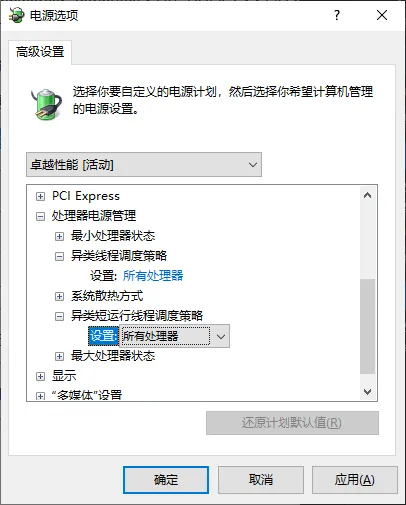
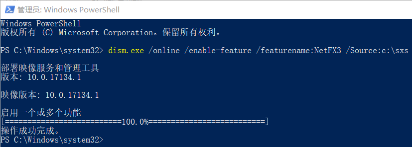
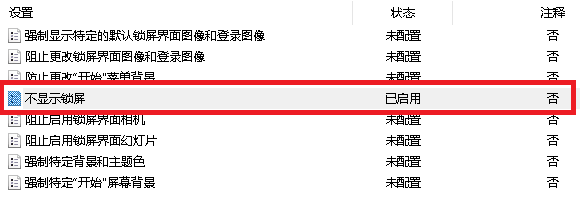
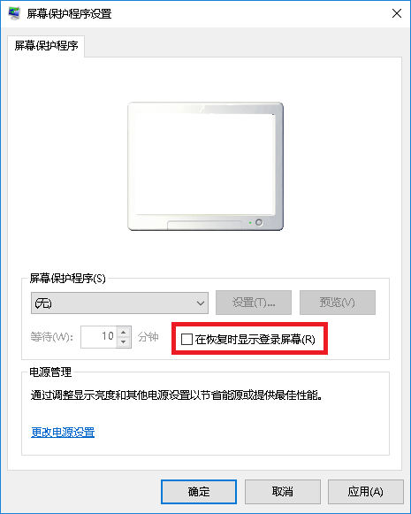
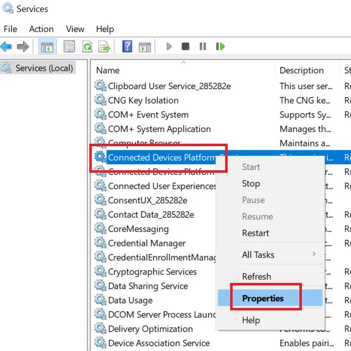
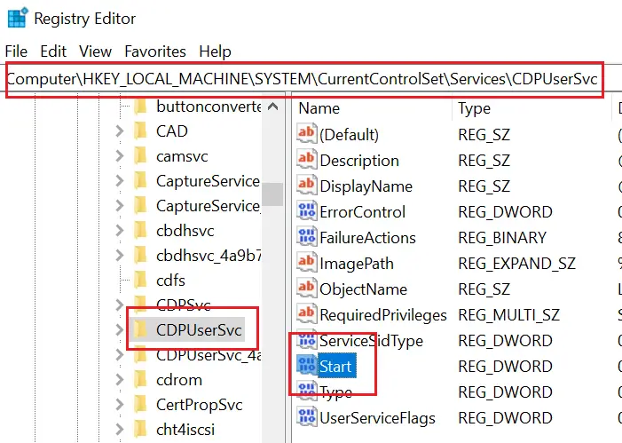
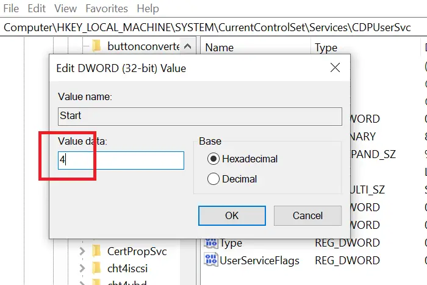

# Win11 安装过程跳过联网

1. 适用于21H2及以下版本

   shift+F10，开启cmd，输入`taskmgr`，结束OOBENetworkConnectionFlow.exe


2. 适用于所有版本，包括22H2

   shift+F10，开启cmd，输入`oobe\BypassNRO.cmd`回车，此时系统会自动重启，重启后就会有一个暂时跳过的选项，可以和以前一样离线配置。


# Windows 开启/关闭测试模式

管理员身份运行cmd或powershell

## 开启

`bcdedit /set testsigning on`

## 关闭

`bcdedit /set testsigning off`

完成后重启计算机。


# 禁用Windows搜索的推荐

`reg add HKCU\Software\Policies\Microsoft\Windows\explorer /v DisableSearchBoxSuggestions /t reg_dword /d 1 /f`


# 服务注册

## NSSM(推荐)

下载：https://nssm.cc/download

将下载好的NSSM 2.24解压；根据自己的操作系统位数选择对应的NSSM。

使用**超级管理员**打开命令行（CMD）界面。

进入NSSM程序路径（比如：我这里的NSSM路径是：【E:\迅雷下载\nssm-2.24\win64】）。

```powershell
nssm install
```

然后设置服务程序。


## Using Shawl

下载后直接解压到`C:\Windows\System32`

Prebuilt binaries are available on the [releases page](https://github.com/mtkennerly/shawl/releases) of Shawl. It’s portable, so you can simply download it and put it anywhere without going through an installer. Otherwise if you have Rust installed, you can run `cargo install shawl`.

Here’s how you create the service with Shawl, then start it. Note that this has to be run from an administrator command prompt.

```powershell
shawl add --name NavidromeG -- "D:\Program Files\navidrome_0.51.1_windows_amd64G\navidrome.exe" -c "D:\Program Files\navidrome_0.51.1_windows_amd64G\navidrome.toml"
sc start NavidromeG
```

```powershell
shawl add --name NavidromeL -- "D:\Program Files\navidrome_0.51.1_windows_amd64L\navidrome.exe" -c "D:\Program Files\navidrome_0.51.1_windows_amd64L\navidrome.toml"
sc start NavidromeL
```

**安装完毕后，运行`services.msc`手动启动navidrome服务。如需自动启动，将其启动方式设置为自动启动。**

其中，第一个指向G盘的navidrome.toml的文件内容为：

```toml
# This is just an example! Please see available options to customize Navidrome for your needs at
# https://www.navidrome.org/docs/usage/configuration-options/#available-options

LogLevel = 'DEBUG'
ScanSchedule = '@every 24h'
TranscodingCacheSize = '150MiB'

# IMPORTANT: Use single quotes for paths in Windows
MusicFolder = 'G:\MEDIA\'
# MusicFolder = 'L:\Music\'

# Set this to the path of your ffmpeg executable
FFmpegPath = 'D:\ffmpeg\bin\ffmpeg.exe' 

Address='0.0.0.0'
Port='8236'

DataFolder = 'D:\Program Files\navidrome_0.51.1_windows_amd64G\data\'
CacheFolder = 'T:\Temp\'
```


# 解决Windows系统对 AMD 的负优化，修复部分卡顿问题

解决Windows系统对 AMD 的负优化，修复部分卡顿问题：https://seeizo.com/posts/amd-win-fix/

### 一：异类线程调度[#](https://seeizo.com/posts/amd-win-fix/#一异类线程调度)

禁用异类线程调度可以显著优化 AMD CPU 在 Windows 上的核心负载均衡情况。

1. 右键 Windows 徽标，点击 “Windows Powershell（管理员）”，执行以下命令：

```
powercfg -attributes SUB_PROCESSOR 93b8b6dc-0698-4d1c-9ee4-0644e900c85d -ATTRIB_HIDE

powercfg -attributes SUB_PROCESSOR bae08b81-2d5e-4688-ad6a-13243356654b -ATTRIB_HIDE
```


1. 在设置中搜索 **电源选项**，进入电源计划，选择高性能或者卓越性能。


> TIP
>
> 卓越性能的启动命令：
>
> ```
> powercfg -duplicatescheme e9a42b02-d5df-448d-aa00-03f14749eb61
> ```

> WARNING
>
> 7000/9000系，Ryzen AI 300 以及更新的 AMD CPU 请暂时不要选择“高性能”或“卓越性能”方案，尤其是在 Windows 11 系统上。

3.点击高性能或卓越性能右侧的 **更改计划设置**，点击 **更改高级电源设置**，找到 **处理器电源管理** 并展开。



1. 将 **异类线程调度策略** 和 **异类短运行线程调度策略** 选项修改为 **所有处理器**，然后点击确定即可。



> TIP
>
> 很多笔记本默认隐藏了这2个选项，要调整需要更改注册表。
>
> 1. 点击“Windows键”+“R键”，输入regedit打开注册表编辑器
> 2. 在“HKEY_LOCAL_MACHINE\SYSTEM\CurrentControlSet\Control\Power\PowerSettings\54533251-82be-4824-96c1-47b60b740d00\”下找到“93b8b6dc-0698-4d1c-9ee4-0644e900c85d”以及“bae08b81-2d5e-4688-ad6a-13243356654b”
> 3. 进去后将2个路径下的“Attributes”值由默认0更改为2，重新打开电源计划即可更改异类线程调度策略和异类短运行线程调度策略。

------

### 二：禁用高精度事件计时器。[#](https://seeizo.com/posts/amd-win-fix/#二禁用高精度事件计时器)

*这个属于是远古 AMD CPU 就有的问题，理论上只有AMD处理器上才有，Intel不用管。*
禁用高精度事件计时器可以解决在帧率正常的情况下仍会感觉到卡顿的情况。

```
bcdedit /deletevalue useplatformclock
bcdedit /set useplatformclock false
```

运行第一个指令时，若出现：


则代表系统已默认关闭高精度事件计时器，继续执行第二步骤即可。

若要恢复高精度事件计时器，将指令二中的 **false** 修改为 **true** 即可。


# 计算机重命名失败，提示“这台电脑名称无效”/“此電腦名稱無效”

请您按Win+R, 输入 regedit，找到
HKEY_LOCAL_MACHINE\SYSTEM\CurrentControlSet\Control\ComputerName\ActiveComputerName
HKEY_LOCAL_MACHINE\SYSTEM\CurrentControlSet\Control\ComputerName\ComputerName
将ComputerName修改成新的计算机名称
之后找到
HKEY_LOCAL_MACHINE\SYSTEM\CurrentControlSet\Services\Tcpip\Parameters
将HostName与NV HostName 修改成新的计算机名称


# conda在windows Terminal中提示报错无法加载文件C:\XXX\WindowsPowerShell\profile.ps1

提示 “`无法加载文件C:\XXX\WindowsPowerShell\profile.ps1，因为在此系统上禁止运行脚本`” 的错误。

1. 以管理员身份运行`PowerShell`；

2. 执行：`get-ExecutionPolicy`，回复`Restricted`，表示状态是`禁止`的；

3. 执行：`set-ExecutionPolicy RemoteSigned`，选择`A`即可。

4. ```powershell
   PS C:\WINDOWS\system32> get-ExecutionPolicy
   Restricted
   PS C:\WINDOWS\system32> set-ExecutionPolicy RemoteSigned
   
   执行策略更改
   执行策略可帮助你防止执行不信任的脚本。更改执行策略可能会产生安全风险，如 https:/go.microsoft.com/fwlink/?LinkID=135170
   中的 about_Execution_Policies 帮助主题所述。是否要更改执行策略?
   [Y] 是(Y)  [A] 全是(A)  [N] 否(N)  [L] 全否(L)  [S] 暂停(S)  [?] 帮助 (默认值为“N”): A
   PS C:\WINDOWS\system32>
   ```

   
# Windows10自定义OEM信息

想要自定义OEM信息，只要稍微添加一下注册表信息即可，具体方法如下：

1、在Cortana搜索栏输入regedit，按回车键进入注册表编辑器

2、定位到

HKEY_LOCAL_MACHINE\SOFTWARE\Microsoft\Windows\CurrentVersion\OEMInformation

3、新建字符串值

Manufacturer（意为制造商）Fujitsu

Model（意为型号）LIFEBOOK E5412

SupportHours（售后时间）9:00-21:00（周一至周日）

SupportPhone（售后电话）400-990-8888

SupportURL（厂商网址）

Logo（Logo路径）C:\Windows\System32\oem\oemlogo.bmp  （如果这个目录不存在需自己创建）

Fujitsu的oemlogo:

[oemlogo]: ./img/oemlogo.bmp

Logo图片
大小：120 x 120 像素
格式：BMP
色彩深度：32位

如果你的系统是联想OEM的系统可能以上注册表键值已经存在，只需直接修改OEM信息和图片即可。


# 流媒体服务器推荐

Madsonic

subsonic

jellyfin

navodrome

Kodi

Audirvana 

JRiver Media Center

# navidrome安装与服务注册

Using Shawl

下载后直接解压到`C:\Windows\System32`

Prebuilt binaries are available on the [releases page](https://github.com/mtkennerly/shawl/releases) of Shawl. It’s portable, so you can simply download it and put it anywhere without going through an installer. Otherwise if you have Rust installed, you can run `cargo install shawl`.

Here’s how you create the service with Shawl, then start it. Note that this has to be run from an administrator command prompt.

```powershell
shawl add --name NavidromeG -- "D:\Program Files\navidrome_0.51.1_windows_amd64G\navidrome.exe" -c "D:\Program Files\navidrome_0.51.1_windows_amd64G\navidrome.toml"
sc start NavidromeG
```

```powershell
shawl add --name NavidromeL -- "D:\Program Files\navidrome_0.51.1_windows_amd64L\navidrome.exe" -c "D:\Program Files\navidrome_0.51.1_windows_amd64L\navidrome.toml"
sc start NavidromeL
```

**安装完毕后，运行`services.msc`手动启动navidrome服务。如需自动启动，将其启动方式设置为自动启动。**

其中，第一个指向G盘的navidrome.toml的文件内容为：

```toml
# This is just an example! Please see available options to customize Navidrome for your needs at
# https://www.navidrome.org/docs/usage/configuration-options/#available-options

LogLevel = 'DEBUG'
ScanSchedule = '@every 24h'
TranscodingCacheSize = '150MiB'

# IMPORTANT: Use single quotes for paths in Windows
MusicFolder = 'G:\MEDIA\'
# MusicFolder = 'L:\Music\'

# Set this to the path of your ffmpeg executable
FFmpegPath = 'D:\ffmpeg\bin\ffmpeg.exe' 

Address='0.0.0.0'
Port='8236'

DataFolder = 'D:\Program Files\navidrome_0.51.1_windows_amd64G\data\'
CacheFolder = 'T:\Temp\'
```

第二个指向L盘的navidrome.toml的文件内容为：

```toml
# This is just an example! Please see available options to customize Navidrome for your needs at
# https://www.navidrome.org/docs/usage/configuration-options/#available-options

LogLevel = 'DEBUG'
ScanSchedule = '@every 24h'
TranscodingCacheSize = '150MiB'

# IMPORTANT: Use single quotes for paths in Windows
# MusicFolder = 'G:\MEDIA\'
MusicFolder = 'L:\Music\'

# Set this to the path of your ffmpeg executable
FFmpegPath = 'D:\ffmpeg\bin\ffmpeg.exe' 

Address='0.0.0.0'
Port='8237'

DataFolder = 'D:\Program Files\navidrome_0.51.1_windows_amd64L\data\'
CacheFolder = 'T:\Temp\'
```


# kms激活Windows

完整命令

```powershell
slmgr /skms 101.34.236.228
slmgr /ato
```


直接可用的地址：

```javascript
101.34.236.228
kms.luody.info
```

使用方法：

只需要绑定1688端口即可对外开放1688 就可以用来激活了

## KMS激活使用方法

一般来说，只要确保的下载的是VL批量版本并且没有手动安装过任何key， 你只需要使用**管理员权限**运行cmd执行一句命令就足够：

```powershell
slmgr /skms 101.34.236.228
```

然后去计算机属性或者控制面板其他的什么的地方点一下激活就好了。

当然，如果你懒得点，可以多打一句命令手动激活：

```powershell
slmgr /ato
```

这句命令的意思是，马上对当前设置的key和服务器地址等进行尝试激活操作。

kms激活的前提是你的系统是批量授权版本，即VL版，一般企业版都是VL版，专业版有零售和VL版，家庭版旗舰版OEM版等等那就肯定不能用kms激活。一般建议从[http://msdn.itellyou.cn](http://msdn.itellyou.cn/)上面下载系统 VL版本的镜像一般内置GVLK key，用于kms激活。如果你手动输过其他key，那么这个内置的key就会被替换掉，这个时候如果你想用kms，那么就需要把GVLK key输回去。首先， 到https://technet.microsoft.com/en-us/library/jj612867.aspx 获取你对应版本的KEY 如果打不开下面有对应的

如果不知道自己的系统是什么版本，可以运行以下命令查看系统版本：

```powershell
wmic os get caption
```

得到对应key之后，使用管理员权限运行cmd执行安装key：

```powershell
slmgr /ipk xxxxx-xxxxx-xxxxx-xxxxx
```

然后跟上面说的一样设置kms服务器地址，激活。

Windows GVLK密钥对照表（KMS激活专用）

> 以下key来源于微软官网：https://technet.microsoft.com/en-us/library/jj612867.aspx
>
> https://learn.microsoft.com/zh-cn/windows-server/get-started/kms-client-activation-keys

在下表中，可找到 Windows 每个版本的 GVLK。 LTSC 是长期服务渠道，而 LTSB 是 Long-Term Servicing Branch 。

Windows Server（LTSC 版本）

Windows Server 2022

| 操作系统版本                                 | KMS 客户端产品密钥            |
| :------------------------------------------- | :---------------------------- |
| Windows Server 2022 Datacenter               | WX4NM-KYWYW-QJJR4-XV3QB-6VM33 |
| Windows Server 2022 Datacenter Azure Edition | NTBV8-9K7Q8-V27C6-M2BTV-KHMXV |
| Windows Server 2022 Standard                 | VDYBN-27WPP-V4HQT-9VMD4-VMK7H |

Windows Server 2019

| 操作系统版本                   | KMS 客户端产品密钥            |
| :----------------------------- | :---------------------------- |
| Windows Server 2019 Datacenter | WMDGN-G9PQG-XVVXX-R3X43-63DFG |
| Windows Server 2019 Standard   | N69G4-B89J2-4G8F4-WWYCC-J464C |
| Windows Server 2019 Essentials | WVDHN-86M7X-466P6-VHXV7-YY726 |

Windows Server 2016

| 操作系统版本                   | KMS 客户端产品密钥            |
| :----------------------------- | :---------------------------- |
| Windows Server 2016 Datacenter | CB7KF-BWN84-R7R2Y-793K2-8XDDG |
| Windows Server 2016 Standard   | WC2BQ-8NRM3-FDDYY-2BFGV-KHKQY |
| Windows Server 2016 Essentials | JCKRF-N37P4-C2D82-9YXRT-4M63B |

Windows Server（半年频道版本）

Windows Server，版本 20H2、2004、1909、1903 和 1809

| 操作系统版本              | KMS 客户端产品密钥            |
| :------------------------ | :---------------------------- |
| Windows Server Datacenter | 6NMRW-2C8FM-D24W7-TQWMY-CWH2D |
| Windows Server Standard   | N2KJX-J94YW-TQVFB-DG9YT-724CC |

Windows 11 和 Windows 10（半年频道版本）

有关受支持的版本和服务终止日期的信息，请参阅 [Windows 生命周期情况说明书](https://support.microsoft.com/help/13853/windows-lifecycle-fact-sheet)。

| 操作系统版本                                        | KMS 客户端产品密钥            |
| :-------------------------------------------------- | :---------------------------- |
| Windows 11 专业版 Windows 10 专业版                 | W269N-WFGWX-YVC9B-4J6C9-T83GX |
| Windows 11 专业版 N Windows 10 专业版 N             | MH37W-N47XK-V7XM9-C7227-GCQG9 |
| Windows 11 专业工作站版 Windows 10 专业工作站版     | NRG8B-VKK3Q-CXVCJ-9G2XF-6Q84J |
| Windows 11 专业工作站版 N Windows 10 专业工作站版 N | 9FNHH-K3HBT-3W4TD-6383H-6XYWF |
| Windows 11 专业教育版 Windows 10 专业教育版         | 6TP4R-GNPTD-KYYHQ-7B7DP-J447Y |
| Windows 11 专业教育版 N Windows 10 专业教育版 N     | YVWGF-BXNMC-HTQYQ-CPQ99-66QFC |
| Windows 11 教育版 Windows 10 教育版                 | NW6C2-QMPVW-D7KKK-3GKT6-VCFB2 |
| Windows 11 教育版 N Windows 10 教育版 N             | 2WH4N-8QGBV-H22JP-CT43Q-MDWWJ |
| Windows 11 企业版 Windows 10 企业版                 | NPPR9-FWDCX-D2C8J-H872K-2YT43 |
| Windows 11 企业版 N Windows 10 企业版 N             | DPH2V-TTNVB-4X9Q3-TJR4H-KHJW4 |
| Windows 11 企业版 G Windows 10 企业版 G             | YYVX9-NTFWV-6MDM3-9PT4T-4M68B |
| Windows 11 企业版 G N Windows 10 企业版 G N         | 44RPN-FTY23-9VTTB-MP9BX-T84FV |

Windows 10（LTSC/LTSB 版本）

Windows 10 LTSC 2021 和 2019

| 操作系统版本                                                | KMS 客户端产品密钥            |
| :---------------------------------------------------------- | :---------------------------- |
| Windows 10 企业版 LTSC 2021 Windows 10 企业版 LTSC 2019     | M7XTQ-FN8P6-TTKYV-9D4CC-J462D |
| Windows 10 企业版 N LTSC 2021 Windows 10 企业版 N LTSC 2019 | 92NFX-8DJQP-P6BBQ-THF9C-7CG2H |

Windows 10 LTSB 2016

| 操作系统版本                  | KMS 客户端产品密钥            |
| :---------------------------- | :---------------------------- |
| Windows 10 企业版 LTSB 2016   | DCPHK-NFMTC-H88MJ-PFHPY-QJ4BJ |
| Windows 10 企业版 N LTSB 2016 | QFFDN-GRT3P-VKWWX-X7T3R-8B639 |

Windows 10 LTSB 2015

| 操作系统版本                  | KMS 客户端产品密钥            |
| :---------------------------- | :---------------------------- |
| Windows 10 企业版 2015 LTSB   | WNMTR-4C88C-JK8YV-HQ7T2-76DF9 |
| Windows 10 企业版 2015 LTSB N | 2F77B-TNFGY-69QQF-B8YKP-D69TJ |

早期版本的 Windows Server

Windows Server 版本 1803

| 操作系统版本              | KMS 客户端产品密钥            |
| :------------------------ | :---------------------------- |
| Windows Server Datacenter | 2HXDN-KRXHB-GPYC7-YCKFJ-7FVDG |
| Windows Server Standard   | PTXN8-JFHJM-4WC78-MPCBR-9W4KR |

Windows Server 版本 1709

| 操作系统版本              | KMS 客户端产品密钥            |
| :------------------------ | :---------------------------- |
| Windows Server Datacenter | 6Y6KB-N82V8-D8CQV-23MJW-BWTG6 |
| Windows Server Standard   | DPCNP-XQFKJ-BJF7R-FRC8D-GF6G4 |

Windows Server 2012 R2

| 操作系统版本                      | KMS 客户端产品密钥            |
| :-------------------------------- | :---------------------------- |
| Windows Server 2012 R2 Standard   | D2N9P-3P6X9-2R39C-7RTCD-MDVJX |
| Windows Server 2012 R2 Datacenter | W3GGN-FT8W3-Y4M27-J84CP-Q3VJ9 |
| Windows Server 2012 R2 Essentials | KNC87-3J2TX-XB4WP-VCPJV-M4FWM |

Windows Server 2012

| 操作系统版本                          | KMS 客户端产品密钥            |
| :------------------------------------ | :---------------------------- |
| Windows Server 2012                   | BN3D2-R7TKB-3YPBD-8DRP2-27GG4 |
| Windows Server 2012 N                 | 8N2M2-HWPGY-7PGT9-HGDD8-GVGGY |
| Windows Server 2012 单语言版          | 2WN2H-YGCQR-KFX6K-CD6TF-84YXQ |
| Windows Server 2012 特定国家/地区版   | 4K36P-JN4VD-GDC6V-KDT89-DYFKP |
| Windows Server 2012 Standard          | XC9B7-NBPP2-83J2H-RHMBY-92BT4 |
| Windows Server 2012 MultiPoint 标准版 | HM7DN-YVMH3-46JC3-XYTG7-CYQJJ |
| Windows Server 2012 MultiPoint 高级版 | XNH6W-2V9GX-RGJ4K-Y8X6F-QGJ2G |
| Windows Server 2012 Datacenter        | 48HP8-DN98B-MYWDG-T2DCC-8W83P |

Windows Server 2008 R2

| 操作系统版本                                   | KMS 客户端产品密钥            |
| :--------------------------------------------- | :---------------------------- |
| Windows Server 2008 R2 Web 版                  | 6TPJF-RBVHG-WBW2R-86QPH-6RTM4 |
| Windows Server 2008 R2 HPC 版                  | TT8MH-CG224-D3D7Q-498W2-9QCTX |
| Windows Server 2008 R2 标准版                  | YC6KT-GKW9T-YTKYR-T4X34-R7VHC |
| Windows Server 2008 R2 企业版                  | 489J6-VHDMP-X63PK-3K798-CPX3Y |
| Windows Server 2008 R2 Datacenter              | 74YFP-3QFB3-KQT8W-PMXWJ-7M648 |
| 面向基于 Itanium 系统的 Windows Server 2008 R2 | GT63C-RJFQ3-4GMB6-BRFB9-CB83V |

Windows 2008 Server

| 操作系统版本                                   | KMS 客户端产品密钥            |
| :--------------------------------------------- | :---------------------------- |
| Windows Web Server 2008                        | WYR28-R7TFJ-3X2YQ-YCY4H-M249D |
| Windows Server 2008 标准版                     | TM24T-X9RMF-VWXK6-X8JC9-BFGM2 |
| 不带 Hyper-V 的 Windows Server 2008 标准版     | W7VD6-7JFBR-RX26B-YKQ3Y-6FFFJ |
| Windows Server 2008 企业版                     | YQGMW-MPWTJ-34KDK-48M3W-X4Q6V |
| 不带 Hyper-V 的 Windows Server 2008 企业版     | 39BXF-X8Q23-P2WWT-38T2F-G3FPG |
| Windows Server 2008 HPC                        | RCTX3-KWVHP-BR6TB-RB6DM-6X7HP |
| Windows Server 2008 Datacenter                 | 7M67G-PC374-GR742-YH8V4-TCBY3 |
| 不带 Hyper-V 的 Windows Server 2008 数据中心版 | 22XQ2-VRXRG-P8D42-K34TD-G3QQC |
| 面向基于 Itanium 系统的 Windows Server 2008    | 4DWFP-JF3DJ-B7DTH-78FJB-PDRHK |

早期版本的 Windows

Windows 8.1

| 操作系统版本         | KMS 客户端产品密钥            |
| :------------------- | :---------------------------- |
| Windows 8.1 专业版   | GCRJD-8NW9H-F2CDX-CCM8D-9D6T9 |
| Windows 8.1 专业版 N | HMCNV-VVBFX-7HMBH-CTY9B-B4FXY |
| Windows 8.1 企业版   | MHF9N-XY6XB-WVXMC-BTDCT-MKKG7 |
| Windows 8.1 企业版 N | TT4HM-HN7YT-62K67-RGRQJ-JFFXW |

Windows 8

| 操作系统版本       | KMS 客户端产品密钥            |
| :----------------- | :---------------------------- |
| Windows 8 专业版   | NG4HW-VH26C-733KW-K6F98-J8CK4 |
| Windows 8 专业版 N | XCVCF-2NXM9-723PB-MHCB7-2RYQQ |
| Windows 8 企业版   | 32JNW-9KQ84-P47T8-D8GGY-CWCK7 |
| Windows 8 企业版 N | JMNMF-RHW7P-DMY6X-RF3DR-X2BQT |

Windows 7

| 操作系统版本       | KMS 客户端产品密钥            |
| :----------------- | :---------------------------- |
| Windows 7 专业版   | FJ82H-XT6CR-J8D7P-XQJJ2-GPDD4 |
| Windows 7 专业版 N | MRPKT-YTG23-K7D7T-X2JMM-QY7MG |
| Windows 7 专业版 E | W82YF-2Q76Y-63HXB-FGJG9-GF7QX |
| Windows 7 企业版   | 33PXH-7Y6KF-2VJC9-XBBR8-HVTHH |
| Windows 7 企业版 N | YDRBP-3D83W-TY26F-D46B2-XCKRJ |
| Windows 7 企业版 E | C29WB-22CC8-VJ326-GHFJW-H9DH4 |

Windows Vista

| 操作系统版本           | KMS 客户端产品密钥            |
| :--------------------- | :---------------------------- |
| Windows Vista 商用版   | YFKBB-PQJJV-G996G-VWGXY-2V3X8 |
| Windows Vista 商用版 N | HMBQG-8H2RH-C77VX-27R82-VMQBT |
| Windows Vista 企业版   | VKK3X-68KWM-X2YGT-QR4M6-4BWMV |
| Windows Vista 企业版 N | VTC42-BM838-43QHV-84HX6-XJXKV |


# 安装 RSAT 报错-0x8024001d

解决办法：管理员身份运行 Powershell，运行命令 `Get-WindowsCapability -Name RSAT* -Online | Add-WindowsCapability -Online`

注：需要保证电脑访问外网无限制，大约需10分钟左右。

​    加入域的电脑若安装失败，可尝试退域后再安装。


# 神州网信政府版windows10下载

点击此处直接获取：

<div style="border: 1px solid black; padding: 10px;">
  输入SN：&nbsp;<input id="snInput" value="0502211111111" style="width: 100%; padding: 6px; border: 1px solid black; border-radius: 5px; margin-bottom: 10px; font-size: 14px;"/>&nbsp;
  <button id="getJsonResult" onclick="sendPostRequest()" style="width: 100%; padding: 8px; background-color: #4CAF50; color: white; font-size: 16px; border: 1px solid #4CAF50; border-radius: 5px; cursor: pointer; transition: background-color 0.3s ease;">
    点此获取当前下载链接
  </button>
  <div id="jsonResultDiv" style="margin-top: 10px; border: 1px solid black; padding: 8px; border-radius: 5px;">
    <p id="jsonResultP" style="margin: 0; font-size: 14px; color: #333;">暂无结果！</p>
  </div>
</div>

<script>
function sendPostRequest() {
    const url = "https://download.cmgos.com/api/download/oem/list/";
    const sn = document.getElementById("snInput").value;
    const data = {"is_sn": "true","device_sn": "null","sn": sn};
    fetch(url, {
        method: 'POST',
        headers: {'Content-Type': 'application/json'},
        body: JSON.stringify(data)
    }).then(response => {
        if (!response.ok) {throw new Error('Network response was not ok');}
        return response.json();
    }).then(result => {
        const formattedResult = formatJsonResult(result);
        document.getElementById("jsonResultP").innerHTML = formattedResult;
    }).catch(error => {
        document.getElementById("jsonResultP").textContent = "请求失败: " + error.message;
    });
}
function formatJsonResult(result) {
    let output = "";
    if (result.message) {output += `<strong>Message:</strong> ${result.message}<br>`;}
    if (result.status) {output += `<strong>Status:</strong> ${result.status}<br>`;}
    if (result.url) {output += `<strong>Download URL:</strong> <a href="${result.url}" target="_blank">${result.url}</a><br>`;}
    if (Array.isArray(result)) {
        output += "<strong>Data:</strong><br>";
        result.forEach((item, index) => {
            output += `<strong>Item ${index + 1}:</strong><br>${formatJsonResult(item)}<br>`;
        });
    } else if (typeof result === "object") {
        Object.keys(result).forEach(key => {
            output += `<strong>${key}:</strong> ${formatJsonValue(result[key])}<br>`;
        });
    }
    return output;
}
function formatJsonValue(value) {
    if (typeof value === 'object' && value !== null) {
        return "<span style='color: gray;'>[Object]</span>";
    } else if (Array.isArray(value)) {
        return `<span style="color: gray;">[Array of ${value.length} items]</span>`;
    } else if (typeof value === "string" && value.startsWith("http")) {
        return `<a href="${value}" target="_blank">${value}</a>`;
    } else {
        return `<span style="color: #1a73e8;">${value}</span>`;
    }
}
</script>


或直接到官网下载，序列号：

https://download.cmgos.com/oem/login

```
0601000000000
0502-2000-11367
0502200011367
0502-2000-11364
0502200011364
0101-1901-44825
0101190144825
```

或直接POST接口：

https://download.cmgos.com/api/download/oem/list/

```json
{
    "is_sn": "true",
    "device_sn": "null",
    "sn": "0502211111111"
}
```


# Win10神州网信政府版 取消反人类的设定

https://www.cnblogs.com/night-ray/p/14838652.html

## 1. 取消Ctrl+Alt+Del打开启动屏幕

`Win + R`调出运行窗口键入`gpedit.msc`打开组策略，找到计算机配置->Windows设置->安全设置->本地策略->安全选项
找到`交互式登录：无须按ctrl+alt+dle`，设置为已启用即可。

## 2. 安装.NET Framework 3.5

由于该系统比较特殊，所有系统联网的部分都被魔改了，所以也就无法自动系统更新，也就无法正常安装.NET Framework 3.5。
神州网信官方提供了手动安装教程和文件，使用dism方式进行安装。
官网地址：[官网链接](https://support.cmgos.com/cmgehelp/hottopic/how_to_install_dotnet_35#more-538)
分流：[蓝奏云](https://wwa.lanzoui.com/iBnN9q5i7of)
举例：将.cab后缀文件拖到C:\sxs目录下，然后以管理员方式打开PowerShell或Cmd，直接粘贴语句`dism.exe /online /enable-feature /featurename:NetFX3 /Source:c:\sxs`回车等待就好了。
[](https://img2020.cnblogs.com/blog/1751997/202106/1751997-20210613144436674-31698719.png)

## 3. 解禁麦克风和摄像头限制

3.1 官方工具

神州网信官方推出的工具，操作很简单。
官网地址：[官网链接](https://support.cmgos.com/cmgetools/cmge_mic_camera_tool)
分流：[蓝奏云](https://wwa.lanzoui.com/i28lNq0jyed)
[](https://img2020.cnblogs.com/blog/1751997/202112/1751997-20211202125328133-1632371670.png)

3.2 系统设置

`gpedit.msc`打开组策略->计算机配置->管理模板->windows组件->应用隐私
允许Windows应用访问相机---未配置，或强制允许。允许Windows应用访问麦克风---未配置，或强制允许

## 4. 取消强密码

`gpedit.msc`打开组策略->Windows设置->安全设置->账户策略->密码策略
`密码必须符合复杂性要求`禁用，密码长度最小值、最短和最长使用期限都改成0，重启再次输密码登陆到桌面后，双击`ctrl+alt+del`点更改密码，输入旧密码，两次新密码不用输入，即清空了密码。

## 5. 解除屏幕保护程序限制（选项灰色不可更改）

`gpedit.msc`打开组策略->用户配置->管理模板->控制面板->个性化，将所有与屏幕保护程序相关的选项改为未配置即可。
[](https://img2022.cnblogs.com/blog/1751997/202201/1751997-20220121133104895-695358431.png)
另一种办法，注册表`regedit`定位到`HKEY_CURRENT_USER\Software\Policies\Microsoft\Windows\Control Panel\Desktop`右栏删掉下表提到的键。

|        键名         |  类型  |         说明         |
| :-----------------: | :----: | :------------------: |
|  ScreenSaveActive   | REG_SZ |   开启屏幕保护程序   |
| ScreenSaverIsSecure | REG_SZ | 锁定屏幕保护程序设置 |
|  ScreenSaveTimeOut  | REG_SZ | 屏幕保护程序超时时间 |
|    SCRNSAVE.EXE     | REG_SZ | 修改屏幕保护程序路径 |

## 6. 休眠后直接进入桌面

`gpedit.msc`打开组策略->计算机配置->管理模板->控制面板->个性化，如下图所示，将`不显示锁屏`启用，其他选择未配置。
[](https://img2022.cnblogs.com/blog/1751997/202202/1751997-20220207125457163-1331842797.png)
运行窗口键入`netplwiz`。
[](https://img2020.cnblogs.com/blog/1751997/202112/1751997-20211202124732536-2043733058.png)
先选中要设置的账户，再取消选中“要使用本计算机，用户必须输入用户名和密码”选项。
应用后会出现一个要求输入用户名和密码的菜单，输入确定。
然后，在`屏幕保护程序设置`里，取消`在恢复时显示登录屏幕`。
[](https://img2022.cnblogs.com/blog/1751997/202201/1751997-20220121124902900-1850154663.png)
如果是灰色的，按上述操作5即可解除。


# Win7注入nvme和usb3.0驱动

推荐直接使用联想的工具：

https://iknow.lenovo.com.cn/detail/178680?type=qf

下载链接：

https://console.box.lenovo.com/l/q5WSj8


# 连接设备平台(用户)服务 (CDPSvc) 禁用

https://sclub.homes/tech/blogs/what-is-connected-devices-platform-service-cdpsvc

## 1]使用服务管理器禁用连接设备平台服务

按 Win+R 打开运行窗口并输入命令**服务.msc**。 按 Enter 进入窗户。

滚动到**连接设备平台服务**在列表中并右键单击它。 选择**特性**。



改变**启动类型**这项服务的**残疾人**。


打**申请**然后继续**好的**保存设置。

## 2]使用命令提示符禁用连接设备平台服务

您可以使用提升的命令提示符中的命令行禁用连接设备平台服务。 这样做的过程如下：

搜索**命令提示符**在里面**Windows 搜索栏**并选择**以管理员身份运行**在右窗格中。

在高架**命令提示符**窗口中，键入以下命令并按 Enter 键：

```
sc config CDP user SVC type=own
```


命令执行后重新启动系统。

## 3]使用注册表编辑器禁用连接设备平台服务

如果您无法禁用**连接设备平台服务**从服务管理器或提升的命令提示符中，尝试通过以下方式禁用它**注册表编辑器**如下：

按 Win+R 打开“运行”窗口。 在运行窗口中输入命令**注册表编辑器**。 按 Enter 键打开注册表编辑器窗口。

导航到以下路径：

```
Computer\HKEY_LOCAL_MACHINE\SYSTEM\CurrentControlSet\Services\CDPUserSvc
```

在右侧窗格中，双击**开始**打开它的**特性**。



改变值**价值数据**从**2**到**4**。



点击**好的**保存设置。
